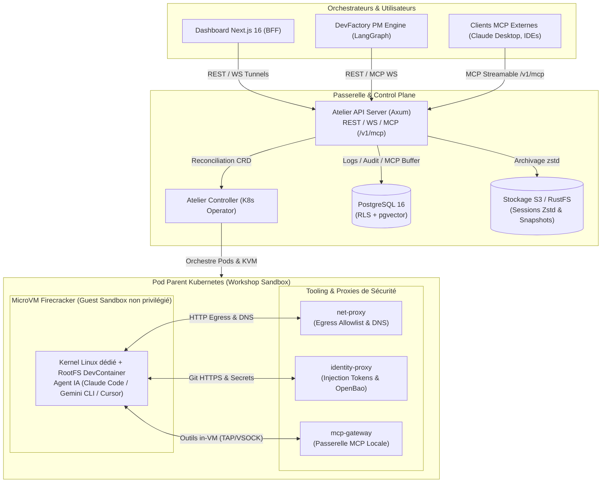

# Atelier

[](https://philippevienne.github.io/atelier/)
[](LICENSE)
[](CODE_OF_CONDUCT.md)
[](SECURITY.md)
[](CONTRIBUTING.md)

**Atelier** est une plateforme cloud-native haute sécurité en **Rust**, **Python (LangGraph)** et **Next.js 16** permettant d'orchestrer et d'isoler des agents de code autonomes (Claude Code, Gemini CLI, Cursor, Antigravity, etc.) dans des **microVMs Firecracker** sous Kubernetes.

Chaque agent s'exécute dans une microVM jaillée et isolée au niveau matériel (KVM), avec une médiation totale de ses accès au monde extérieur : proxy réseau egress avec allowlist stricte, injection transparente de secrets à la volée, passerelle MCP sécurisée, persistance S3 chiffrée et quotas d'inférence LLM contrôlés.

🌐 **Site officiel & Documentation** : [https://philippevienne.github.io/atelier/](https://philippevienne.github.io/atelier/)

---

## 🏛️ Architecture & Composants




### 1. Control Plane & Passerelles (Rust)
- **`crates/common`** : Types partagés, définition de la ressource personnalisée (CRD) `Workshop` et initialisation télémétrique OpenTelemetry (OTLP).
- **`crates/controller`** : Opérateur Kubernetes (`kube-rs`) réconciliant les `Workshop`, gérant le cycle de vie des pods parents, le provisionnement OpenBao, les quotas LLM et l'injection Git HTTPS.
- **`crates/api-server`** : Passerelle centrale Axum (authentification OIDC JWT universelle, endpoints de supervision `/health/*`, tunnels VS Code `code-server` et Terminal `ttyd` avec Basic Auth dynamique, et **Serveur MCP externe `/v1/mcp`** SSE & WebSockets).
- **`crates/image-builder`** & **`crates/builder-vm-init`** : Compilation des fichiers `.devcontainer/devcontainer.json` en images rootfs Firecracker avec mise en cache content-addressed et isolation totale du build dans une microVM jetable.

### 2. Isolation MicroVM & Proxies de Sécurité (Rust)
- **`crates/firecracker`** & **`crates/vm-supervisor`** : Orchestration de la microVM Firecracker avec confinement Jailer, interfaces réseau TAP link-local et snapshots mémoire différentiels.
- **`crates/kvm-device-plugin`** : DaemonSet Kubernetes exposant `/dev/kvm` et `/dev/net/tun` aux pods sans exiger de privilèges `root` (`securityContext.privileged: false`).
- **`crates/net-proxy`** : Médiation réseau egress stricte (filtrage HTTP CONNECT avec allowlist dynamique, serveur DNS interne link-local et bypass pour `git.atelier.internal`).
- **`crates/identity-proxy`** : Courtier de secrets OpenBao injectant à la volée les identifiants et tokens (Personal Access Tokens Forgejo/GitHub/GitLab, credentials cloud) sans jamais exposer de clés privées dans la VM.
- **`crates/mcp-gateway`** : Serveur MCP link-local fournissant à l'agent in-VM les outils de diagnostic, de compilation et d'accès aux services autorisés.
- **`crates/guest-init`** : Init minimal (PID 1) posé dans le rootfs des devcontainers dépourvus de `systemd` — monte les pseudo-filesystems, lance et relance les services `atelier-*` en arrière-plan, reap les zombies et surveille les process orphelins.

### 3. Intelligence & Gestion Autonome (Python 3.12 / LangGraph)
- **`services/pm-engine`** : Moteur DevFactory basé sur LangGraph et FastAPI. Consomme les événements tickets/issues en mode at-least-once via **Redis Streams**, gère la mémoire sémantique du projet dans PostgreSQL avec **`pgvector`** et RLS multi-tenant étanche, et interagit avec les microVMs via le serveur MCP externe.

### 4. Interface Utilisateur & Intégration IDE (Next.js 16)
- **`dashboard/`** : Application Next.js 16 App Router (BFF sécurisé, tokens de session dans cookies `httpOnly`, relayage des flux WebSockets pour VS Code et Terminal).

---

## 📦 Structure du Dépôt

```text
atelier/
├── crates/                    # Workspace Rust (Control plane, superviseur, proxies)
│   ├── api-server/            # Passerelle REST, WebSockets & Serveur MCP /v1/mcp
│   ├── controller/            # Opérateur Kubernetes Workshop
│   ├── common/                # CRD Workshop, client OpenBao, télémétrie OTLP
│   ├── firecracker/           # Wrapper Firecracker Jailer & snapshot-restore
│   ├── vm-supervisor/         # Processus parent pilotant la microVM
│   ├── builder-vm-init/       # Init VM pour la compilation d'images devcontainer
│   ├── image-builder/         # Constructeur d'images rootfs Firecracker
│   ├── net-proxy/             # Proxy egress filtrant & résolveur DNS interne
│   ├── identity-proxy/        # Injection transparente de credentials & tokens Git
│   ├── mcp-gateway/           # Serveur MCP local in-VM
│   ├── guest-init/            # Init PID 1 minimal (devcontainers sans systemd)
│   └── kvm-device-plugin/     # Kubernetes Device Plugin pour /dev/kvm
├── services/
│   └── pm-engine/             # Moteur DevFactory LangGraph (Python 3.12, Redis, pgvector)
├── dashboard/                 # Frontend & BFF Next.js 16 (React 19, TailwindCSS)
├── charts/                    # Packaging Helm de production (Ingress dédiés, Cloud IAM)
├── crds/                      # Manifestes CustomResourceDefinition (workshops.atelier.dev)
├── deploy/
│   ├── dev/                   # Stack de développement local Kind (Postgres, Keycloak, S3, Forgejo, PKI)
│   └── manifests/             # Manifestes Kubernetes de référence
└── docs/                      # Documentation technique, progression & spécifications d'architecture
```

---

## 🖥️ Installation Serveur Single-Node (Low-Cost)

Pour un premier essai ou une petite exploitation sur un seul serveur (bare-metal ou instance cloud avec **accès réel à `/dev/kvm`** — voir [`docs/specs/10-low-cost-single-node-install.md`](docs/specs/10-low-cost-single-node-install.md), la plupart des VPS grand public n'en disposent pas) :

```bash
curl -fsSL https://raw.githubusercontent.com/PhilippeVienne/atelier/main/scripts/install.sh | bash -s -- --domain atelier.exemple.com --email admin@exemple.com
```

Installe k3s, ingress-nginx, cert-manager (TLS Let's Encrypt automatique) et le chart `atelier`, avec des identifiants générés aléatoirement. Voir la spec pour les compromis assumés de ce mode (OpenBao sans persistance par défaut, pas de haute disponibilité) — le [guide administrateur](docs/admin-guide.md) reste la référence pour un déploiement multi-nœud/production.

---

## 🚀 Démarrage Rapide en Développement Local

Atelier s'appuie sur le principe fondamental **« Vérification Empirique Réelle (Zéro Mock) »** : tous les tests et le développement s'exécutent contre des composants réels déployés dans un cluster [Kind](https://kind.sigs.k8s.io/) local.

### 1. Prérequis
- Linux (avec support de virtualisation `/dev/kvm`)
- **Docker** ou **Podman**
- **Kind** (`kind create cluster`) & `kubectl`
- **Rust** 1.80+ (`rustup`)
- **Node.js** 22+ & **npm**
- **Python** 3.12+ & **uv**

### 2. Configuration des Domaines Locaux
Ajoutez les domaines de développement à votre fichier `/etc/hosts` :
```bash
echo "127.0.0.1 auth.atelier.local git.atelier.local app.atelier.local api.atelier.local" | sudo tee -a /etc/hosts
```

### 3. Déploiement de la Stack Complète
Le script d'orchestration initialise automatiquement la PKI locale, PostgreSQL 16 (`pgvector`), Keycloak 26 (OIDC), Forgejo (Git HTTPS), S3 RustFS, OpenBao et Traefik Ingress :

```bash
# Déployer toute l'infrastructure dans Kind
./deploy/dev/local-stack.sh
```

### 4. Lancement des Services Locaux
Sourcez les variables générées et lancez les composants en mode développement :

```bash
source deploy/dev/local-stack/env.sh

# Terminal 1 : Opérateur Kubernetes
cargo run -p atelier-controller --bin atelier-controller

# Terminal 2 : API Server & Passerelle MCP
cargo run -p atelier-api-server

# Terminal 3 : Dashboard Next.js
cd dashboard && npm run dev

# Terminal 4 (Optionnel) : Moteur DevFactory PM Engine
cd services/pm-engine && uv run uvicorn pm_engine.main:app --port 8100
```

- **Dashboard UI** : [http://app.atelier.local:3000](http://app.atelier.local:3000) (ou `http://localhost:3000`)
- **Keycloak IAM** : [http://auth.atelier.local:8080](http://auth.atelier.local:8080) (Identifiants : `admin` / `dev-only-not-for-production`)
- **Forgejo Git** : [http://git.atelier.local:3000](http://git.atelier.local:3000)
- **Stockage S3 (RustFS)** : `http://127.0.0.1:9000`

---

## 🧪 Tests & Assurance Qualité

```bash
# Vérifier le formatage et le typage strict
cargo fmt --all -- --check
cargo clippy --workspace --all-targets -- -D warnings

# Exécuter l'ensemble des tests unitaires et d'intégration
cargo test --workspace

# Tests du Dashboard
cd dashboard && npm run build

# Tests du Moteur PM Engine
cd services/pm-engine && pytest -q
```

---

## 🤝 Communauté, Gouvernance & Sécurité

- **Code de Conduite** : Nous adhérons au [Code de Conduite des Contributeurs (CODE_OF_CONDUCT.md)](CODE_OF_CONDUCT.md) basé sur le Contributor Covenant 2.1.
- **Guide de Contribution** : Consultez [CONTRIBUTING.md](CONTRIBUTING.md) et les directives d'agents [AGENTS.md](AGENTS.md).
- **Gouvernance & Décisions** : Consultez [GOVERNANCE.md](GOVERNANCE.md) pour comprendre notre modèle de gouvernance et le cycle des RFCs ([`docs/specs/`](docs/specs/)).
- **Assistance & Questions** : Consultez [SUPPORT.md](SUPPORT.md) ou participez aux [GitHub Discussions](https://github.com/PhilippeVienne/atelier/discussions).
- **Signalement de Sécurité** : Consultez notre politique de divulgation responsable dans [SECURITY.md](SECURITY.md) (contact : `philippe@vienne.me`).
- **Citation** : Pour citer Atelier dans vos publications de recherche ou travaux logiciels, consultez [CITATION.cff](CITATION.cff).

---

## 📄 Licence

Ce projet est distribué sous licence **GNU Affero General Public License v3.0** ([AGPLv3](LICENSE)).
Toute contribution soumise au dépôt est régie par les termes du [Contributor License Agreement (CLA.md)](CLA.md).
