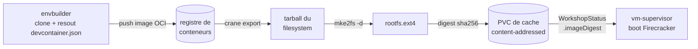
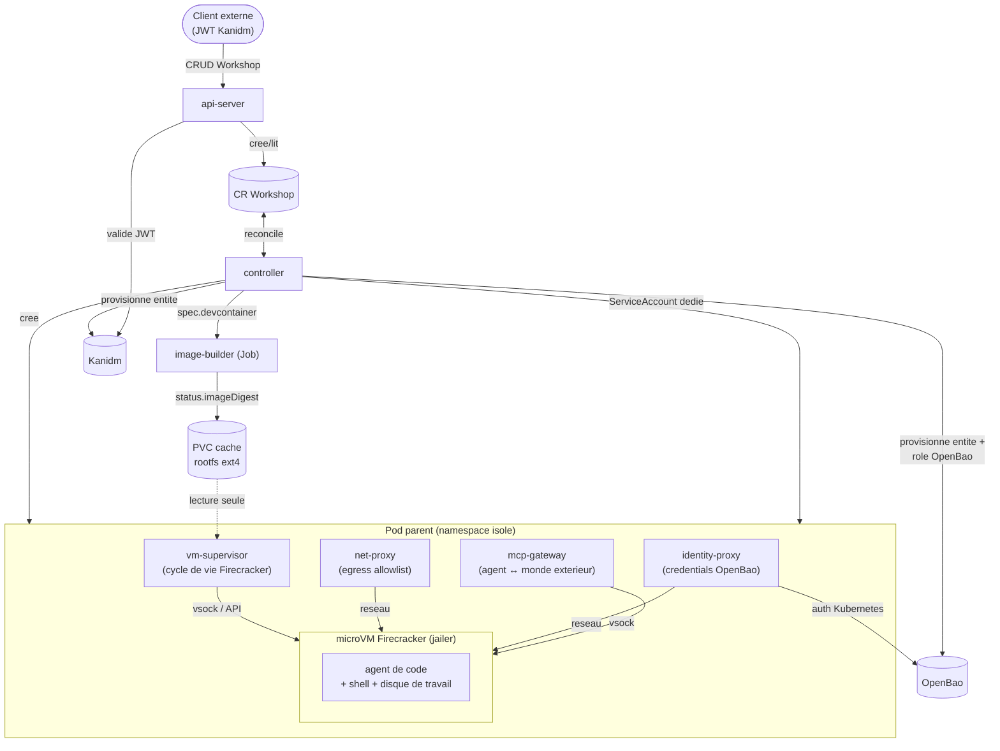
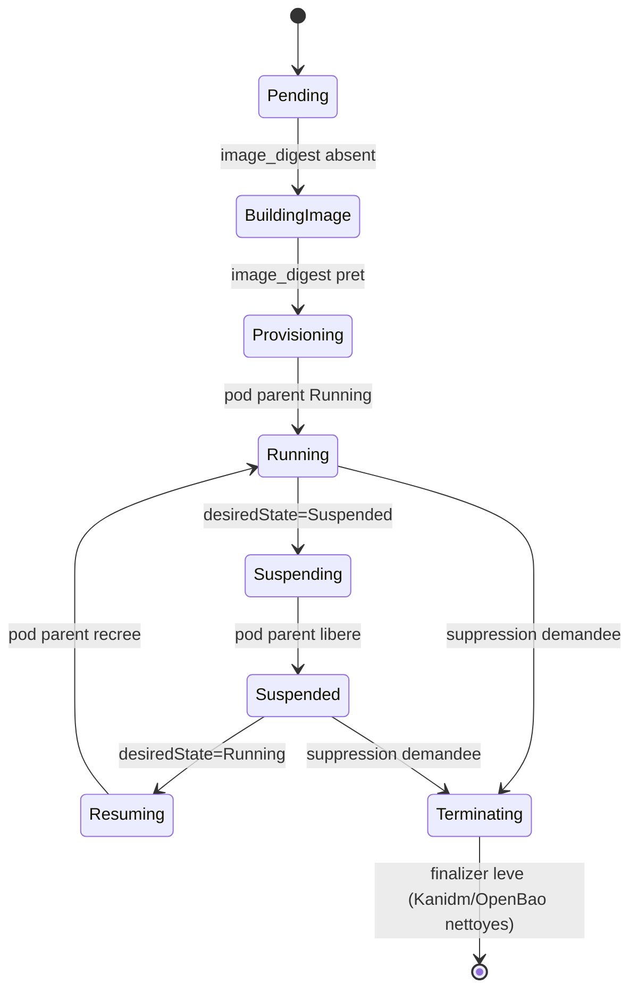
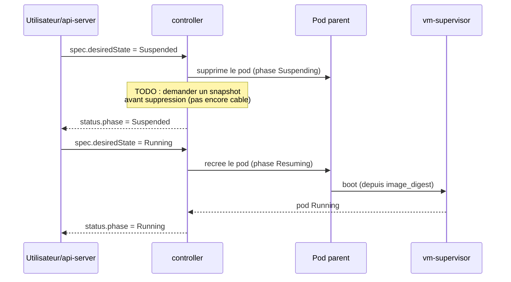

# Architecture d'Atelier

> État d'avancement, ce qui est testé et ce qui reste ouvert : voir
> [`PROGRESS.md`](PROGRESS.md). Ce document decrit la cible et les decisions
> de conception ; il n'essaie pas de suivre l'avancement au jour le jour.

## Sommaire

- [Objectif](#objectif)
- [Le devcontainer comme source de verite](#le-devcontainer-comme-source-de-verite)
- [Vue d'ensemble](#vue-densemble)
- [Composants](#composants)
- [Cycle de vie d'un Workshop](#cycle-de-vie-dun-workshop)
- [Mise en veille : snapshot/restore Firecracker](#mise-en-veille--snapshotrestore-firecracker)
- [Identite et secrets : Kanidm + OpenBao](#identite-et-secrets--kanidm--openbao)
- [Observabilite](#observabilite)
- [Modele de securite](#modele-de-securite)
- [Allocation de ressources et scaling](#allocation-de-ressources-et-scaling)

## Objectif

Fournir a un agent de code (Claude Code, Gemini CLI, etc.) un environnement
d'execution auquel on peut accorder des pouvoirs larges (shell, reseau,
ecriture disque) sans risque pour le reste du systeme, parce qu'il est
execute dans une prison suffisamment etanche : une **microVM Firecracker**,
elle-meme orchestree depuis un **pod Kubernetes**.

## Le devcontainer comme source de verite

L'environnement livre a l'agent n'est pas decrit par une image ad hoc : il
est defini par un `.devcontainer/devcontainer.json` standard, au sens de la
[specification VS Code Dev Containers](https://containers.dev/). N'importe
quel depot deja equipe pour Dev Containers (VS Code, GitHub Codespaces,
`devcontainer` CLI) peut donc etre servi tel quel par Atelier.

`image-builder` ne reimplemente pas la resolution du devcontainer.json : il
delegue a [envbuilder](https://github.com/coder/envbuilder).



Point de conception a retenir : `envbuilder` ne produit **pas** de dossier
d'export propre. Il construit "en place" — il commence par supprimer le
systeme de fichiers du conteneur qui l'execute (sauf `/.envbuilder`) avant
d'y extraire l'image cible. Consequences directes sur `image-builder` :

- il tourne dans le **meme conteneur** qu'envbuilder
  (`crates/image-builder/Dockerfile`), pas en l'invoquant depuis un
  conteneur separe ;
- tout outil dont il a besoin **apres** l'appel a envbuilder (`crane`, le
  cache) doit vivre sur un point de montage distinct de la racine du
  conteneur, sous peine d'etre efface avec le reste.

Voir [`deploy/dev/image-builder/README.md`](../deploy/dev/image-builder/README.md)
pour reproduire ce pipeline en local.

## Vue d'ensemble



## Composants

### Control plane (hors du pod parent)

| Composant | Role |
|---|---|
| **api-server** (`crates/api-server`) | API HTTP externe. Authentifie via JWT dont l'issuer est [Kanidm](https://kanidm.com/) (JWKS recuperes au demarrage). Cree/lit/detruit des CR `Workshop`. |
| **controller** (`crates/controller`) | Operateur Kubernetes (kube-rs) qui reconcilie les CR `Workshop` en ressources concretes (pod parent, Job de build, PVC, ServiceAccount) et met a jour leur statut. Un finalizer (`atelier.dev/cleanup`) bloque la suppression effective d'un Workshop tant que ses ressources externes (entite Kanidm, role OpenBao) n'ont pas ete nettoyees ; les ressources Kubernetes owned (Job, ServiceAccount, Pod) n'en ont pas besoin, le garbage collector standard suffit. |
| **CRD `Workshop`** (`crates/common/src/crd.rs` → `crds/workshop.yaml`) | Source de verite declarative pour un environnement (source devcontainer, ressources, allowlist reseau, outils/simulateurs actifs, proprietaire). |
| **image-builder** (`crates/image-builder`) | Construit le rootfs Firecracker a partir de `WorkshopSpec.devcontainer` (voir pipeline ci-dessus) et le publie dans le cache content-addressed. |

### Tooling du pod parent (a cote de la microVM, pas dedans)

| Composant | Role |
|---|---|
| **vm-supervisor** (`crates/vm-supervisor`) | Demarre/arrete la microVM Firecracker **jailee** (chroot, cgroups) et gere le cycle boot/snapshot/restore, via [`fctools`](https://docs.rs/fctools) (SDK Rust, pas de client HTTP maison). Le jailer tourne avec des capabilities Linux dediees (`setcap`), pas root/sudo. |
| **net-proxy** (`crates/net-proxy`) | Seul chemin de sortie reseau autorise pour la microVM ; n'autorise que les domaines listes dans `Workshop.spec.egress_allowlist`, journalise chaque appel. Sert aussi de resolveur DNS pour la VM, avec la meme allowlist (un nom refuse recoit `REFUSED` sans jamais atteindre l'upstream). Peut lui-meme chainer vers un proxy HTTP parent impose par le reseau environnant, avec une liste `no_proxy` de destinations a joindre en direct. Dans l'autre sens, expose aussi le port-forward de la microVM vers l'exterieur (ex: VS Code Remote) selon un modele calque sur `kubectl port-forward` : net-proxy tient le role du kubelet (execute le forward, aupres de la microVM), `api-server` celui du coordinateur qui authentifie le client et relaie le flux — net-proxy lui-meme ne fait pas d'authentification. |
| **identity-proxy** (`crates/identity-proxy`) | Injecte des credentials/tokens dans les appels sortants sans jamais exposer le secret brut a l'agent. Secrets stockes dans OpenBao, recuperes en s'authentifiant avec le ServiceAccount Kubernetes du pod parent (pas l'identite Kanidm — voir [Identite et secrets](#identite-et-secrets--kanidm--openbao)). |
| **mcp-gateway** (`crates/mcp-gateway`) | Serveur MCP expose a l'agent (via vsock). Seul point d'entree pour que l'agent agisse sur le monde exterieur au-dela du reseau proxifie, et demande des reglages a l'atelier (elargir une allowlist, activer un simulateur, demander un credential). Point d'extension privilegie pour de nouveaux simulateurs (LocalStack pour AWS, mocks d'API, etc.). |

### Interfaces utilisateur

| Composant | Role |
|---|---|
| **dashboard** (`dashboard/`, Next.js) | Vue admin et utilisateur final : lister/creer/detruire des Workshops, visualiser leur etat, s'y connecter (SSH ou VS Code via un `code-server` embarque, cf. `coder/code-server` comme reference). |

## Cycle de vie d'un Workshop



Chaque flèche correspond a un pas de la boucle de reconciliation
(`crates/controller/src/reconcile.rs::apply`) : le `controller` ne fait
qu'une seule transition par appel, et se rappelle lui-meme (`requeue`)
jusqu'a convergence.

## Mise en veille : snapshot/restore Firecracker

Un Workshop n'est pas seulement demarre/detruit : il peut etre **suspendu**.
Firecracker expose nativement `snapshot/create` (fige l'etat de la VM et sa
memoire) et `snapshot/load` (restaure a l'identique), ce qui permet de :

- liberer les ressources du pod parent pendant qu'un Workshop est inactif,
  sans perdre l'etat de travail de l'agent ;
- reprendre en quelques centaines de millisecondes, sans rejouer le boot du
  noyau invite ni le setup du devcontainer.



L'API expose ce cycle via `POST /v1/workshops/:name/suspend` et `/resume`
(`crates/api-server`), typiquement utilises par le dashboard pour une mise
en veille manuelle ou une politique d'auto-suspend sur inactivite (a
definir).

L'entite Kanidm et le role OpenBao du Workshop sont deliberement **laisses
intacts** a travers ce cycle (pas reprovisionnes a chaque resume) : un
Workshop suspendu reste "le meme" Workshop du point de vue identite/secrets.

## Identite et secrets : Kanidm + OpenBao

Deux notions d'identite bien distinctes :

- **L'utilisateur humain** proprietaire d'un Workshop
  (`WorkshopSpec.owner_subject`). Son identite est geree par
  [Kanidm](https://kanidm.com/), fournisseur d'identite pour l'ensemble
  d'Atelier (`api-server` ne valide que des JWT dont l'issuer est Kanidm),
  qui peut lui-meme federer vers un provider externe (OIDC/LDAP
  d'entreprise) sans qu'Atelier ait a gerer cette integration directement.
- **L'environnement lui-meme** : chaque `Workshop` recoit sa propre entite
  machine dans Kanidm (`WorkshopStatus.kanidmEntityId`), distincte du sujet
  humain proprietaire. Cette identite reste la reference cote
  utilisateur/dashboard, mais ce n'est **pas** elle qui sert de pont vers
  OpenBao (choix deliberement explique ci-dessous).

Les secrets destines aux environnements (credentials/tokens injectes par
`identity-proxy`) sont stockes dans [OpenBao](https://openbao.org/) —
deliberement separe des Secrets Kubernetes du cluster sous-jacent, qui
restent geres par les mecanismes k8s standards pour le control plane
lui-meme. Un secret stocke la est souvent lui-meme l'identite de sortie de
l'environnement (ex: une cle d'API presentee a un service externe) :
**seul** `identity-proxy` peut la recuperer et l'utiliser — l'agent dans la
microVM n'y a jamais acces directement, meme indirectement via les
variables d'environnement ou le systeme de fichiers de la VM.

### Pont d'identite vers OpenBao : auth Kubernetes, pas Kanidm

`identity-proxy` s'authentifie aupres d'OpenBao via la **methode d'auth
Kubernetes** d'OpenBao, pas via une federation JWT/OIDC avec Kanidm. Le pod
parent de chaque Workshop recoit son propre ServiceAccount Kubernetes
(`<name>-parent`) ; `identity-proxy` presente le token projete de ce
ServiceAccount, qu'OpenBao verifie en direct aupres de l'API Kubernetes
(TokenReview) — aucun secret a distribuer ou stocker pour amorcer cette
confiance.

Le `controller` provisionne, par Workshop, une policy OpenBao et un role
`auth/kubernetes/role/workshop-<name>` scopant l'acces au chemin KV
`secret/{data,metadata}/workshops/<name>/*` au seul ServiceAccount de ce
Workshop (`crates/controller/src/openbao.rs`), ce qui borne le rayon
d'action d'un Workshop compromis aux seuls secrets qui lui ont ete
explicitement destines.

> **Pourquoi pas une federation Kanidm → OpenBao ?** Ce serait plus
> coherent conceptuellement ("Kanidm = identite pour tout"), mais
> demanderait de configurer un Resource Server OAuth2 cote Kanidm et un
> backend JWT/OIDC cote OpenBao (JWKS, client credentials grant) — une
> integration nettement plus lourde et une surface de panne plus grande que
> l'auth Kubernetes, deja standard.

## Observabilite

Convention imposee a tous les binaires : chaque `main.rs` appelle
`atelier_common::telemetry::init("<nom-du-binaire>")` en toute premiere
instruction (`crates/common/src/telemetry.rs`), et garde le
`TelemetryGuard` renvoye en vie jusqu'a la fin de `main` (flush des traces
avant l'arret). Ce helper commun :

- configure `tracing-subscriber` (logs structures, filtrable via
  `RUST_LOG`) — toujours actif ;
- si `OTEL_EXPORTER_OTLP_ENDPOINT` est present, ajoute une couche
  `tracing-opentelemetry` qui exporte les spans en OTLP/gRPC
  (`service.name` = le nom du binaire) ;
- sans cette variable (tests, dev local), aucune dependance dure a un
  collecteur.

Les fonctions de la boucle de reconciliation du `controller` sont annotees
`#[tracing::instrument]`, ce qui produit une hierarchie de spans exploitable
(`reconciling object` → `reconcile` → `apply` → `ensure_*`).

**Backlog** : deployer un stack d'observabilite complet (collector +
backend de stockage des traces/metriques + **Grafana**) et un dashboard de
supervision dedie — pour l'instant seule l'instrumentation applicative est
en place.

## Modele de securite

- La seule surface d'attaque exposee par la microVM vers l'exterieur passe
  par le pod parent : reseau (`net-proxy`), identite (`identity-proxy`) et
  controle (`mcp-gateway`). Aucun acces direct de la VM au reste du
  cluster.
- Isolation memoire/noyau assuree par Firecracker (jailer, seccomp,
  cgroups) plutot que par la seule isolation de conteneur d'un Pod.
- Authentification externe : JWT emis par Kanidm, seule source de verite
  identite. Pas de gestion d'utilisateurs locale dans Atelier lui-meme.

### Isolation reseau de la microVM : mecanisme concret

L'affirmation ci-dessus ("aucun acces direct au reste du cluster") n'est
vraie que si elle est appliquee au niveau paquet, pas seulement au niveau
applicatif (allowlist de `net-proxy`) — sinon rien n'empeche la VM
d'ouvrir une connexion TCP brute vers l'IP du pod (`eth0`), l'API server
Kubernetes, un autre pod, ou un service de metadata cloud, en contournant
`net-proxy` entierement. Cible retenue, deux composants distincts pour
deux transports distincts :

1. **`mcp-gateway` : isolation structurelle, pas de regle de pare-feu
   necessaire.** Expose uniquement via `vsock` (`AF_VSOCK`, adressage
   CID/port), pas sur le reseau IP de la VM. Rien de ce qui transite par
   le tap reseau ne peut jamais l'atteindre, et rien d'externe au couple
   hote/VM ne peut atteindre ce vsock — l'isolation est une consequence du
   transport, pas d'une regle a maintenir.
2. **`net-proxy` et `identity-proxy` : seules destinations IP autorisees,
   appliquees par pare-feu sur le device TAP.** La VM recoit une seule
   interface reseau (le TAP link-local `/30` deja implemente dans
   `crates/firecracker/src/network.rs`, ex. hote `169.254.0.1`, guest
   `169.254.0.2`) et une route par defaut vers l'IP hote. Comme tous les
   conteneurs d'un meme pod partagent une seule et meme network namespace,
   `net-proxy` et `identity-proxy` lies sur `0.0.0.0` sont deja joignables
   depuis la VM a `169.254.0.1:<leur port>` sans aucun NAT ni forwarding —
   c'est de la livraison locale dans la meme netns. **Il ne faut donc pas
   reutiliser tel quel le `MASQUERADE` inconditionnel de
   `setup_link_local_tap`** (legitime pour la microVM "builder" de
   `image-builder`, qui a explicitement besoin de sortir vers un registre
   OCI/depot git quelconque, elle-meme isolee autrement — voir
   "Reseau kind ↔ registre" dans `PROGRESS.md`) : pour la VM de l'agent, la
   sortie doit rester fermee par defaut.
   - Ne pas poser de regle `MASQUERADE`/`FORWARD -j ACCEPT` vers `eth0`
     pour ce TAP : sans route de sortie, un paquet vers une destination
     autre que `169.254.0.1` est simplement injoignable.
   - Poser explicitement, en defense en profondeur (le sysctl
     `net.ipv4.ip_forward` est global au netns du pod — une autre
     microVM du meme pod qui l'active ne doit pas rouvrir cette voie par
     accident) :
     ```
     iptables -N atelier-vm-<id>
     iptables -A atelier-vm-<id> -p tcp -d 169.254.0.1 --dport <port net-proxy>     -j ACCEPT
     iptables -A atelier-vm-<id> -p tcp -d 169.254.0.1 --dport <port identity-proxy> -j ACCEPT
     iptables -A atelier-vm-<id> -p udp -d 169.254.0.1 --dport 53                    -j ACCEPT
     iptables -A atelier-vm-<id> -p tcp -d 169.254.0.1 --dport 53                    -j ACCEPT
     iptables -A atelier-vm-<id> -j DROP
     iptables -A INPUT   -i <tap> -j atelier-vm-<id>
     iptables -A FORWARD -i <tap> -j DROP
     ```
     (chaine dediee par VM, nettoyee au `teardown()`, symetrique a ce que
     fait deja `NetworkSetup::teardown` pour la regle NAT de la VM
     "builder"). Le port de controle de `net-proxy`
     (`ATELIER_NET_PROXY_CONTROL_ADDR`, le websocket `/portforward`
     destine a `api-server`) reste volontairement hors de cette liste : la
     VM ne doit jamais pouvoir l'atteindre, seul `api-server` le peut,
     depuis l'exterieur du pod.
   - **DNS** : `net-proxy` sert aussi de resolveur pour la VM (port 53,
     UDP+TCP, `crates/net-proxy/src/dns.rs`), avec la **meme allowlist**
     que le proxy egress — une seule source de verite pour la politique,
     appliquee au niveau du nom demande plutot qu'a la seule destination
     IP de la connexion applicative. Une requete pour un nom hors
     allowlist recoit `REFUSED` immediatement, sans jamais etre transmise
     a l'upstream DNS : le DNS ne doit pas devenir un canal de decouverte
     ou d'exfiltration pour des noms que la VM ne pourra de toute facon
     pas joindre via le proxy egress. Implemente et teste (parsing du nom
     de la question, relai brut vers l'upstream si autorise, refus local
     sinon — voir les tests de `dns.rs`).
   - A trancher (ouvert, cf. TODO dans `crates/identity-proxy/src/main.rs`) :
     si l'agent parle a `identity-proxy` en direct (necessite son port dans
     la regle ci-dessus) ou si l'injection de credentials passe par
     `net-proxy` lui-meme (auquel cas la VM n'a besoin que d'un seul port
     autorise, surface de pare-feu plus simple a auditer). Le reste de ce
     document suppose la premiere option, plus proche du schema actuel
     ("Vue d'ensemble" ci-dessus).

## Allocation de ressources et scaling

Chaque `Workshop` se traduit par un pod avec `resources.requests/limits`
explicites (`WorkshopSpec.resources`), compatible avec le
cluster-autoscaler et un HPA standard au niveau du nombre de Workshops
actifs.
