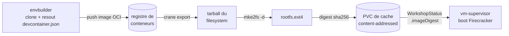
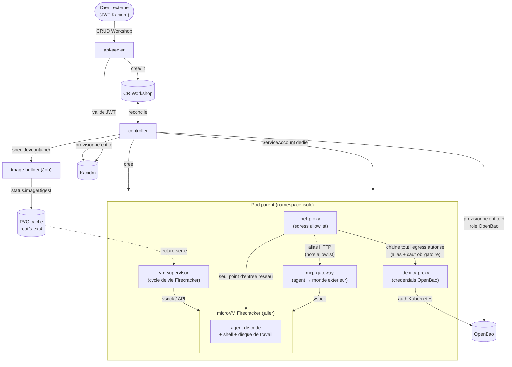
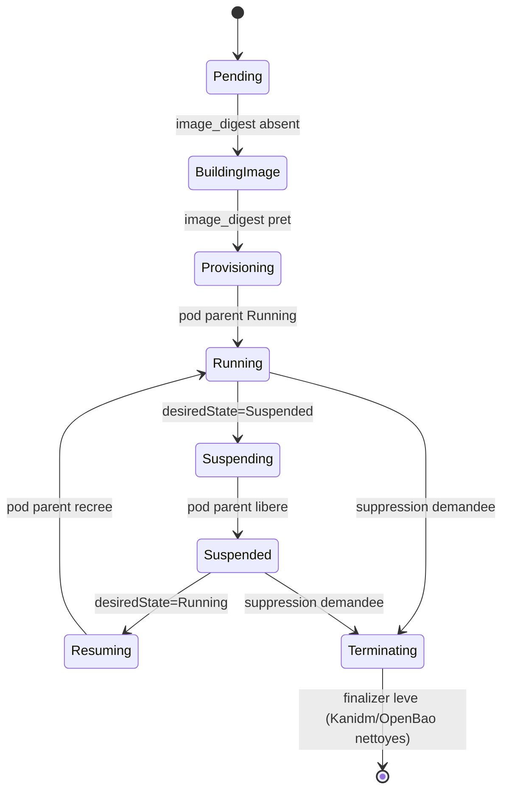

# Architecture d'Atelier

> État d'avancement, ce qui est testé et ce qui reste ouvert : voir
> [`PROGRESS.md`](PROGRESS.md). Ce document decrit la cible et les decisions
> de conception ; il n'essaie pas de suivre l'avancement au jour le jour.

Ce document donne la vue d'ensemble. Les sujets denses ont leur propre
fichier dans [`architecture/`](architecture/) :

- [`architecture/identity-secrets.md`](architecture/identity-secrets.md) —
  Kanidm + OpenBao, pont d'identite, `identity-proxy`.
- [`architecture/network-security.md`](architecture/network-security.md) —
  modele de securite et isolation reseau de la microVM (mecanisme concret,
  regles iptables).
- [`architecture/snapshot-restore.md`](architecture/snapshot-restore.md) —
  mise en veille d'un Workshop (snapshot/restore Firecracker).

## Sommaire

- [Objectif](#objectif)
- [Le devcontainer comme source de verite](#le-devcontainer-comme-source-de-verite)
- [Vue d'ensemble](#vue-densemble)
- [Composants](#composants)
- [Cycle de vie d'un Workshop](#cycle-de-vie-dun-workshop)
- [Observabilite](#observabilite)
- [Allocation de ressources et scaling](#allocation-de-ressources-et-scaling)

## Objectif

Fournir a un agent de code (Claude Code, Gemini CLI, etc.) un environnement
d'execution auquel on peut accorder des pouvoirs larges (shell, reseau,
ecriture disque) sans risque pour le reste du systeme, parce qu'il est
execute dans une prison suffisamment etanche : une **microVM Firecracker**,
elle-meme orchestree depuis un **pod Kubernetes**.

## Le devcontainer comme source de verite

L'environnement livre a l'agent n'est pas decrit par une image ad hoc : il
est defini par un `.devcontainer/devcontainer.json` standard, au sens de la
[specification VS Code Dev Containers](https://containers.dev/). N'importe
quel depot deja equipe pour Dev Containers (VS Code, GitHub Codespaces,
`devcontainer` CLI) peut donc etre servi tel quel par Atelier.

`image-builder` ne reimplemente pas la resolution du devcontainer.json : il
delegue a [envbuilder](https://github.com/coder/envbuilder).

Point de conception a retenir : `envbuilder` ne produit **pas** de dossier
d'export propre. Il construit "en place" — il commence par supprimer le
systeme de fichiers du conteneur qui l'execute (sauf `/.envbuilder`) avant
d'y extraire l'image cible. Consequences directes sur `image-builder` :

- il tourne dans le **meme conteneur** qu'envbuilder
  (`crates/image-builder/Dockerfile`), pas en l'invoquant depuis un
  conteneur separe ;
- tout outil dont il a besoin **apres** l'appel a envbuilder (`crane`, le
  cache) doit vivre sur un point de montage distinct de la racine du
  conteneur, sous peine d'etre efface avec le reste.

Voir [`deploy/dev/image-builder/README.md`](../deploy/dev/image-builder/README.md)
pour reproduire ce pipeline en local.

## Vue d'ensemble

## Composants

### Control plane (hors du pod parent)

| Composant | Role |
|---|---|
| **api-server** (`crates/api-server`) | API HTTP externe. Authentifie via JWT dont l'issuer est [Kanidm](https://kanidm.com/) (JWKS recuperes au demarrage). Cree/lit/detruit des CR `Workshop`. |
| **controller** (`crates/controller`) | Operateur Kubernetes (kube-rs) qui reconcilie les CR `Workshop` en ressources concretes (pod parent, Job de build, PVC, ServiceAccount) et met a jour leur statut. Un finalizer (`atelier.dev/cleanup`) bloque la suppression effective d'un Workshop tant que ses ressources externes (entite Kanidm, role OpenBao) n'ont pas ete nettoyees ; les ressources Kubernetes owned (Job, ServiceAccount, Pod) n'en ont pas besoin, le garbage collector standard suffit. |
| **CRD `Workshop`** (`crates/common/src/crd.rs` → `crds/workshop.yaml`) | Source de verite declarative pour un environnement (source devcontainer, ressources, allowlist reseau, outils/simulateurs actifs, proprietaire). |
| **image-builder** (`crates/image-builder`) | Construit le rootfs Firecracker a partir de `WorkshopSpec.devcontainer` (voir pipeline ci-dessus) et le publie dans le cache content-addressed. |

### Tooling du pod parent (a cote de la microVM, pas dedans)

| Composant | Role |
|---|---|
| **vm-supervisor** (`crates/vm-supervisor`) | Demarre/arrete la microVM Firecracker **jailee** (chroot, cgroups) et gere le cycle boot/snapshot/restore, via [`fctools`](https://docs.rs/fctools) (SDK Rust, pas de client HTTP maison). Le jailer tourne avec des capabilities Linux dediees (`setcap`), pas root/sudo. Detail du cycle snapshot/restore : voir [`architecture/snapshot-restore.md`](architecture/snapshot-restore.md). |
| **net-proxy** (`crates/net-proxy`) | Seul point d'entree reseau que la VM peut joindre (decision de design : `identity-proxy` et `mcp-gateway` ne sont jamais joints directement par la VM, uniquement via net-proxy). N'autorise que les domaines listes dans `Workshop.spec.egress_allowlist`, journalise chaque appel. Sert aussi de resolveur DNS pour la VM, avec la meme allowlist. Peut chainer vers un proxy HTTP parent impose par le reseau environnant. Expose deux alias internes hors allowlist — `identity-proxy` et `mcp-gateway` — et, si `identity-proxy` est configure, lui chaine en plus *tout* l'egress autorise (pas seulement l'alias) : c'est le seul moyen pour l'agent d'obtenir un credential injecte. Dans l'autre sens, expose le port-forward de la microVM vers l'exterieur (modele `kubectl port-forward`). Detail : voir [`architecture/network-security.md`](architecture/network-security.md). |
| **identity-proxy** (`crates/identity-proxy`) | Proxy HTTP qui injecte des credentials/tokens dans les appels sortants de l'agent sans jamais exposer le secret brut a la VM. Jamais joint directement par la VM : c'est `net-proxy`, apres avoir deja tranche l'allowlist, qui lui chaine les requetes ; identity-proxy se connecte donc toujours directement a la destination finale (pas de rebouclage vers net-proxy). Secrets stockes dans OpenBao. Detail : voir [`architecture/identity-secrets.md`](architecture/identity-secrets.md). |
| **mcp-gateway** (`crates/mcp-gateway`) | Serveur MCP expose a l'agent (via vsock). Seul point d'entree pour que l'agent agisse sur le monde exterieur au-dela du reseau proxifie, et demande des reglages a l'atelier (elargir une allowlist, activer un simulateur, demander un credential). Point d'extension privilegie pour de nouveaux simulateurs (LocalStack pour AWS, mocks d'API, etc.). |

### Interfaces utilisateur

| Composant | Role |
|---|---|
| **dashboard** (`dashboard/`, Next.js) | Vue admin et utilisateur final : lister/creer/detruire des Workshops, visualiser leur etat, s'y connecter (SSH ou VS Code via un `code-server` embarque, cf. `coder/code-server` comme reference). |

## Cycle de vie d'un Workshop

Chaque flèche correspond a un pas de la boucle de reconciliation
(`crates/controller/src/reconcile.rs::apply`) : le `controller` ne fait
qu'une seule transition par appel, et se rappelle lui-meme (`requeue`)
jusqu'a convergence.

La transition `Suspending`/`Resuming` est en realite un cycle snapshot/restore
Firecracker — voir [`architecture/snapshot-restore.md`](architecture/snapshot-restore.md)
pour le detail.

## Observabilite

Convention imposee a tous les binaires : chaque `main.rs` appelle
`atelier_common::telemetry::init("<nom-du-binaire>")` en toute premiere
instruction (`crates/common/src/telemetry.rs`), et garde le
`TelemetryGuard` renvoye en vie jusqu'a la fin de `main` (flush des traces
avant l'arret). Ce helper commun :

- configure `tracing-subscriber` (logs structures, filtrable via
  `RUST_LOG`) — toujours actif ;
- si `OTEL_EXPORTER_OTLP_ENDPOINT` est present, ajoute une couche
  `tracing-opentelemetry` qui exporte les spans en OTLP/gRPC
  (`service.name` = le nom du binaire) ;
- sans cette variable (tests, dev local), aucune dependance dure a un
  collecteur.

Les fonctions de la boucle de reconciliation du `controller` sont annotees
`#[tracing::instrument]`, ce qui produit une hierarchie de spans exploitable
(`reconciling object` → `reconcile` → `apply` → `ensure_*`).

**Backlog** : deployer un stack d'observabilite complet (collector +
backend de stockage des traces/metriques + **Grafana**) et un dashboard de
supervision dedie — pour l'instant seule l'instrumentation applicative est
en place.

## Allocation de ressources et scaling

Chaque `Workshop` se traduit par un pod avec `resources.requests/limits`
explicites (`WorkshopSpec.resources`), compatible avec le
cluster-autoscaler et un HPA standard au niveau du nombre de Workshops
actifs.
