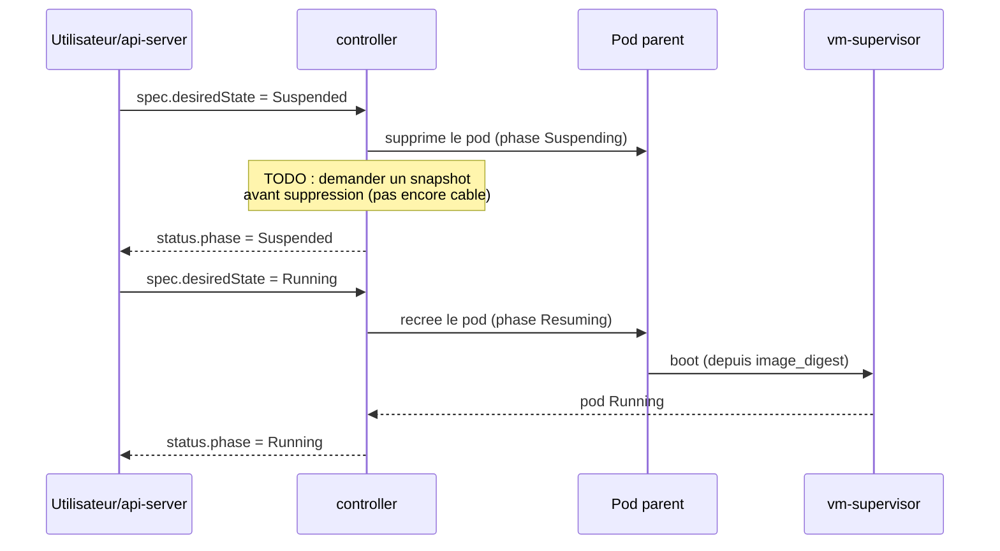

# Mise en veille : snapshot/restore Firecracker

> Retour a la [vue d'ensemble](../ARCHITECTURE.md).

Un Workshop n'est pas seulement demarre/detruit : il peut etre **suspendu**.
Firecracker expose nativement `snapshot/create` (fige l'etat de la VM et sa
memoire) et `snapshot/load` (restaure a l'identique), ce qui permet de :

- liberer les ressources du pod parent pendant qu'un Workshop est inactif,
  sans perdre l'etat de travail de l'agent ;
- reprendre en quelques centaines de millisecondes, sans rejouer le boot du
  noyau invite ni le setup du devcontainer.

L'API expose ce cycle via `POST /v1/workshops/:name/suspend` et `/resume`
(`crates/api-server`), typiquement utilises par le dashboard pour une mise
en veille manuelle ou une politique d'auto-suspend sur inactivite (a
definir).

L'entite Kanidm et le role OpenBao du Workshop sont deliberement **laisses
intacts** a travers ce cycle (pas reprovisionnes a chaque resume) : un
Workshop suspendu reste "le meme" Workshop du point de vue identite/secrets
(voir [`identity-secrets.md`](identity-secrets.md)).
