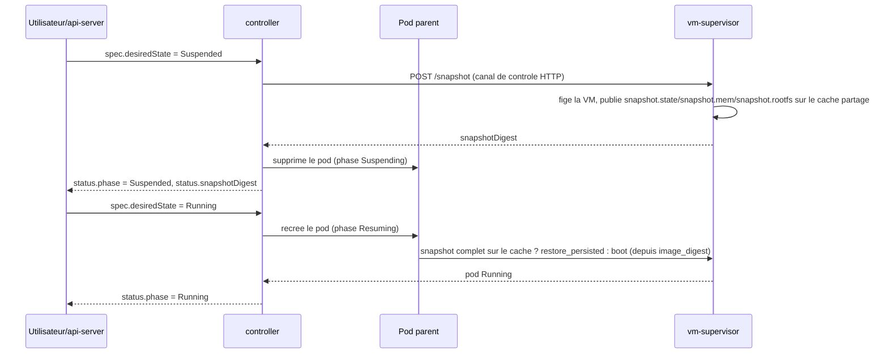

# Mise en veille : snapshot/restore Firecracker

> Retour a la [vue d'ensemble](../ARCHITECTURE.md).

Un Workshop n'est pas seulement demarre/detruit : il peut etre **suspendu**.
Firecracker expose nativement `snapshot/create` (fige l'etat de la VM et sa
memoire) et `snapshot/load` (restaure a l'identique), ce qui permet de :

- liberer les ressources du pod parent pendant qu'un Workshop est inactif,
  sans perdre l'etat de travail de l'agent ;
- reprendre en quelques centaines de millisecondes, sans rejouer le boot du
  noyau invite ni le setup du devcontainer.

```mermaid
sequenceDiagram
    participant U as Utilisateur/api-server
    participant C as controller
    participant P as Pod parent
    participant VM as vm-supervisor

    U->>C: spec.desiredState = Suspended
    C->>VM: POST /snapshot (canal de controle HTTP)
    VM->>VM: fige la VM, publie snapshot.state/snapshot.mem/snapshot.rootfs sur le cache partage
    VM-->>C: snapshotDigest
    C->>P: supprime le pod (phase Suspending)
    C-->>U: status.phase = Suspended, status.snapshotDigest

    U->>C: spec.desiredState = Running
    C->>P: recree le pod (phase Resuming)
    P->>VM: snapshot complet sur le cache ? restore_persisted : boot (depuis image_digest)
    VM-->>C: pod Running
    C-->>U: status.phase = Running
```

Best-effort par conception : si l'appel `POST /snapshot` echoue (pod pas
encore joignable, timeout, ...), la suspension aboutit quand meme, sans
etat fige (`ensure_suspended`/`request_snapshot`,
`crates/controller/src/reconcile.rs`) — mieux vaut honorer
`desired_state: Suspended` sans snapshot que rester bloque dessus
indefiniment.

## Le disque fait partie de l'instantane

`snapshot/create` ne fige que l'etat de la VM et sa memoire. Or cette
memoire contient le cache de pages et le journal du systeme de fichiers de
l'invite : elle ne vaut qu'avec le disque qu'elle decrit. Un instantane
d'Atelier compte donc **trois** fichiers, publies ensemble dans le
repertoire du Workshop sur le cache partage (et sur S3 quand l'offload est
configure) :

| Fichier | Contenu |
|---|---|
| `snapshot.state` | etat des peripheriques et des vCPU |
| `snapshot.mem` | memoire de l'invite |
| `snapshot.rootfs` | disque racine de la microVM, copie **pendant que la VM est figee** |

- Le disque est copie entre `snapshot/create` et la relance des vCPU
  (`Vm::snapshot_with_disk`, `crates/firecracker/src/vm.rs`) : avant, il
  serait en retard sur la memoire ; apres, en avance.
- La copie conserve les trous du fichier (`cp --sparse=always`) : un disque
  de 6 Gio dont l'invite a ecrit 500 Mio occupe 500 Mio sur le cache. S3,
  lui, le recoit a sa taille apparente.
- A la reprise, `Vm::restore_persisted` remet ce disque dans le jail a la
  place de la copie de l'image, sans le verifier ni l'agrandir :
  `resources.disk` n'est pas reapplique a un Workshop repris.
- Les trois fichiers ne se publient pas atomiquement. L'etat de la
  suspension precedente est retire en premier et le nouveau publie en
  dernier (`snapshot_and_publish`, `crates/vm-supervisor/src/main.rs`) : une
  publication interrompue laisse un instantane incomplet, jamais un melange
  de deux suspensions.
- Un instantane incomplet n'est pas repris : le Workshop redemarre a froid
  depuis son image. C'est aussi le sort des instantanes pris avant que le
  disque ne soit conserve (`snapshot.state` et `snapshot.mem` seuls) : leur
  memoire est perdue, mais les reprendre sur le disque de l'image
  corrompait le systeme de fichiers de l'invite.

L'API expose ce cycle via `POST /v1/workshops/:name/suspend` et `/resume`
(`crates/api-server`), typiquement utilises par le dashboard pour une mise
en veille manuelle ou une politique d'auto-suspend sur inactivite (a
definir).

Le role OpenBao du Workshop est deliberement **laisse intact** a travers ce
cycle (pas reprovisionne a chaque resume) : un Workshop suspendu reste "le
meme" Workshop du point de vue identite/secrets (voir
[`identity-secrets.md`](identity-secrets.md)).
