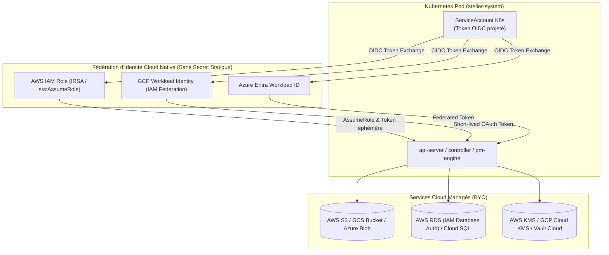

# Principes Directeurs d'Architecture : Substituabilité, Identités Cloud & Neutralité d'Infrastructure

> **Statut** : Document Cadre Transversal (Applicable à toutes les spécifications `01` à `05` et au `PLAN-ACTION-GLOBAL.md`)  
> **Date** : 2026-08-23  
> **Auteur** : Équipe Atelier  
> **Contexte** : Règle d'or de conception — Tous les services d'infrastructure embarqués (PostgreSQL, Keycloak, Forgejo, OpenBao, RustFS, LiteLLM) sont substituables par des services tiers ou managés (AWS RDS, GCP Cloud SQL, Azure Database, Auth0, GitHub, Vault, AWS S3) avec **priorité absolue à l'usage des identités natives Cloud sans secrets statiques (Workload Identity, IRSA / IAM Roles Anywhere, AssumeRole / Workload Identity Federation)**.

---

## 1. La Règle d'Or : "Identités Cloud Natives & Contrats Standards"

Atelier privilégie une sécurité **Zero Static Secrets** :
- **En environnement Cloud (AWS / GCP / Azure)** : Les composants s'authentifient auprès des services managés (S3, RDS, KMS, Vault) via leurs **ServiceAccounts Kubernetes projetés** liés à des identités IAM Cloud natives :
  - **AWS** : IAM Roles for Service Accounts (IRSA) / EKS Pod Identity / `sts:AssumeRole`.
  - **GCP** : Google Cloud Workload Identity Federation (ServiceAccount K8s ➔ GCP Service Account).
  - **Azure** : Microsoft Entra Workload ID (ServiceAccount K8s ➔ Azure Managed Identity / Federated Credential).
- **En environnement On-Premise / Bare-metal** : Fallback gracieux sur le Secret unique `atelier-external-credentials` ou les instances locales déployées dans le chart.



---

## 2. Matrice de Substituabilité & Authentification Cloud

| Domaine | Implémentation Embarquée (Défaut) | Contrat d'Interface Standard | Remplaçants Certifiés (*Bring Your Own*) | Mode d'Authentification Recommandé |
| :--- | :--- | :--- | :--- | :--- |
| **Base de Données** | **PostgreSQL 16** (`pgvector`) | Protocole Wire PostgreSQL v3 (`sqlx` / `asyncpg`) | **AWS RDS PostgreSQL / Aurora, GCP Cloud SQL, Azure Database** | **IAM Database Authentication** (Jetons d'accès IAM temporaires) ou Secret `atelier-external-credentials` |
| **Stockage d'Objets & Snapshots** | **RustFS** | Amazon S3 REST API (v4 Signatures) | **AWS S3, Google Cloud Storage (GCS), Azure Blob Storage** | **AWS IRSA (AssumeRole) / GCP Workload Identity / Azure Workload ID** (Zero secret) |
| **IAM / Auth** | **Keycloak** | OpenID Connect Discovery, JWKS RFC 7517, OAuth2 PKCE RFC 7636 | **Auth0, Okta, Microsoft Entra ID, GitLab OIDC, Authentik** | OIDC Discovery standard + Client Credentials éphémères |
| **Forge Git** | **Forgejo** | Git over HTTPS standard, API REST, Webhooks JSON | **GitHub (SaaS / Enterprise), GitLab (SaaS / Self-Hosted)** | **GitHub App / GitLab Project Access Token** injecté via OpenBao |
| **Gestion des Secrets** | **OpenBao** | HashiCorp Vault API v1 (KV v2, `auth/kubernetes`) | **HashiCorp Vault Cloud / AWS Secrets Manager / GCP Secret Manager** | **Méthode d'Auth Kubernetes native** (`auth/kubernetes`) |
| **Inférence LLM** | **LiteLLM Proxy** | OpenAI Completions & Anthropic Messages API | **AWS Bedrock, Azure OpenAI, GCP Vertex AI, vLLM** | **AssumeRole AWS Bedrock / GCP Service Account Vertex AI** |

---

## 3. Détails d'Implémentation des Identités Cloud dans le Chart Helm

### 3.1. Annotations de ServiceAccounts pour IRSA / Workload Identity
Chaque composant du Chart Helm (`controller`, `apiServer`, `pmEngine`) permet de spécifier des annotations IAM sur son ServiceAccount Kubernetes :

```yaml
# Configuration dans values.yaml pour AWS EKS (IRSA)
apiServer:
  serviceAccount:
    create: true
    annotations:
      eks.amazonaws.com/role-arn: "arn:aws:iam::123456789012:role/atelier-apiserver-s3-role"
      eks.amazonaws.com/audience: "sts.amazonaws.com"

# Configuration dans values.yaml pour GCP GKE (Workload Identity)
controller:
  serviceAccount:
    create: true
    annotations:
      iam.gke.io/gcp-service-account: "atelier-controller@my-gcp-project.iam.gserviceaccount.com"

# Configuration dans values.yaml pour Azure AKS (Workload ID)
pmEngine:
  serviceAccount:
    create: true
    annotations:
      azure.workload.identity/client-id: "33333333-3333-3333-3333-333333333333"
    labels:
      azure.workload.identity/use: "true"
```

### 3.2. Support de `AssumeRole` (Multi-Comptes / Rôles Spécifiques)
Pour les accès inter-comptes AWS ou permissions granulaires, les SDKs Rust (`aws-config`) et Python (`boto3`) supportent nativement le chaînage de rôles (`sts:AssumeRole`) sans configuration manuelle :
```yaml
s3Storage:
  external:
    enabled: true
    endpoint: "" # Détecté automatiquement via la région AWS
    region: "eu-west-1"
    assumeRoleArn: "arn:aws:iam::987654321098:role/atelier-cross-account-s3-role"
    buckets:
      sessions: "my-corp-atelier-sessions"
      snapshots: "my-corp-atelier-snapshots"
      forgejo: "my-corp-forgejo-lfs"
```
