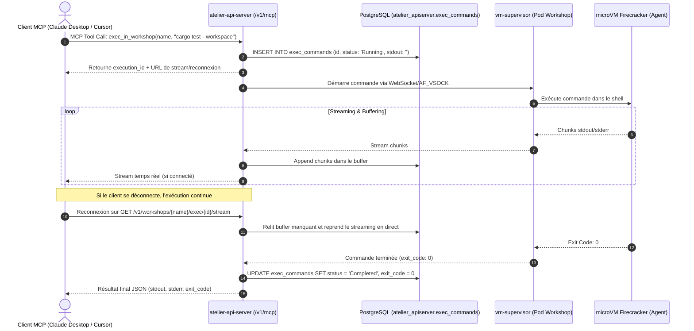
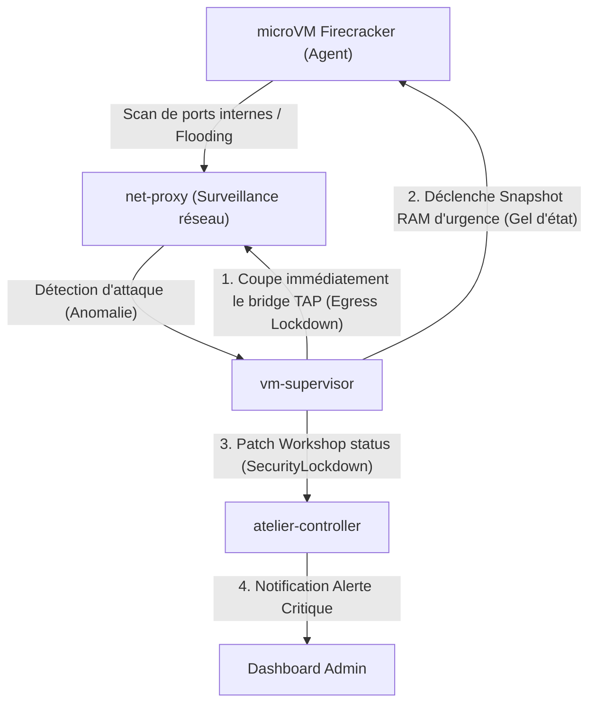

# Spécification Technique : Serveur MCP Externe (Intégré dans API Server)

> **Statut** : Validé suite aux sessions d'itération et stress-test d'architecture (Grill-Me)  
> **Date** : 2026-08-23  
> **Auteur** : Équipe Atelier  
> **Contexte** : Serveur Model Context Protocol (MCP) intégré directement dans `atelier-api-server` sous `/v1/mcp`, authentifié via OIDC Keycloak, supportant l'exécution asynchrone bufferisée, le confinement de sécurité automatique et le principe Fast-Fail de dépendances.

---

## 1. Objectifs & Choix d'Architecture

Le **Serveur MCP Externe** est directement **embarqué au sein de `atelier-api-server`** (accessible sur la route `https://api.atelier.example.com/v1/mcp/sse` ou `/v1/mcp/ws`) :
- **Principe Fast-Fail sur Dépendances Critiques** :
  Si LiteLLM ou OpenBao est inaccessible, l'API Server refuse immédiatement les requêtes `/v1/mcp` créatrices d'état (`create_workshop`, `exec_in_workshop`) avec une erreur explicite `503 Service Unavailable (Security dependencies unreachable)`, garantissant qu'aucun environnement ne démarre sans politique de sécurité ou de budget active.
- **Résilience aux Coupures Réseau & Exécutions Longues** :
  L'exécution de commande `exec_in_workshop` est découplée de manière asynchrone avec persistance du buffer de sortie dans PostgreSQL.
- **Confinement Automatique de Sécurité (Egress Lockdown & Snapshot)** :
  Si `net-proxy` détecte une tentative d'évasion (scan de ports internes, tentative de contournement d'allowlist ou inondation réseau), la microVM est **immédiatement suspendue (Snapshot d'urgence)**, l'accès réseau est gelé (`Lockdown`), et une alerte de sécurité est journalisée sur le Dashboard.

---

## 2. Flux d'Exécution Asynchrone Découplé (`exec_in_workshop`)

---

## 3. Confinement Automatique de Sécurité

