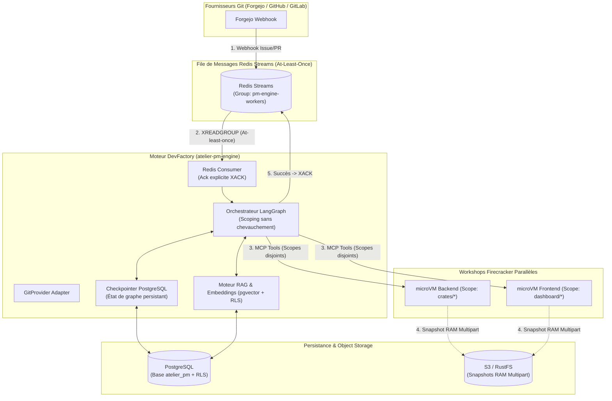

# Spécification Technique : Moteur DevFactory & Project Manager Autonome (LangGraph)

> **Statut** : Validé suite aux sessions d'itération et stress-test d'architecture (Grill-Me)  
> **Principe Cadre** : Conforme au document [`00-architecture-principles-substitutability.md`](00-architecture-principles-substitutability.md) (Forge Git et LLMs entièrement substituables).  
> **Date** : 2026-08-23  
> **Auteur** : Équipe Atelier  

---

## 1. Vision & Rôle du Project Manager (PM) Autonome

Le **Moteur DevFactory (`atelier-pm-engine`)** introduit un agent d'orchestration de niveau supérieur au sein d'Atelier :

1. **Parallélisation Intelligente & Découpage Sans Chevauchement (Prompt Injection)** :
   - Lorsque le PM découpe une issue complexe en sous-tâches parallèles (ex: Backend Rust / Frontend React), le système injecte dynamiquement dans le contexte de chaque agent la liste des Workshops actifs, leur périmètre d'action et **l'interdiction stricte de toucher aux fichiers appartenant à un autre périmètre**, prévenant ainsi les conflits logiques et de code.
2. **Garantie At-Least-Once & Résilience Redis Streams** :
   - Les webhooks d'issues et de PRs sont empilés dans **Redis Streams** avec accusé de réception explicite (`XACK`).
   - En cas de crash du worker `atelier-pm-engine`, les messages non acquittés sont relus (`XAUTOCLAIM`) et l'exécution du workflow LangGraph reprend exactement au **dernier checkpoint PostgreSQL**.
3. **Isolation Multi-Tenant par Row Level Security (RLS) sur `pgvector`** :
   - Les recherches sémantiques RAG (`project_memories`) sont protégées par RLS au niveau PostgreSQL (`SET LOCAL app.current_tenant`), empêchant toute contamination de mémoire ou de code entre entreprises ou organisations clientes distinctes.
4. **Boucle d'Auto-Correction Continue (Bornée par Budget LLM)** :
   - Ré-injection continue des traces d'erreurs jusqu'à réussite des tests ou épuisement du budget `maxLlmBudgetUsd`.
5. **Mise en Veille Instantanée & Intégrité Git (`git-sync`)** :
   - Dès l'ouverture de la PR, le PM force la synchronisation Git et déclenche `suspend_workshop` (snapshot mémoire Firecracker déchargé sur S3) pour libérer CPU/RAM.

---

## 2. Architecture de Résilience & Graphe LangGraph

