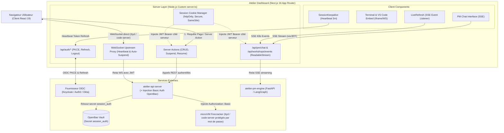

# Spécification Technique : Cadrage & Architecture du Dashboard Next.js 16

> **Statut** : Validé suite aux sessions d'itération et de stress-test d'architecture (Grill-Me)  
> **Date** : 2026-08-23  
> **Auteur** : Équipe Atelier  
> **Composant** : `dashboard/` (Next.js 16 App Router, React 19, Tailwind CSS, TypeScript)  
> **Principe Cadre** : Pattern Backend-for-Frontend (BFF) strict, Server Actions, Zero Token Exposure côté client, WebSockets managés et Basic Auth sécurisée OpenBao.

---

## 1. Vision & Rôle du Dashboard Atelier

Le **Dashboard Atelier** est l'interface unifiée de gestion, d'observabilité et d'interaction pour les développeurs et administrateurs de la plateforme :

1. **Cycle de Vie des Workshops & Réactivité Temps Réel** :
   - Tableau de bord des environnements actifs, en veille (`Suspended`) ou en construction (`BuildingRootfs`).
   - Mises à jour réactives sans polling via le composant client `LiveRefresh` (écoute SSE `/api/workshops/events`).
   - Formulaire de création guidé avec surcharge de ressources et budget LLM (`max_llm_budget_usd`).
2. **Accès Interactif aux MicroVMs (Pont HTTP, WebSockets Managés & Injection Basic Auth)** :
   - Intégration de **VS Code Web (`code-server`)** et d'un **Terminal Web (`ttyd`)** sans port SSH exposé.
   - **Protection par Basic Auth & Injection OpenBao** : Les daemons invités `code-server` et `ttyd` sont protégés par mot de passe aléatoire. L'accès utilisateur est authentifié par JWT OIDC auprès de `api-server`, qui injecte automatiquement le header `Authorization: Basic <base64(atelier:password)>` extrait d'OpenBao lors du relai vers la microVM.
   - **Gestion de l'Inactivité & Auto-Suspend** : Le serveur Node.js custom (`server.ts`) détecte la fermeture des sockets WebSockets clients et envoie des heartbeats d'activité. Après 15 minutes d'inactivité totale, la microVM est mise en veille (`suspend`).
3. **Console DevFactory & Chat "Ask Project Manager" (Streaming SSE BFF)** :
   - Vue dédiée par projet permettant d'interroger la mémoire sémantique du PM (`pgvector`).
   - Streaming SSE sécurisé via Route Handler Next.js `/api/pm/chat` (Zero Token OIDC côté client).
   - Interface d'approbation **Human-in-the-Loop (HITL)** pour valider ou rejeter les Pull Requests.
4. **Maintien de Session Continue (`SessionKeepalive`)** :
   - Le composant client `SessionKeepalive` envoie un heartbeat `/api/auth/refresh` toutes les 5 minutes pour maintenir la session active.

---

## 2. Architecture Technique : Pattern Backend-for-Frontend (BFF)

