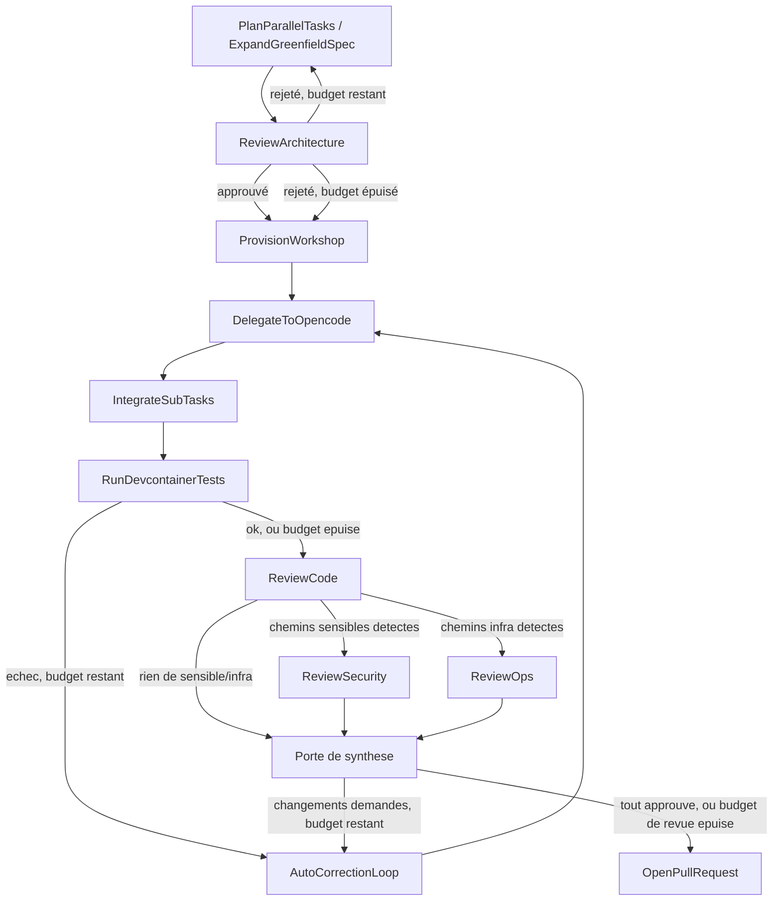

# Spécification Technique : Équipe IT Consultative autour du PM (Architecte, QA, Sécurité, Ops)

> **Statut** : Proposé (non implémenté) — rédigé avant tout code, à valider avant démarrage des tâches d'implémentation.
> **Principe Cadre** : Conforme à [`00-architecture-principles-substitutability.md`](00-architecture-principles-substitutability.md) et prolonge [`05-devfactory-pm-engine.md`](05-devfactory-pm-engine.md) (le graphe LangGraph existant n'est pas remplacé, il gagne des nœuds).
> **Date** : 2026-09-02
> **Auteur** : Équipe Atelier

---

## 1. Constat & Vision

Le PM Engine actuel (`services/pm-engine`) ne connaît que deux façons de penser :

1. Un découpage **par périmètre technique** (`PlanParallelTasks` répartit les fichiers entre Workshops), jamais par **compétence**.
2. Un seul type d'exécutant générique (`DelegateToOpencode`) qui code, sans second regard avant la Pull Request — hors auto-correction bornée sur l'échec des tests, purement mécanique.

Rien dans le graphe ne rejoue ce qu'un service IT réel ferait spontanément : un architecte qui relit un découpage avant de lancer plusieurs devs dessus, une revue de code avant merge, un regard sécurité sur les changements sensibles (auth, secrets, égress réseau), un regard ops sur ce qui touche au déploiement. Cette spec ajoute ces quatre rôles comme des **nœuds consultatifs** dans le graphe existant — décision actée en amont : pas de nouveaux Workshops OpenCode par rôle (trop coûteux et redondant avec le mécanisme de délégation déjà en place), mais des nœuds LangGraph qui appellent `deps.llm_client.chat(...)` exactement comme le font déjà `AnalyzeIssue`/`PlanParallelTasks`.

Objectif explicite : ces rôles **bloquent ou font boucler**, ils ne se contentent pas de commenter dans le vide. Un rôle qui ne peut jamais changer l'issue du run n'est qu'un log déguisé et ne mérite pas un nœud de graphe.

---

## 2. Les quatre rôles

| Rôle | Question posée | Quand il intervient | Toujours actif ? |
|---|---|---|---|
| **Architecte** (`ReviewArchitecture`) | Ce découpage en sous-tâches est-il sain (scopes vraiment disjoints, pas de dépendance cachée, pas de sur-ingénierie) ? | Juste après `PlanParallelTasks`/`ExpandGreenfieldSpec`, avant `ProvisionWorkshop` — donc **avant qu'aucune microVM ne soit créée** | Oui, systématique |
| **QA / Revue de code** (`ReviewCode`) | Le diff produit répond-il au ticket, sans régression évidente ni code mort ? | Après `RunDevcontainerTests` (tests verts), avant `OpenPullRequest` | Oui, systématique |
| **Sécurité** (`ReviewSecurity`) | Le diff touche-t-il à l'auth, aux secrets, à l'égress réseau, à l'injection de credentials ? Si oui, est-ce sain ? | Même point que QA, **en parallèle** | Non — seulement si le diff touche des chemins sensibles (§4.2) |
| **Ops / SRE** (`ReviewOps`) | Le diff touche-t-il à l'infra (Helm, Terraform, migrations SQL) ? Si oui, l'impact déploiement est-il maîtrisé ? | Même point que QA, **en parallèle** | Non — seulement si le diff touche des chemins infra (§4.2) |

Les deux rôles conditionnels (`ReviewSecurity`, `ReviewOps`) évitent le coût LLM et le bruit d'une revue qui n'a rien à dire sur 90% des tickets qui ne touchent ni l'un ni l'autre — cohérent avec la doctrine déjà en place pour `ExpandGreenfieldSpec` (n'ajoute un appel LLM que quand la situation le justifie).

---

## 3. Placement dans le graphe



Deux points de bouclage, chacun borné par un compteur dédié (§5) :

- `ReviewArchitecture` rejeté → retour à `PlanParallelTasks` (le LLM replanifie avec les objections injectées), **jamais** directement à `ProvisionWorkshop` — un découpage jugé malsain ne doit pas être corrigé en aval par les devs, il doit être refait à la source.
- `ReviewCode`/`ReviewSecurity`/`ReviewOps` rejetés → retour à `DelegateToOpencode` via un nœud dédié `ReviewReconsideration` (même mécanisme de re-délégation qu'`AutoCorrectionLoop`, mais un nœud **distinct** — voir §4.4 : un code rejeté par la revue et un code qui ne compile pas sont des échecs de nature différente, confondre leurs budgets bornerait l'un par l'usure de l'autre), avec les commentaires de revue injectés dans `analysis` de la même façon que `error_trace` l'est aujourd'hui.

Budget épuisé sur l'un ou l'autre point : on **avance quand même**, exactement la doctrine déjà retenue par `route_after_tests` — un humain tranche ensuite via `AwaitHitlApproval`, qui doit voir dans son message d'interruption que des rôles ont été outrepassés (§6).

`ReviewSecurity` et `ReviewOps`, quand tous deux déclenchés, s'exécutent en parallèle (fan-out/fan-in LangGraph natif — `route_after_code_review` renvoie une liste de plusieurs clés, LangGraph exécute chacune, convergence sur un nœud `ReviewGate`) : ils lisent le même diff sans écrire le même champ **de résultat**.

**Piège réel, trouvé lors du premier run de validation de bout en bout (ticket #27, 2026-09-02), pas anticipé à la conception** : les deux nœuds écrivaient chacun `"phase"` (comme tout autre nœud du graphe) avec des valeurs différentes (`"ReviewSecurity"` / `"ReviewOps"`). LangGraph refuse deux écritures concurrentes différentes sur une même clé d'état dans le même superstep sans réducteur explicite (`InvalidUpdateError: At key 'phase'. Can receive only one value per step.`) — aucun test unitaire (qui invoque chaque nœud isolément) ne pouvait le révéler, seule l'exécution réelle du fan-out par le moteur LangGraph le fait apparaître. Corrigé en retirant l'écriture de `"phase"` de ces deux nœuds : `ReviewGate`, seul point de convergence, la porte pour les deux. **Leçon pour tout futur rôle qui s'exécuterait en parallèle d'un autre** : n'écrire, dans l'état partagé, que des clés dont on est seul responsable à cet instant du graphe — jamais une clé « générique » (`phase`, `status`...) que plusieurs branches concurrentes pourraient toucher au même superstep, sauf à la déclarer explicitement `Annotated` avec un réducteur qui sait fusionner deux écritures.

---

## 4. Détails d'implémentation

### 4.1. Nouvelle capacité `BaseGitProvider.get_diff`

Aucun rôle ne peut relire un diff qui n'existe nulle part dans l'état actuel — `open_pull_request` ne lit que `changed_file_count`. Ajout, même convention que `git_push_credential`/`changed_file_count` (méthode non abstraite, `None` par défaut si le provider ne sait pas répondre) :

```python
# base.py
async def get_diff(self, repo: str, base_branch: str, head_branch: str) -> str | None:
    """Diff textuel (format unifié) entre head_branch et base_branch, ou
    None si le provider ne sait pas le produire. Les rôles de revue
    (ReviewCode/Security/Ops) tronquent ce texte avant de l'injecter dans
    un prompt — voir leur docstring pour la limite retenue."""
    return None
```

Implémentations concrètes, **vérifiées contre l'instance de dev réelle** (Forgejo `9.0.3+gitea-1.22.0`, dépôt `pm-validation-url-shortener`) avant d'écrire une ligne de code, pas supposées :

- **Forgejo** : `GET /repos/{owner}/{repo}/compare/{base}...{head}` ne renvoie que du JSON (liste de commits + noms de fichiers changés, jamais le texte du diff, quel que soit l'en-tête `Accept` envoyé) et l'URL `.../compare/{base}...{head}.diff` répond `404 Not Found` dans cette version — contrairement à ce qu'on aurait pu supposer par analogie avec `pulls/{index}.diff` (qui, lui, fonctionne réellement, mais suppose une PR déjà ouverte, justement ce qu'on n'a pas encore à ce stade du graphe). Chemin retenu : `GET .../compare/{base}...{head}` (JSON) pour lister les shas de commits, puis `GET /repos/{owner}/{repo}/git/commits/{sha}.diff` (confirmé `200 text/plain`, diff unifié classique) pour chacun, concaténés dans l'ordre. Un commit de fusion ne diffe alors que contre son premier parent — acceptable pour une revue, qui n'a pas besoin d'un patch ré-applicable.
- **GitHub** : `GET /repos/{owner}/{repo}/compare/{base}...{head}` avec `Accept: application/vnd.github.v3.diff` (à vérifier de la même façon avant d'écrire le code, l'API GitHub étant connue pour bien supporter ce type de comparaison directement, sans le contournement Forgejo).
- **GitLab** : `GET /projects/:id/repository/compare` (champ `diffs[].diff`, à concaténer) — à vérifier de même.

`ReviewArchitecture` n'a pas besoin de `get_diff` (rien n'est encore codé à ce stade) : il relit `state["plan"]` et `state["analysis"]`, comme le fait déjà `plan_parallel_tasks`.

### 4.2. Détection des chemins sensibles / infra

Déterministe, pas de LLM pour décider si `ReviewSecurity`/`ReviewOps` se déclenchent — même doctrine que les garde-fous de `_plan_is_credible` : une décision qui peut se vérifier par du code ne doit jamais dépendre de l'approximation d'un LLM.

**Point d'attention essentiel** : le PM Engine pilote des dépôts **cibles** quelconques (un ticket sur `pm-validation-url-shortener`, une app Node.js sans aucun rapport avec Atelier, en a été la validation de référence — voir §7). Ces motifs ne doivent donc **jamais** nommer un composant interne d'Atelier (`identity-proxy`, `net-proxy`, `openbao`...) : ce serait confondre le dépôt qui héberge le PM avec le dépôt que le PM gère. Les motifs ci-dessous ne décrivent que des conventions de nommage génériques, qu'on retrouverait dans n'importe quel projet (Node.js, Rust, Python, Go...) :

```python
# nodes.py, motifs glob (fnmatch) sur les chemins du diff — extraits par la
# ligne "diff --git a/<path> b/<path>" ou l'entete "+++ b/<path>", pas de
# dependance a un format de diff en particulier au-dela de cette ligne.
# Volontairement generiques : ce sont des conventions de nommage qu'on
# retrouve dans N'IMPORTE QUEL depot cible, jamais un nom de composant
# specifique a Atelier (le PM ne gere pas son propre code).
SECURITY_SENSITIVE_PATTERNS = [
    "**/*auth*", "**/*credential*", "**/*secret*", "**/*password*",
    "**/*token*", "**/*session*", "**/*.pem", "**/*.key", "**/.env*",
    "**/*oauth*", "**/*jwt*",
]
OPS_SENSITIVE_PATTERNS = [
    "**/*.tf", "**/migrations/**", "Dockerfile*", "docker-compose*",
    "**/*.yaml", "**/*.yml", ".devcontainer/**", "**/Chart.yaml",
]
```

`OPS_SENSITIVE_PATTERNS` inclut `**/*.yaml`/`**/*.yml` (large) plutôt qu'un chemin type `charts/**` propre à la convention Helm d'Atelier : un dépôt cible peut organiser ses manifestes Kubernetes/CI/Compose n'importe où, et il n'y a aucune raison de supposer qu'il suit la même arborescence que ce dépôt. Un faux positif ici ne coûte qu'un appel LLM de revue en plus ; un faux négatif laisse passer un changement d'infra sans second regard.

Ces listes sont volontairement des constantes de module, pas un champ `PmEngineDeps` configurable dans cette première version — même arbitrage que documenté pour `workshop_egress_allowlist` v.s. une politique complexe : on ouvre la configurabilité seulement si un vrai besoin apparaît en usage, pas par anticipation.

### 4.3. Forme d'un verdict de revue

Un seul format de sortie LLM pour les quatre rôles, cohérent avec le JSON déjà attendu de `PlanParallelTasks` :

```json
{"verdict": "approve", "comments": []}
```
ou
```json
{"verdict": "request_changes", "comments": ["Le scope de task-2 chevauche task-1 sur src/shared/**"]}
```

Réponse non-parsable → repli sur `"approve"` avec un log `warning`, **jamais** sur `"request_changes"` : un LLM qui répond mal ne doit pas bloquer indéfiniment un run par accident (même esprit que le repli sur une tâche unique dans `plan_parallel_tasks` face à une réponse non-JSON — dégrader vers la voie qui laisse le graphe avancer).

### 4.4. Nouveaux champs d'état (`state.py`)

```python
class ReviewVerdict(TypedDict):
    verdict: str  # "approve" | "request_changes"
    comments: list[str]

# --- ReviewArchitecture ---
architecture_review: NotRequired[ReviewVerdict]
architecture_review_attempts: NotRequired[int]

# --- ReviewCode / ReviewSecurity / ReviewOps ---
code_review: NotRequired[ReviewVerdict]
security_review: NotRequired[ReviewVerdict | None]  # None : non déclenché
ops_review: NotRequired[ReviewVerdict | None]
review_attempts: NotRequired[int]
```

Deux compteurs distincts (`architecture_review_attempts`, `review_attempts`) plutôt qu'un seul partagé avec `correction_attempts` : un découpage refusé et un code refusé sont des échecs de nature différente, et confondre leurs budgets ferait qu'une replanification bornerait à tort les tentatives de correction de code (ou l'inverse). Chacun a son propre plafond, `max_architecture_review_attempts`/`max_review_attempts`, même convention que `max_correction_attempts` (valeur par défaut `3`, portée par `PmEngineDeps`).

### 4.5. `AwaitHitlApproval` : rendre visible un passage en force

Si un rôle a été outrepassé par épuisement de budget, le relecteur humain doit le voir **dans le message d'interruption lui-même**, pas seulement en creusant l'état — même raison que le garde-fou ajouté à `open_pull_request` pour `pr_changed_files` (une revue qui ne voit pas l'anomalie approuve à l'aveugle). Le payload `interrupt()` gagne un champ `outstanding_concerns: list[str]`, rempli à partir de tout verdict `request_changes` encore actif à ce stade.

---

## 5. Nœuds à ajouter (`nodes.py`) et câblage (`graph.py`)

Cinq nouveaux nœuds : `review_architecture`, `review_code`, `review_security`, `review_ops`, plus une fonction de synthèse `route_after_review` (arête conditionnelle, pas un nœud) qui agrège `code_review`/`security_review`/`ops_review` en une seule décision `OpenPullRequest` vs `AutoCorrectionLoop`.

Chaque nœud de revue suit le même squelette que `plan_parallel_tasks` : un prompt système spécialisé au rôle, un prompt utilisateur portant le contexte pertinent (plan pour l'architecte, diff tronqué pour les trois autres), un parse JSON défensif avec repli sur `approve`.

`review_security`/`review_ops` ne sont ajoutés au graphe qu'avec une arête conditionnelle en amont (`route_after_tests` étendu, ou une nouvelle fonction `route_to_specialized_reviews`) qui vérifie la présence de chemins sensibles/infra dans le diff — s'ils ne se déclenchent pas, leur champ d'état reste à `None` et `route_after_review` les ignore.

---

## 6. Ce que cette spec ne couvre pas (hors périmètre assumé)

- Pas de cinquième rôle "Product Owner" qui validerait la conformité fonctionnelle au ticket avant tout code — recouvrirait `AnalyzeIssue`, pas de valeur ajoutée identifiée pour l'instant.
- Pas de mémoire RAG (`project_memories`) dédiée par rôle — les quatre rôles réutilisent le même modèle de chat (`deps.chat_model`) et le même contexte que le reste du graphe, aucune isolation supplémentaire n'a été demandée.
- Pas de configurabilité des rôles actifs par dépôt/organisation dans cette version (tous les runs passent par `ReviewArchitecture`/`ReviewCode`, `ReviewSecurity`/`ReviewOps` restant conditionnels au contenu du diff) — à revisiter si un cas d'usage concret l'exige.

---

## 7. Tests & Preuves attendues

Même standard que le reste de `pm-engine` (voir `AGENTS.md`) : pas de mock du LLM au-delà de ce qui existe déjà pour `plan_parallel_tasks`/`analyze_issue`, et au moins un run réel de bout en bout couvrant :

1. Un ticket dont le découpage initial est délibérément mauvais (scopes qui se chevauchent) → `ReviewArchitecture` le rejette → replanification → découpage propre accepté.
2. Sur un dépôt cible générique (même nature que `pm-validation-url-shortener`, sans rapport avec le code d'Atelier) : un ticket qui ajoute un module d'authentification (`src/auth.js`, par exemple) → `ReviewSecurity` se déclenche ; un ticket qui n'y touche pas → il ne se déclenche PAS, pour prouver que la détection de chemins n'est pas un simple "toujours vrai".
3. Un run complet où tous les rôles approuvent du premier coup, pour mesurer le coût en temps/tours LLM ajouté par cette spec par rapport à la baseline déjà validée (PR 26, run entièrement automatisé).
