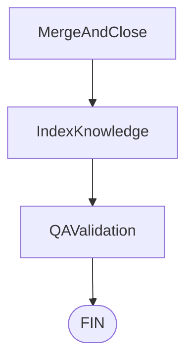

# Spécification Technique : Validation QA Dynamique Post-Merge

> **Statut** : Proposé (non implémenté) — rédigé avant tout code, à valider avant démarrage des tâches d'implémentation.
> **Principe Cadre** : Conforme à [`00-architecture-principles-substitutability.md`](00-architecture-principles-substitutability.md) et prolonge [`05-devfactory-pm-engine.md`](05-devfactory-pm-engine.md) et [`08-equipe-it-consultative.md`](08-equipe-it-consultative.md) (le graphe LangGraph existant gagne un nœud final, aucun mécanisme existant n'est remplacé).
> **Date** : 2026-09-02
> **Auteur** : Équipe Atelier

---

## 1. Constat & Vision

Les quatre rôles consultatifs de la spec 08 (Architecte/QA/Sécurité/Ops) relisent tous la même chose : un **diff statique**, avant la fusion. Aucun d'eux n'exécute réellement l'application — `RunDevcontainerTests` fait tourner la suite de tests du dépôt, mais dans le Workshop de développement de la sous-tâche, avant intégration finale sur `main`.

Cette spec ajoute un cinquième rôle, de nature différente : un **validateur QA post-merge**, qui s'exécute **après** `MergeAndClose`, sur le code réellement fusionné sur `main`, dans un Workshop **frais et dédié** (jamais celui, déjà potentiellement pollué ou suspendu, d'une sous-tâche). Son but n'est pas de bloquer une fusion — il n'y a plus rien à bloquer, le code est déjà fusionné — mais de produire une **preuve de bon fonctionnement** : l'application démarre-t-elle réellement, répond-elle comme attendu aux critères d'acceptation du ticket, et à quoi ressemble-t-elle (capture d'écran) si elle sert une interface web ?

Décision actée en amont (voir les réponses à la clarification qui précède cette spec) :
1. Un **nouveau nœud** dans le graphe `pm-engine` existant (`QAValidation`), pas un second workflow séparé — même checkpoint, même historique de thread.
2. **Détection automatique** UI vs API pure, à l'exécution (pas un champ déclaratif à maintenir).
3. Les preuves (captures d'écran, sorties de requêtes) vont dans le **stockage S3/RustFS** déjà en place pour les snapshots Firecracker et les archives de session (`crates/api-server/src/storage.rs`).

---

## 2. Choix de conception déterminant : pas de nouvelle capacité côté Rust

Une lecture rapide du problème suggère une solution lourde : donner au Workshop de QA un accès réseau direct à S3 (identité injectée par `identity-proxy`, comme pour Git/LiteLLM). **Cette voie est écartée** : contrairement à un jeton Git ou une clé LLM (un simple en-tête `Authorization` statique, injecté par `identity-proxy::with_injected_header`), l'authentification S3 (SigV4) signe chaque requête à partir de son contenu — une injection d'en-tête statique ne peut pas la satisfaire. La faire fonctionner exigerait qu'`identity-proxy` sache re-signer des requêtes S3 à la volée, une capacité qui n'existe pas et dont le coût dépasse largement le besoin.

**Choix retenu** : `pm-engine` (le service Python, pas le Workshop) est déjà server-side, sur le même réseau que `S3_ENDPOINT`. Le Workshop ne parle jamais à S3 : il écrit ses preuves sur son propre disque, puis `pm-engine` les récupère **par le canal qui existe déjà** — `exec_in_workshop` (texte, via SSH) — en les encodant en base64, exactement comme il récupère déjà la sortie d'une suite de tests (`RunDevcontainerTests`) ou un diff (`get_diff`, tâche 5.6.1). `pm-engine` décode et téléverse lui-même vers S3, avec un client Python (`aioboto3`, nouvelle dépendance — aucune n'existe encore côté `pm-engine`).

Conséquence : **zéro modification** de `identity-proxy`, `net-proxy`, `controller`, ou du modèle OpenBao. Toute cette brique reste entièrement dans `services/pm-engine`.

---

## 3. Placement dans le graphe



`QAValidation` ne s'exécute que sur le chemin **approuvé** (`route_after_hitl` → `MergeAndClose`) : sur rejet (`route_after_hitl` → `__end__`), rien n'a été fusionné, il n'y a rien à valider dynamiquement. Aucune arête conditionnelle n'est nécessaire en sortie de `QAValidation` — c'est un nœud terminal, purement observationnel, qui ne peut plus faire échouer le workflow (voir §6, doctrine d'échec).

---

## 4. Déroulé du nœud `QAValidation`

1. **Provisionnement d'un Workshop dédié**, nommé de façon déterministe et disjointe des Workshops de sous-tâches (`pm-<issue>-task-N`) pour ne jamais les confondre ni entrer en conflit : **`pm-<issue>-qa`**. Pointé sur `main` (`devcontainerRevision: "main"`), pas sur une branche de sous-tâche — c'est précisément le code fusionné qu'on veut exercer. Réutilise `create_workshop`/`_await_workshop_running` tels quels (aucune nouvelle capacité MCP nécessaire ici).
2. **Délégation à un agent OpenCode**, même mécanisme que `delegate_to_opencode` (`exec_in_workshop` + `opencode run --auto`), mais avec un prompt et un contrat de sortie différents (voir §5) — ce n'est **pas** un appel à `delegate_to_opencode` tel quel, les deux nœuds divergent trop pour partager une fonction (le premier écrit du code et le pousse sur une branche ; celui-ci exécute l'application et rapporte un verdict, sans jamais commiter).
3. **Récupération des preuves** : `pm-engine` énumère les fichiers que l'agent a rapportés (`find .qa-evidence -type f`, convention de répertoire fixe), les récupère un par un via `exec_in_workshop` (`base64 <fichier>`) sur le même modèle que `ForgejoProvider.get_diff` (petits appels courts, pas de session MCP tenue ouverte pendant un exec long — même piège déjà corrigé documenté dans `pieges.md`), puis les téléverse vers S3.
4. **Mise en veille** du Workshop de QA (`suspend_workshop`), jamais sa suppression immédiate — même doctrine que les Workshops de sous-tâches, pour permettre une inspection manuelle a posteriori si le verdict est mauvais.
5. **Rapport** : le verdict (`qa_verdict`, voir §5) et les références des preuves (`qa_evidence_keys`) sont écrits dans l'état du graphe, et un commentaire est posté sur la PR déjà fusionnée (`BaseGitProvider.post_comment`) résumant le verdict et listant les preuves — la seule façon, pour un humain qui n'irait pas fouiller le graphe LangGraph, de savoir qu'une validation post-merge a eu lieu et ce qu'elle a trouvé.

---

## 5. Contrat de l'agent QA (prompt et sortie attendue)

Le prompt (dans `run_qa_validation`, nouvelle fonction, pas une variante de `delegate_to_opencode`) donne à l'agent :
- Le ticket original (`state["analysis"]`) et ses critères d'acceptation.
- Une consigne explicite de **démarrer réellement l'application** (pas de relecture statique — c'est tout l'intérêt de ce rôle par rapport à `ReviewCode`).
- La détection UI/API est laissée à l'agent lui-même (il lit le code, sait comment l'app répond) plutôt que codée en heuristique Python fragile (recherche de port, grep de `Content-Type`...) : "si l'application sert du HTML, capture une preuve visuelle (`.qa-evidence/*.png`, un outil de capture d'écran headless au choix — installe-le toi-même si besoin) ; sinon, exerce l'API par de vraies requêtes HTTP et consigne les réponses obtenues (`.qa-evidence/*.txt`)."
- Une consigne de ne **jamais commiter** ces fichiers (ils n'appartiennent pas à l'historique git du projet cible, seulement à la preuve de ce run).
- Le format de sortie final, un unique bloc JSON en fin de réponse (même convention de parsing que les rôles de revue, `_parse_review_verdict`, réutilisée telle quelle) :
  ```json
  {"verdict": "pass", "comments": [], "evidence_files": [".qa-evidence/screenshot.png"]}
  ```
  ou
  ```json
  {"verdict": "fail", "comments": ["GET /:code renvoie 500 au lieu de 404 pour un code inconnu"], "evidence_files": [".qa-evidence/get-unknown-code.txt"]}
  ```

Réponse non-JSON ou champ `evidence_files` absent → repli sur `{"verdict": "fail", "comments": ["reponse de l'agent QA non exploitable"], "evidence_files": []}` — **inversion volontaire** de la doctrine des rôles de revue (qui replient vers `"approve"` pour ne jamais bloquer un run) : ici, rien ne bloque plus rien (§6), donc le repli sûr est celui qui **ne masque pas une incertitude** derrière un verdict positif. Un agent QA qui échoue à rendre un rapport exploitable doit se voir, pas disparaître silencieusement en "pass".

---

## 6. Doctrine d'échec : jamais bloquant, toujours visible

`QAValidation` est un nœud **terminal et non bloquant** : quel que soit le verdict (`pass`/`fail`), le graphe se termine normalement après ce nœud — la fusion a déjà eu lieu, il n'existe plus de mécanisme pour la défaire depuis ce point du graphe (voir §8, hors périmètre). Une erreur d'infrastructure pendant ce nœud (Workshop qui ne démarre pas, agent qui plante) est **rattrapée** (`try`/`except` autour du corps du nœud), jamais laissée remonter et faire échouer tout le workflow — un run par ailleurs entièrement réussi (ticket résolu, code fusionné) ne doit pas finir en erreur parce que la validation *a posteriori* a eu un problème. Dans ce cas : `qa_verdict = {"verdict": "fail", "comments": [f"QAValidation en erreur: {exc}"], "evidence_files": []}`, `qa_evidence_keys = []`, et le commentaire de PR le dit explicitement.

Un verdict `"fail"` ne rouvre **pas** la PR ni ne déclenche de correction automatique dans cette première version — voir §8. Il est uniquement rapporté (état du graphe + commentaire PR), à charge pour un humain (ou un futur outillage) d'agir dessus.

---

## 7. Nouveaux éléments (état, dépendances)

### 7.1. État (`state.py`)

```python
class QAVerdict(TypedDict):
    verdict: str  # "pass" | "fail"
    comments: list[str]
    evidence_files: list[str]  # chemins RELATIFS au Workshop, cote agent

# --- QAValidation ---
qa_verdict: NotRequired[QAVerdict]
qa_evidence_keys: NotRequired[list[str]]  # cles S3, apres televersement
```

Pas de compteur de tentatives/budget ici (contrairement aux quatre rôles de la spec 08) : `QAValidation` ne boucle jamais, elle s'exécute une fois, produit un verdict, et le graphe se termine.

### 7.2. Dépendances (`deps.py`)

```python
qa_workshop_devcontainer_repo: str = ""
"""Le meme depot que le ticket, mais le devcontainer QUI SERT A LA
VALIDATION peut differer de celui utilise pour le developpement (ex: pas
besoin des memes outils de code, mais un navigateur headless dispo).
Vide = reutilise `devcontainer_repo` du ticket (comportement par defaut,
suffisant tant qu'aucun besoin de divergence n'est demontre)."""

qa_evidence_s3_bucket: str = ""
"""Bucket S3/RustFS de destination des preuves QA (ecran, sorties de
requetes). Meme instance S3 que `crates/api-server/src/storage.rs`, un
bucket DEDIE (`S3_BUCKET_QA_EVIDENCE`, jamais `S3_BUCKET_SNAPSHOTS`, deja
un usage distinct — des snapshots RAM Firecracker, pas des preuves QA
lisibles par un humain) : cycle de vie et politique de retention propres.
Vide = QAValidation degrade a "verdict produit, preuves NON televersees"
(voir sa docstring) plutot que d'echouer tout le noeud."""

# + s3_endpoint / s3_region / clefs, memes conventions que storage.rs cote Rust.
```

### 7.3. Nouveau module `pm_engine/evidence_store.py`

Client S3 minimal (async, `aioboto3`) : une seule fonction `upload_evidence(bucket, key, content: bytes) -> str` (renvoie la clé). Pas de lecture, pas de presigned URL dans cette version — les objets sont écrits, leur exposition (téléchargement depuis le Dashboard) est explicitement hors périmètre (§8).

### 7.4. Nouvelle dépendance Python

`aioboto3` (ou équivalent async S3), ajoutée à `pyproject.toml`. Premier client S3 côté `pm-engine` — jusqu'ici, seul `crates/api-server` (Rust, `aws-sdk-s3`) en avait un.

---

## 8. Hors périmètre (assumé pour cette première version)

- **Pas de blocage/rollback automatique sur `verdict: "fail"`** — voir §6. Une escalade automatique (réouvrir un ticket, notifier une chaîne Slack/email) est un futur raisonnable, pas construit ici.
- **Pas d'exposition Dashboard des preuves** (télécharger un screenshot depuis l'UI) — nécessiterait une route `api-server` dédiée (mirroir de `get_session_stream`) ou des URLs présignées ; le commentaire de PR (§4, étape 5) reste, pour cette version, le seul point de visibilité humaine.
- **Pas de matrice de compatibilité navigateurs/résolutions** pour les captures d'écran — une seule capture, dans les conditions par défaut de l'outil que l'agent choisit d'installer.
- **Pas de garantie que l'installation d'un navigateur headless réussisse** dans n'importe quel devcontainer — un échec d'installation dégrade vers un verdict basé sur les seules vérifications HTTP, jamais un échec dur du nœud (l'agent le signale dans `comments`, pas dans une exception).

---

## 9. Tests & preuves attendues

Même standard que le reste de `pm-engine` : au moins un run réel de bout en bout couvrant :

1. Un ticket avec une interface HTML servie → l'agent produit une capture d'écran, retrouvée dans le bucket S3 de dev après le run (vérifiée en la relisant directement, pas seulement en faisant confiance au code qui l'a écrite).
2. Un ticket purement API (le raccourcisseur d'URL déjà utilisé pour valider la spec 08) → pas de capture d'écran, mais des preuves textuelles de requêtes HTTP réellement exécutées contre l'application réellement démarrée sur `main` fusionné.
3. Une erreur d'infrastructure simulée (Workshop de QA qui échoue à démarrer) → le graphe se termine quand même normalement (`status: done`), avec un `qa_verdict` en échec explicite plutôt qu'une exception qui remonte.
