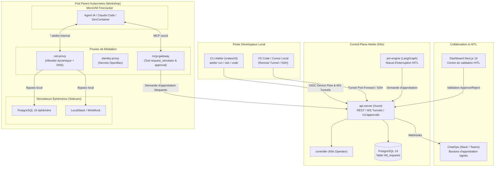
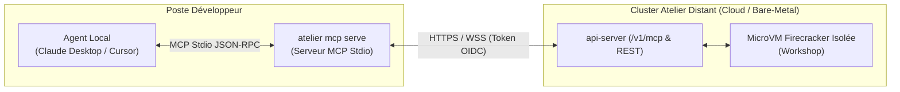
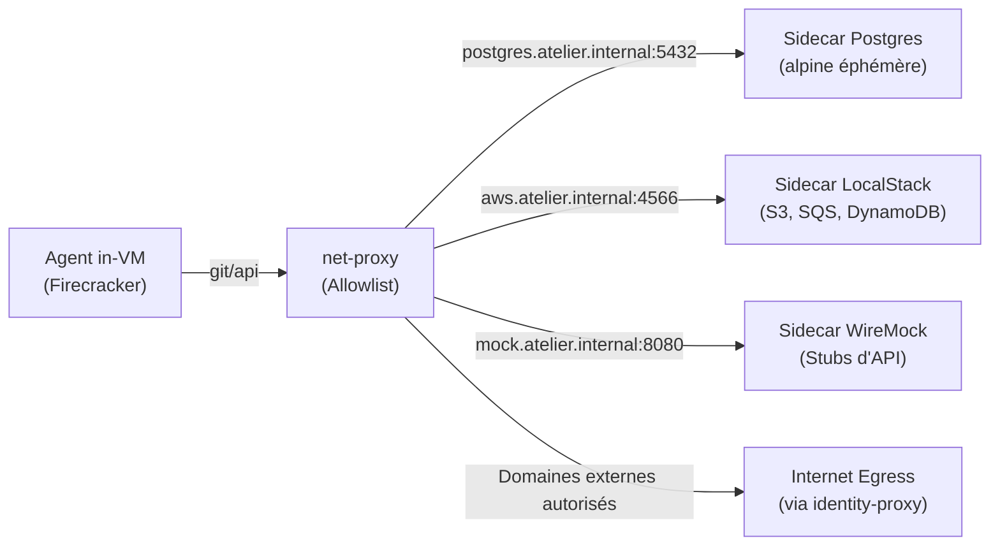
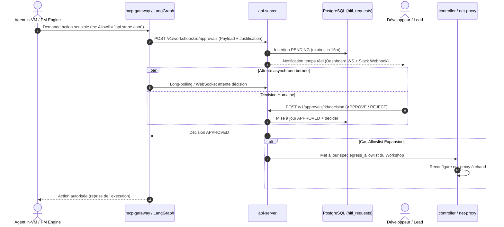

# Spécification Technique : Expérience Développeur (CLI, Pont IDE), Simulateurs Éphémères & Approbations Human-in-the-Loop (HITL)

> **Statut** : Proposé (Document de cadrage technique pour l'Horizon 2)  
> **Date** : 2026-09-05  
> **Auteur** : Équipe Atelier  
> **Principes directeurs** : Conforme à [`00-architecture-principles-substitutability.md`](00-architecture-principles-substitutability.md), prolonge [`04-external-mcp-server.md`](04-external-mcp-server.md), [`05-devfactory-pm-engine.md`](05-devfactory-pm-engine.md), [`06-dashboard-architecture-cadrage.md`](06-dashboard-architecture-cadrage.md) et [`08-equipe-it-consultative.md`](08-equipe-it-consultative.md).

---

## 1. Contexte & Problématique

Les jalons **M1 à M7** ont doté Atelier d'un socle d'exécution hautement sécurisé (microVMs Firecracker isolées, proxies réseau/secrets, quotas LLM LiteLLM, serveur MCP `/v1/mcp`, observabilité OTLP et moteur autonome LangGraph).

Cependant, trois frictions majeures limitent encore l'adoption quotidienne par les développeurs et l'efficacité des agents en entreprise :

1. **Expérience Développeur dépendante du navigateur** : Pour interagir avec un `Workshop`, le développeur doit passer par l'interface web Next.js 16 ou exécuter manuellement des commandes `kubectl`. Il manque un outillage en ligne de commande (`atelier`) permettant de lancer, piloter et connecter son IDE local (VS Code, Cursor) directement au Workshop distant sans friction.
2. **Besoin d'infrastructures d'appoint pour les agents sans accès Internet direct** : Lorsqu'un agent (Claude Code, Gemini CLI) écrit et teste du code, il a fréquemment besoin d'une base PostgreSQL, d'un cache Redis, de S3 ou d'un mock d'API externe. Lui refuser l'accès réseau bloque ses tests ; lui ouvrir l'accès Internet ou à des bases de staging compromet la sécurité. Il manque un catalogue de **simulateurs éphémères in-pod**.
3. **Absence de médiation humaine sur les actions sensibles ("Human-in-the-Loop")** : Si l'agent a besoin d'accéder à un domaine externe non prévu, de lire un secret sensible ou de déclencher une Pull Request critique, le système est soit purement bloquant, soit sans supervision humaine temps réel.

Cette spécification définit l'architecture et les contrats d'interface de ces 3 volets.

---

## 2. Architecture Globale de l'Horizon 2



---

## 3. Volet 1 : Atelier CLI Unifiée (`atelier`) : Client Dev, Pont IDE & Gestionnaire Serveur (Single-Node)

### 3.1. Objectifs
- Fournir un **binaire Rust universel unique** (`crates/cli`, compilé pour Linux, macOS, Windows).
- **Double casquette unifiée** (façon Docker, K3s ou Tailscale) :
  1. **Mode Client Développeur** : piloter ses Workshops, lancer des agents (`atelier run`), ouvrir des tunnels IDE (`atelier code`) et approuver les demandes sensibles (`atelier approvals`).
  2. **Mode Hôte / Serveur Single-Node (`atelier server ...`)** : fusionner et remplacer le script shell d'installation monolithique (`scripts/install.sh` de la spec 10) par un moteur d'installation et de diagnostic natif en Rust, typé, interactif et idempotent.

### 3.2. Arborescence de Commandes Unifiée
```text
atelier
├── context              # Gestion multi-environnements (local kind vs atelier distant entreprise)
│   ├── add <name> --url # Enregistre un cluster Atelier distant (ex: https://api.atelier.acme.corp)
│   ├── use <name>       # Bascule le contexte actif
│   ├── list             # Liste les contextes configurés
│   └── current          # Affiche le contexte et tenant en cours
├── auth
│   ├── login            # Flux OAuth2 Device Code RFC 8628 ou redirection locale
│   ├── logout           # Révocation de session locale
│   └── status           # État du jeton OIDC, utilisateur et tenant actif
├── workshops
│   ├── list             # Liste les workshops du contexte distant actif
│   ├── create           # Crée un Workshop (--repo, --devcontainer, --budget)
│   ├── status <id>      # Affiche l'état (Building, Running, Suspended)
│   ├── stop / resume    # Mise en veille / reprise snapshot
│   └── delete <id>      # Suppression et nettoyage des ressources
├── run <id|--repo>      # Lance un agent (Claude Code / Gemini) avec stream du terminal
├── ssh <id>             # Ouvre un terminal interactif PTY direct in-VM via WebSocket
├── port-forward <id>    # Mappe un port local vers la microVM distante (ex: 8080:8080)
├── code <id>            # Configure et lance l'IDE local (VS Code / Cursor) en Remote
├── mcp                  # [NOUVEAU] Fournisseur de serveur MCP local pour agents desktop
│   ├── serve            # Lance le serveur MCP (stdio / SSE) pour Claude Desktop ou Cursor
│   └── install-config   # Injecte la configuration MCP dans claude_desktop_config.json
├── approvals
│   ├── list             # Liste les demandes HITL en attente
│   └── approve / reject # Valide ou rejette une demande avec justification
└── server               # Gestion du cycle de vie du serveur (Hôte Single-Node)
    ├── install          # Installation complète K3s + Helm + Ingress + Atelier
    ├── doctor           # Diagnostic pré-vol (/dev/kvm, mémoire, ports 80/443, DNS)
    ├── status           # État des pods, services K8s et certificats TLS
    ├── upgrade          # Mise à niveau idempotente du chart et des images
    └── uninstall        # Nettoyage propre et désinstallation des composants
```

### 3.3. Gestion Multi-Contextes (Support d'Atelier Distant / Multi-Tenant)
La CLI permet de basculer instantanément entre un cluster de développement local (Kind) et des plateformes Atelier d'entreprise hébergées à distance (EKS, GKE, bare-metal privé) :
- Fichier de configuration `~/.config/atelier/config.yaml` (avec permissions restreintes 0600).
- Chaque contexte mémorise : l'URL de l'`api-server`, l'issuer OIDC, et la clé d'entrée dans le trousseau sécurisé OS (`keyring`).
- Bascule fluide : `atelier context use prod-eu` redirige immédiatement toutes les requêtes subséquentes vers le cluster de production européen.

### 3.4. Serveur MCP Local pour Agents Desktop (`atelier mcp serve`)
Permet à un agent exécuté localement sur le poste du développeur (Claude Desktop, Cursor, scripts IA locaux) de bénéficier de la puissance et de la sécurité des microVMs isolées d'Atelier sans quitter son interface habituelle.



#### Outils MCP exposés à l'agent local :
1. `atelier_create_sandbox(repo_url, devcontainer_path, max_budget_usd)` : Provisionne à la volée une microVM distante dédiée à la tâche.
2. `atelier_list_sandboxes()` : Liste les sandboxes actives de l'utilisateur.
3. `atelier_exec_in_sandbox(workshop_id, command)` : Exécute une commande shell hermétique in-VM et retourne stdout/stderr (streaming bufferisé dans Postgres).
4. `atelier_read_file(workshop_id, path)` : Lit un fichier du workspace distant.
5. `atelier_write_file(workshop_id, path, content)` : Écrit ou modifie un fichier dans la microVM.
6. `atelier_git_diff(workshop_id)` : Inspecte les modifications de code effectuées in-VM.
7. `atelier_suspend(workshop_id)` / `atelier_resume(workshop_id)` : Gère la mise en veille avec snapshot mémoire.

#### Intégration en une commande dans Claude Desktop :
```bash
atelier mcp install-config --context prod-eu
```
Cette commande met à jour automatiquement `claude_desktop_config.json` :
```json
{
  "mcpServers": {
    "atelier": {
      "command": "atelier",
      "args": ["mcp", "serve", "--context", "prod-eu"]
    }
  }
}
```

### 3.5. Intégration du Moteur d'Installation Serveur (`atelier server install`)
La logique actuellement portée par `scripts/install.sh` (spec 10) est encapsulée dans le sous-module `atelier::server` :
1. **Diagnostic Pré-Vol (`atelier server doctor`)** :
   - Vérification de l'accès matériel réel à `/dev/kvm` (ioctl direct `KVM_GET_API_VERSION`).
   - Vérification de la mémoire vive disponible (>= 8 Go recommandés), de l'espace disque et des ports 80 / 443.
   - Détection de l'architecture CPU (`x86_64` ou `aarch64`).
2. **Orchestration Idempotente (`atelier server install`)** :
   - Déploiement de k3s avec désactivation des composants en conflit (`traefik`, `servicelb`).
   - Installation d'`ingress-nginx` (4.15.x) et de `cert-manager` (v1.21.x) avec Let's Encrypt `ClusterIssuer`.
   - Génération cryptographique sécurisée des secrets (mots de passe PostgreSQL, OpenBao tokens, LiteLLM salt).
   - Application du chart Helm `charts/atelier` avec feedback terminal riche (barres de progression et spinners via `indicatif`).
   - Écriture d'un fichier d'inventaire sécurisé (`credentials.txt` chmod 0600).
3. **Script Bootstrap Allégé** :
   Le script d'installation distant devient un simple téléchargeur du binaire Rust :
   ```bash
   curl -fsSL https://get.atelier.dev | sh
   # Télécharge le binaire `atelier` dans /usr/local/bin et lance automatiquement:
   sudo atelier server install --domain atelier.exemple.com --email admin@exemple.com
   ```

### 3.6. Authentification CLI (RFC 8628 Device Authorization Grant)
Pour éviter la manipulation de tokens statiques :
1. Le développeur tape `atelier auth login`.
2. La CLI sollicite `/v1/auth/device/code` sur l'`api-server` (qui relaie vers Keycloak/Entra ID).
3. La CLI affiche l'URL de connexion et le code utilisateur (ex: `WDJB-MJHT`).
4. L'utilisateur valide dans son navigateur ; la CLI poll le token OIDC avec un intervalle strict et stocke les tokens dans le trousseau de clés du système d'exploitation (`keyring` Rust).

### 3.7. Pont IDE (VS Code & Cursor Remote)
Pour connecter un VS Code local à la microVM distante sans exposer de port SSH sur Internet :
1. `atelier code <workshop-id>` initie un port-forward local sécurisé vers le port `code-server` / SSH interne du Workshop via l'endpoint WebSocket `/v1/workshops/:id/tunnels/vscode`.
2. La CLI utilise un proxy de commande SSH dynamique :
   ```text
   ProxyCommand: atelier port-forward --stdio <workshop-id> 22
   ```
3. La CLI invoque `code --remote ssh-remote+atelier-<workshop-id> /workspace` (ou `cursor`).

---

## 4. Volet 2 : Catalogue de Simulateurs Éphémères in-VM

### 4.1. Problématique
Les agents de code ont besoin de tester leurs développements contre de vraies dépendances (base de données relationnelle, broker, mock API). Exécuter Docker in-Docker dans la microVM Firecracker est complexe et alourdit la VM.

### 4.2. Architecture des Simulateurs en Sidecars
Plutôt que d'alourdir la microVM, les simulateurs sont déployés comme **conteneurs sidecars éphémères dans le Pod Parent Kubernetes du Workshop**, gérés par le `controller` :

1. **Réseau Local Privé** : Les sidecars écoutent sur le loopback ou une interface virtuelle du pod parent.
2. **Résolution DNS & Routage** : `net-proxy` résout automatiquement les domaines internes de type `<simulateur>.atelier.internal` vers le port local dédié.
3. **Zéro Egress** : Aucune donnée ne sort du pod ; le trafic reste confiné dans le nœud.



### 4.3. Extension du CRD `Workshop`
Le schéma du CRD s'enrichit d'un bloc `simulators` :
```yaml
apiVersion: atelier.dev/v1alpha1
kind: Workshop
metadata:
  name: feature-auth-backend
spec:
  devcontainer:
    gitUrl: https://git.atelier.internal/org/auth-service.git
  simulators:
    - name: postgres
      version: "16-alpine"
      env:
        POSTGRES_DB: testdb
        POSTGRES_USER: dev
        POSTGRES_PASSWORD: devpassword
    - name: localstack
      services: ["s3", "sqs"]
    - name: wiremock
      stubsDirectory: "./tests/mocks"
```

### 4.4. Activation Dynamique à Chaud via MCP (`request_simulator`)
L'agent peut également demander un simulateur en cours d'exécution si le devcontainer ne l'a pas déclaré à l'avance.
L'agent in-VM appelle l'outil `request_simulator` exposé par `mcp-gateway` :
```json
{
  "tool": "request_simulator",
  "arguments": {
    "type": "postgres",
    "version": "16",
    "options": { "database": "orders_test" }
  }
}
```
`mcp-gateway` relaie la requête au `controller` qui met à jour la ressource `Workshop` pour insérer le sidecar à chaud ou démarre un process léger in-VM selon les capabilities.

---

## 5. Volet 3 : Workflow Collaboratif & Approbations "Human-in-the-Loop" (HITL)

### 5.1. Cas d'Usage Nécessitant Approbation
Une approbation humaine est requise pour 3 catégories d'événements à risque :
1. `ALLOWLIST_EXPANSION` : L'agent a besoin d'accéder à un domaine externe absent de la spec initiale (ex: téléchargement d'un nouveau paquet sur un dépôt non déclaré).
2. `SECRET_REQUEST` : Demande d'injection d'un token à portée sensible (ex: token de déploiement, accès Cloud).
3. `PR_GATEWAY` : Validation finale de la Pull Request générée par le PM Engine avant publication ou fusion.

### 5.2. Schéma de Données (`hitl_requests`)
Une nouvelle table PostgreSQL est gérée par `api-server` :
```sql
CREATE TYPE hitl_status AS ENUM ('PENDING', 'APPROVED', 'REJECTED', 'EXPIRED');
CREATE TYPE hitl_category AS ENUM ('ALLOWLIST_EXPANSION', 'SECRET_REQUEST', 'PR_GATEWAY', 'SHELL_COMMAND');

CREATE TABLE hitl_requests (
    id UUID PRIMARY KEY DEFAULT gen_random_uuid(),
    workshop_id VARCHAR(128) NOT NULL,
    category hitl_category NOT NULL,
    requested_by VARCHAR(128) NOT NULL, -- "agent/claude-code" ou "pm-engine"
    payload JSONB NOT NULL,             -- Détails de la demande (ex: domaine, justification)
    status hitl_status NOT NULL DEFAULT 'PENDING',
    decided_by VARCHAR(128),            -- Email / sub OIDC de l'approbateur
    decision_reason TEXT,
    created_at TIMESTAMPTZ NOT NULL DEFAULT NOW(),
    expires_at TIMESTAMPTZ NOT NULL DEFAULT (NOW() + INTERVAL '15 minutes'),
    decided_at TIMESTAMPTZ
);

CREATE INDEX idx_hitl_workshop ON hitl_requests(workshop_id, status);
```

### 5.3. Déroulement du Workflow d'Approbation



### 5.4. Intégrations Multi-Canaux
1. **Dashboard Next.js 16** :
   - Bandeau sticky d'alerte en haut du dashboard dès qu'une demande `PENDING` concerne un workshop de l'utilisateur.
   - Fenêtre modale de comparaison (diff avant/après, justification fournie par l'IA).
2. **ChatOps (Slack / Teams)** :
   - Webhook sortant formaté avec Block Kit / Adaptive Cards.
   - Boutons interactifs « Approuver » et « Rejeter ».
   - Endpoint `/v1/webhooks/slack/interactions` validant la signature cryptographique HMAC du webhook avant de commuter l'état dans la base de données.
3. **CLI** :
   - Notification dans la sortie terminal : `Demande d'accès réseau à api.stripe.com en attente. Tapez 'atelier approve <id>' pour débloquer.`

---

## 6. Sécurité & Substituabilité

1. **Principe du Moindre Privilège & RBAC** :
   - Un utilisateur ne peut approuver que les requêtes des Workshops dont il est propriétaire ou pour lesquels il possède le rôle `maintainer` dans le groupe OIDC.
2. **Expiration Automatique (Fail-Closed)** :
   - Toute demande HITL sans réponse à expiration de son TTL (15 minutes par défaut) passe en `EXPIRED` et renvoie une erreur `PermissionDenied` à l'agent.
3. **Audit Immuable** :
   - Chaque décision (approbation ou refus) est enregistrée avec le `sub` OIDC de l'approbateur, son horodatage et son IP pour traçabilité complète dans les audits SOC2 / ISO 27001.

---

## 7. Plan d'Implémentation par Lots (Phasage)

| Lot | Intitulé | Livrables Clés | Dépendances |
| :--- | :--- | :--- | :--- |
| **14.1** | **Atelier CLI (Socle & Auth)** | Crate `crates/cli`, commandes `auth login/status`, `workshops list/status`, intégration `keyring`. | M1 (api-server OIDC) |
| **14.2** | **Pont Tunnels CLI & IDE** | Commandes `atelier ssh`, `atelier port-forward`, `atelier code`, relayage WS Axum vers PTY/code-server. | M1, M4 |
| **14.3** | **Simulateurs Sidecars (Spec & K8s)** | Extension CRD `WorkshopSpec.simulators`, réconciliation des sidecars dans `controller`, routage DNS dans `net-proxy`. | M1, M2 |
| **14.4** | **Outil MCP `request_simulator`** | Extension de `mcp-gateway` pour l'activation dynamique in-VM. | 14.3, M4 |
| **14.5** | **Socle HITL (Backend & DB)** | Table `hitl_requests`, routes `/v1/workshops/:id/approvals`, long-polling/WS dans `api-server`. | M1 |
| **14.6** | **Interface HITL (Dashboard & CLI)** | Composants UI Next.js 16 d'approbation, commandes `atelier approvals list/approve`. | 14.1, 14.5 |
| **14.7** | **Intégrations ChatOps (Slack Webhooks)** | Envoi de notifications Slack signées et réception des interactions de vote. | 14.5 |
| **14.8** | **Moteur Serveur Single-Node (`atelier server`)** | Commandes `atelier server install/doctor/status/upgrade/uninstall` (fusion et remplacement de `scripts/install.sh`), script bootstrap `curl \| sh`. | Spec 10, 14.1 |
| **14.9** | **Serveur MCP Local pour Agents Desktop (`atelier mcp`)** | Commande `atelier mcp serve` (stdio JSON-RPC relayant vers l'API distante), injection auto `atelier mcp install-config` dans `claude_desktop_config.json`. | 14.1, M4 |
