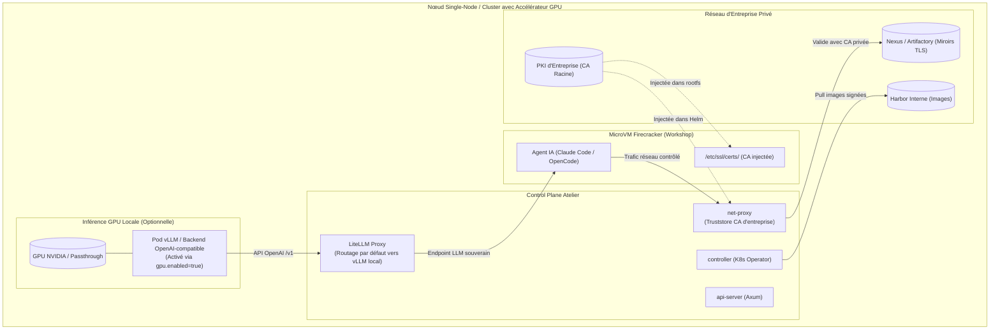

# Spécification Technique : Déploiement Souverain, Inférence GPU Locale (vLLM) & CAs Privées (Air-Gap)

> **Statut** : Document de Cadrage Technique (Jalon M11)  
> **Date** : 2026-09-05  
> **Auteur** : Équipe Atelier  
> **Principes directeurs** : Conforme à [`00-architecture-principles-substitutability.md`](00-architecture-principles-substitutability.md), étend [`03-litellm-proxy.md`](03-litellm-proxy.md) et s'articule avec [`14-devex-cli-simulateurs-hitl.md`](14-devex-cli-simulateurs-hitl.md).

---

## 1. Contexte & Objectifs

Dans les environnements d'entreprise régulés (banque, défense, santé, OIV) ou les installations bare-metal souveraines :
1. **L'inférence LLM doit pouvoir être 100% locale** : Aucune donnée ne doit transiter vers un fournisseur d'API cloud (OpenAI, Anthropic). Sur une machine ou un cluster équipé de GPUs (NVIDIA/AMD), Atelier doit fournir un backend d'inférence local prêt à l'emploi.
2. **Le réseau peut être déconnecté (Air-Gap)** : Les images, manifestes et dépendances doivent pouvoir être ingérés depuis des registres d'entreprise privés (Harbor, Nexus).
3. **Les certificats d'autorité d'entreprise (PKI interne) doivent être reconnus** : Les outils de développement in-VM (`git`, `npm`, `pip`, `cargo`, `curl`) et `net-proxy` doivent valider les certificats internes signés par la CA d'entreprise sans désactiver la sécurité TLS.

---

## 2. Architecture Globale



---

## 3. Spécification Détaillée

### 3.1. Backend vLLM Local dans LiteLLM (tâche 11.3, **implémentée**)

Pour les déploiements mono-machine (`atelier server install --enable-gpu`, tâche 11.4) ou les clusters Kubernetes disposant de ressources GPU :

1. **Composant Helm Dédié** — `charts/atelier/templates/infra/vllm-statefulset.yaml` (image officielle `vllm/vllm-openai`, un seul réplica, `volumeClaimTemplates` pour le cache HuggingFace afin de ne pas retélécharger les poids à chaque redémarrage) et `vllm-service.yaml`, déclarés dans `charts/atelier/values.yaml` section `gpu` (`enabled`, `model`, `maxModelLen`, `tensorParallelSize`, `resources.limits."nvidia.com/gpu"`, `persistence.size`).
2. **Câblage Automatique dans LiteLLM** — **correction par rapport à la première rédaction** : il n'existe PAS de `charts/atelier/templates/litellm-configmap.yaml` dans ce chart, ni nulle part ailleurs — `litellm-deployment.yaml` positionne `STORE_MODEL_IN_DB=True` et TOUS les modèles LiteLLM de ce chart sont gérés dynamiquement via l'API d'administration (`POST /model/new`, spec [`11-admin-litellm-model-config.md`](11-admin-litellm-model-config.md)), jamais via un fichier statique. Nouveau `charts/atelier/templates/jobs/litellm-vllm-model-init-job.yaml` (hook Helm `post-install,post-upgrade`, image `curlimages/curl`) enregistre donc le backend vLLM local en appelant cette même API, gardé derrière `gpu.enabled && litellm.enabled && initJobs.litellmVllmModelInit.enabled` :
   - `model_name: "*"` (wildcard), pas `"default"` — même convention que `deploy/dev/llm-proxy/config.yaml` (le nom de modèle envoyé par l'agent change selon sa version/son CLI ; un wildcard capte tout ce qui n'est pas explicitement routé ailleurs, exactement le comportement recherché pour "modèle par défaut GPU local").
   - `litellm_params.model: "hosted_vllm/<gpu.model>"` (préfixe de provider LiteLLM dédié aux backends vLLM auto-hébergés compatibles OpenAI, pas `openai/...`), `api_base` vers le Service `vllm` interne, `api_key: "not-needed"` (vLLM n'exige aucune authentification en local).
   - **Idempotence sans `jq`** (absent de l'image `curlimages/curl`) : `GET /model/info` avant toute création, détection par simple présence de la chaîne `api_base` (stable et propre à ce backend) dans la réponse — nécessaire car LiteLLM ne garantit pas l'unicité de `model_name` (spec 11 §3.2), un `/model/new` rejoué à chaque `helm upgrade` dupliquerait sinon l'entrée wildcard indéfiniment. **Piège vérifié et écarté empiriquement** contre l'instance LiteLLM réelle du cluster de dev (`atelier-llm-proxy`, `STORE_MODEL_IN_DB=True`) : la RÉPONSE de `POST /model/new` chiffre `litellm_params.api_base` (chaîne illisible, cohérent avec la note non expliquée de la spec 11 §3.1) — mais `GET /model/info`, LUI, le renvoie bien EN CLAIR, confirmé par un Job jetable réel (création réussie `200`, `api_base` retrouvé en clair via `/model/info`, second passage détecté comme "déjà présent", entrée de test supprimée après coup).
   - L'agent de code in-VM (`Claude Code`, `opencode`) consomme le proxy LiteLLM sur `http://169.254.0.1:4000` (alias `llm-proxy` de `net-proxy`) sans changer sa configuration standard ; budgets et Virtual Keys par Workshop continuent de s'appliquer normalement (mécanisme LiteLLM inchangé, orthogonal au choix du backend).
3. **Intégration CLI Single-Node (`atelier server install --enable-gpu`)** : tâche 11.4, non couverte ici.
4. **Non vérifié en conditions réelles d'inférence** : cette machine de développement possède un GPU physique (NVIDIA RTX 3060) mais ni `nvidia-container-toolkit` ni un device plugin Kubernetes `nvidia.com/gpu` n'y sont installés (`docker run --gpus all` échoue explicitement : `could not select device driver`) — les installer serait un changement système invasif (modification du runtime Docker par défaut) hors du périmètre raisonnable de cette tâche sur une machine de dev partagée. Le `StatefulSet` vLLM lui-même n'a donc jamais été réellement déployé/testé (resterait `Pending`, aucun nœud n'exposant la ressource `nvidia.com/gpu`) : seuls `helm lint`/`helm template` (rendu vérifié avec `gpu.enabled: true`) et `shellcheck` (script du Job d'enregistrement) le couvrent côté template ; la logique métier du Job (idempotence, forme du payload) est, elle, vérifiée en réel comme décrit ci-dessus.

### 3.2. Prise en Charge des CAs Privées d'Entreprise

Pour résoudre les blocages `SSL: CERTIFICATE_VERIFY_FAILED` fréquents en entreprise :

1. **Configuration Centralisée Helm** (tâche 11.1, **implémentée**) :
   ```yaml
   tls:
     customCaBundle: |
       -----BEGIN CERTIFICATE-----
       MIIE... (Certificat racine d'entreprise)
       -----END CERTIFICATE-----
   ```
   Monté par le chart en ConfigMap `<release>-ca-bundle` (`charts/atelier/templates/infra/ca-bundle-configmap.yaml`).
2. **Correction par rapport à la première rédaction de cette spec** : `net-proxy` ne termine **jamais** TLS sur le chemin de relais egress — vérifié dans le code (`crates/net-proxy/src/proxy.rs`, `crates/net-proxy/src/tls_sni.rs`) : que ce soit via `CONNECT` (tunnel `TcpStream` brut, octets non interprétés) ou via la détection SNI transparente (lecture du seul champ `server_name` en clair du `ClientHello`, jamais un déchiffrement), le trafic HTTPS relayé reste chiffré de bout en bout entre la microVM et sa vraie destination. Une CA d'entreprise dans `net-proxy` ne pourrait donc rien "inspecter" sans une réécriture MITM complète — hors périmètre, et contraire à la conception documentée du module. Le point réel où la CA d'entreprise doit être approuvée est donc **où TLS est réellement terminé** : côté client, à chaque appelant Rust (`reqwest`, backend `rustls`, qui ne consulte ni le magasin système ni `SSL_CERT_FILE`) et côté outillage in-VM (`git`/`npm`/`pip`/`cargo`/`curl`, §3.3 ci-dessous).
   - Mécanisme générique implémenté dans `crates/common/src/tls_client.rs::client_builder_trusting_extra_ca` (généralise l'`ATELIER_JWT_CA_PATH` pré-existant d'`api-server`) : construit un `reqwest::ClientBuilder` qui fait confiance à la CA d'entreprise en plus des CA publiques. **Piège trouvé en vérifiant** : `reqwest::Certificate::from_pem` (backend `rustls-tls-native-roots`) accepte silencieusement un PEM structurellement invalide (octets arbitraires, ou en-têtes PEM avec un corps base64 corrompu) sans jamais retourner d'erreur — validé explicitement au préalable avec `rustls_pemfile::certs`.
   - Câblé côté `api-server` : quand `tls.customCaBundle` est renseignée et qu'aucun `ATELIER_JWT_CA_PATH` explicite n'est déjà fourni via `apiServer.env`, le chart positionne automatiquement `ATELIER_JWT_CA_PATH` sur le fichier monté — couvre le cas réel `keycloak.external.enabled` avec un IdP d'entreprise derrière une CA privée. Vérifié par `helm template` (ConfigMap rendue, montage, variable positionnée, et override explicite respecté).
   - Non fait dans cette tâche, laissé à une suite : aucun autre `reqwest::Client` du workspace n'a aujourd'hui de véritable besoin de cette CA (les autres appels HTTPS sortants observés sont soit en clair intra-cluster, soit inexistants) — le mécanisme est en place et testé unitairement, mais `api-server`/JWKS reste son seul consommateur réel pour l'instant.
3. **Propagation dans les MicroVMs** (tâche 11.2, **implémentée**) :
   - Le controller retransmet le nom de la `ConfigMap` (`ctx.ca_bundle_configmap`, `ATELIER_CA_BUNDLE_CONFIGMAP`) au Job `image-builder` qu'il crée, monté à `/etc/atelier/ca/ca.crt` (`ensure_image_build_job`, `crates/controller/src/reconcile.rs`) et transmis par `ATELIER_CA_BUNDLE_PATH`.
   - **Correction par rapport à la première rédaction** : `update-ca-certificates` n'est jamais invoqué — ce binaire n'existe pas forcément dans l'image de base cible, et l'exécuter en `chroot` depuis le conteneur `image-builder` (architecture/libc potentiellement différentes) est fragile. À la place, `crates/image-builder/src/main.rs::append_pem_to_bundle_file` ajoute directement la CA au bundle système déjà présent (`/etc/ssl/certs/ca-certificates.crt`, paquet `ca-certificates`) — un **ajout, jamais un remplacement** : remplacer casserait tout accès HTTPS public (PyPI, npm, GitHub...) pour les mécanismes qui font confiance à ce seul fichier. Ce mécanisme sert à DEUX endroits distincts :
     - `trust_enterprise_ca_bundle_for_this_process` : le PROPRE magasin de confiance du conteneur `image-builder` — nécessaire pour son `git clone` (`ensure_workspace_clone`, tourne sur ce pod, PAS relayé/déchiffré par `net-proxy`, voir la correction de la tâche 11.1).
     - `inject_enterprise_ca_bundle` : le rootfs PRODUIT, pour `git`/`curl`/`pip`/`cargo` (OpenSSL) IN-VM au runtime du Workshop, via `GIT_SSL_CAINFO`/`CURL_CA_BUNDLE`/`REQUESTS_CA_BUNDLE`/`PIP_CERT`/`SSL_CERT_FILE` pointés sur le bundle combiné.
   - **Cas particulier Node.js/`npm`** : Node ne consulte JAMAIS le magasin système, même après cet ajout — `NODE_EXTRA_CA_CERTS` (mécanisme additif propre à Node, documenté officiellement) pointe sur une copie brute dédiée (`/usr/local/share/ca-certificates/atelier-ca.crt`), déposée dans tous les cas.
   - **Limite assumée et documentée** : seules les images de base Debian/Ubuntu (bundle système à `/etc/ssl/certs/ca-certificates.crt`) bénéficient de la couverture complète — une image RHEL/Fedora (`/etc/pki/tls/certs/ca-bundle.crt`) ne reçoit que `NODE_EXTRA_CA_CERTS`, jamais testée faute d'image de ce type dans ce workspace. `envbuilder` (microVM builder jetable, `crates/builder-vm-init`) — utilisé pour RÉSOUDRE le devcontainer.json et exécuter `postCreateCommand`/features avant que ce rootfs ne soit exporté — n'est PAS couvert par cette tâche : un devcontainer dont les features ont besoin d'un miroir npm/pip d'entreprise AU MOMENT DU BUILD échouerait encore. Laissé à une suite (nécessiterait d'injecter la CA dans le rootfs de LA microVM builder elle-même, `crates/builder-vm-init/Dockerfile`, un chantier distinct).

### 3.3. Outillage Déconnecté (Air-Gap Packaging)

1. **Préfixage Universel des Registres** :
   - Le chart supporte `.Values.global.imageRegistry` pour rediriger l'ensemble des images (`api-server`, `controller`, `vm-supervisor`, `net-proxy`, `identity-proxy`, `mcp-gateway`, `envbuilder`) vers le registre d'entreprise privé (ex: `harbor.internal.corp/atelier`).
2. **Script d'Export Autonome (`scripts/airgap-bundle.sh`)** :
   - Lit la liste complète des images requises pour une version donnée d'Atelier.
   - Utilise `skopeo copy` ou `docker save` pour générer une archive portable `atelier-images-<version>.tar.gz`.
   - Fournit la commande d'import inverse :
     ```bash
     ./scripts/airgap-bundle.sh import --registry harbor.internal.corp/atelier
     ```

---

## 4. Garde-Fous & Pièges Évités

1. **Substituabilité Respectée** :
   - Atelier n'impose pas vLLM : si l'entreprise utilise déjà Ollama, TGI, TensorRT-LLM ou un cluster GPU externe, il suffit de renseigner son URL dans LiteLLM. vLLM n'est qu'un composant optionnel de commodité.
2. **Pas d'Ordonnancement Multi-Cluster Artificiel** :
   - Chaque instance d'Atelier reste scopée à son cluster. Pour une séparation physique (cluster public vs cluster confidentiel), on déploie deux instances d'Atelier indépendantes.
3. **Zéro Baisse de Sécurité TLS** :
   - Ne jamais proposer de flag `insecure-skip-tls-verify` généralisé. L'injection de la CA racine est la seule approche propre et conforme aux politiques de sécurité d'entreprise.

---

## 5. Phasage Opérationnel

| Tâche | Description | Composants |
| :--- | :--- | :--- |
| **11.1** | Support de `customCaBundle` dans Helm et injection dans `net-proxy` | `charts/atelier`, `crates/net-proxy` |
| **11.2** | Injection automatique de la CA d'entreprise dans le rootfs des microVMs | `crates/image-builder`, `crates/guest-init` |
| **11.3** | Composant Helm optionnel `gpu.vllm` et templating de route par défaut LiteLLM | `charts/atelier`, `templates/litellm` |
| **11.4** | Détection GPU et flag `--enable-gpu` dans `atelier server install` | `crates/cli` |
| **11.5** | Script d'export/import d'images conteneurs déconnecté (`airgap-bundle.sh`) | `scripts/` |
