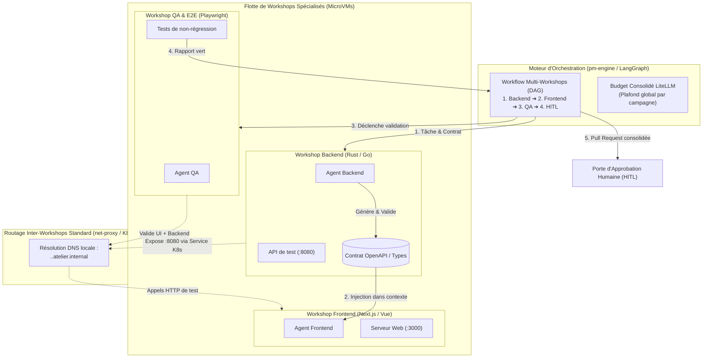

# Spécification Technique : Workflows Multi-Workshops & Orchestration d'Équipes d'Agents

> **Statut** : Document de Cadrage Technique (Jalon M12)  
> **Date** : 2026-09-05  
> **Auteur** : Équipe Atelier  
> **Principes directeurs** : Conforme à [`00-architecture-principles-substitutability.md`](00-architecture-principles-substitutability.md), prolonge [`05-devfactory-pm-engine.md`](05-devfactory-pm-engine.md) et s'articule avec [`14-devex-cli-simulateurs-hitl.md`](14-devex-cli-simulateurs-hitl.md).

---

## 1. Contexte & Problématique

Jusqu'au Jalon M8, un Workshop Atelier isole un unique agent dans une unique microVM.

Pour des chantiers d'ingénierie logicielle d'envergure (ex: ajout d'une fonctionnalité complète touchant un backend Rust/Go et une interface Next.js/React) :
1. **Saturation du contexte LLM** : Forcer un agent unique à comprendre et modifier l'ensemble de la base de code polyglotte entraîne des hallucinations, des pertes d'instructions et un coût prohibitif en tokens.
2. **Incompatibilité des environnements** : Vouloir faire cohabiter tous les runtimes (Rust nightly, Node.js, Python, bases de données) dans un seul devcontainer alourdit inutilement l'image et crée des conflits d'outillage.
3. **Nécessité de spécialisation** : Le développement moderne s'organise en rôles spécialisés :
   - *Agent Backend* : Développe l'API et génère la spécification du contrat (OpenAPI / protobuf).
   - *Agent Frontend* : Implémente l'interface utilisateur en consommant le contrat et l'API de test.
   - *Agent QA & E2E* : Valide les parcours utilisateurs et teste les cas limites.

Plutôt que d'instaurer un réseau maillé complexe ou des discussions directes et anarchiques entre LLMs (sujettes aux boucles infinies de bavardage), Atelier orchestre des **Workshops spécialisés coordonnés par contrats via `pm-engine`**.

---

## 2. Architecture Globale (Workflow Dirigé par Contrats)



---

## 3. Spécification Détaillée

### 3.1. Orchestration Dirigée par Contrats (Élimination du "Chatter Loop")

Au lieu de faire communiquer les agents en Peer-to-Peer de manière asynchrone non structurée :
1. **Séquencement par Graphe (LangGraph dans `pm-engine`)** :
   - Le travail est ordonnancé selon un graphe dirigé acyclique (DAG) strict.
   - **Étape 1 (Backend)** : L'agent Backend implémente l'endpoint, valide ses tests unitaires et produit le fichier de contrat (`openapi.yaml` ou `schema.graphql`).
   - **Étape 2 (Publication du Contrat)** : `pm-engine` extrait le contrat validé et l'injecte sous forme de contexte immuable dans le prompt de l'agent Frontend.
   - **Étape 3 (Frontend)** : L'agent Frontend sait exactement quelle structure consommer sans jamais avoir besoin de dialoguer avec l'agent Backend.
2. **Garantie de Convergence** :
   - Aucun échange informel entre LLMs : chaque agent travaille sur un périmètre clairement délimité avec des entrées/sorties typées.

### 3.2. Interconnexion Inter-Workshops Standard (Zero WireGuard) — tâche 12.1, **implémentée**

Pour que le Frontend puisse tester dynamiquement l'API du Backend pendant son développement :
1. **Ports Exportés dans `WorkshopSpec`** :
   - Le CRD `Workshop` supporte une liste d'endpoints exportés :
     ```yaml
     spec:
       exportedServices:
         - name: api
           port: 8080
     ```
2. **Routage K8s Natif via `net-proxy` & Validation Stricte des Cibles — correction par rapport à la première rédaction** :
   - **Un port applicatif du guest n'existe QUE dans le netns de la microVM** — vérifié dans le code (`crates/controller/src/guest_probe.rs`, doc de tête : "pas de port exposé directement sur l'IP du pod", seul le relais WebSocket multiplexé `/portforward` de `net-proxy`, réservé au chemin externe `api-server`→Workshop, y accède). Un `Service` Kubernetes ne peut donc PAS cibler l'IP du guest (hors netns du pod, injoignable depuis un autre pod) : il cible `net-proxy` du Workshop exportateur, qui relaie lui-même vers son PROPRE guest. Nouveau `crates/net-proxy/src/ingress.rs` : un relais TCP simple (`tokio::io::copy_bidirectional`) par service exporté, PAS le protocole `portforward.k8s.io`-like (réservé au chemin externe, inutile entre deux composants du même pod).
   - Le `controller` expose un `Service` Kubernetes standard pour chaque service exporté (`<workshop-name>-<service>`, `crates/controller/src/reconcile.rs::ensure_exported_service`), sélecteur = pod parent (`atelier.dev/workshop`).
   - **Résolution — correction** : pas un résolveur DNS dans `net-proxy` (jamais besoin de résoudre `*.atelier.internal` lui-même, même raisonnement que `git.atelier.internal`) — le `controller` résout chaque cible en ClusterIP RÉEL du Service correspondant (`resolve_allowed_internal_targets`, même méthode que `git_identity::resolve_cluster_ip`) et transmet `alias=ip:port` à `net-proxy` du Workshop DEMANDEUR via `ATELIER_ALLOWED_INTERNAL_TARGETS`.
   - **Validation Nominative des Cibles (Zero Wildcard)** :
     * Il est formellement interdit d'autoriser `*.atelier.internal` en wildcard — table `squad` de `crates/net-proxy/src/internal.rs` (séparée de `simulators`, même mécanisme textuel), recherche de clé EXACTE, jamais un suffixe/motif.
     * Le `controller` n'injecte dans la configuration `net-proxy` du Workshop client QUE les cibles explicitement déclarées dans les dépendances du workflow (`allowed_internal_targets: ["api.ws-backend.atelier.internal:8080"]`).
     * Toute requête vers une cible non listée est traitée comme n'importe quel hôte inconnu par `net-proxy` (correction : pas un `403 Forbidden` dédié, comportement standard déjà en place pour tout alias non résolu).
3. **Cloisonnement au Niveau Réseau Kubernetes (`NetworkPolicy`)** :
   - Pour empêcher tout contournement par IP brute au niveau socket :
   - Le `controller` génère une `NetworkPolicy` PAR WORKSHOP de la campagne (`campaign_network_policy`) : seuls les pods portant le même label `atelier.dev/campaign-id: <id>` ET le même `atelier.dev/owner-group` (posés sur le pod parent UNIQUEMENT si `campaign_id` est renseigné) sont autorisés à établir une connexion entrante. Tout trafic transversal inter-projets ou inter-utilisateurs est détruit au niveau noyau (`DROP` implicite d'une `NetworkPolicy` de type `Ingress` sans règle correspondante) — en plus, jamais à la place, de la validation applicative "Zero Wildcard" ci-dessus.
4. **Authentification de Session Inter-Workshops (`identity-proxy`)** — tâche 12.2, non couverte ici :
   - `identity-proxy` injecte un jeton éphémère d'escouade (`X-Atelier-Squad-Token`) signé par le Controller avec un TTL court (15 min).
   - Le proxy du Workshop récepteur valide le jeton et le `campaign-id` avant de transférer la connexion à l'application in-VM.
   - Les règles d'allowlist egress vers Internet restent 100% actives et indépendantes.

### 3.3. Isolation et Consolidation Git

1. **Branches Dédiées par Rôle** :
   - `pm-engine` provisionne une sous-branche par Workshop à partir de l'issue mère :
     - `feature/auth-backend`
     - `feature/auth-frontend`
2. **Consolidation Automatisée par `pm-engine`** :
   - Une fois les tests de chaque sous-branche validés :
     1. `pm-engine` fusionne les sous-branches sur une branche d'intégration commune.
     2. Déclenche le Workshop QA pour exécuter les tests end-to-end de non-régression.
     3. Si les tests passent, génère une Pull Request unique avec le résumé consolidé des modifications.
3. **Porte d'Approbation Humaine (HITL)** :
   - Aucune fusion sur la branche principale (`main`) ne s'effectue sans approbation explicite d'un développeur via le Dashboard ou la CLI (`atelier approvals approve`).

### 3.4. Gestion Consolidée des Budgets LLM

1. **Virtual Key Parente dans LiteLLM** :
   - À l'initialisation de la campagne, `pm-engine` crée une Virtual Key de projet avec un plafond financier global (ex: `max_budget: 10.00$`).
2. **Coupe-Circuit Collectif** :
   - Si l'ensemble des agents atteint le quota, LiteLLM bloque immédiatement les appels avec un code HTTP 429.
   - Empêche tout emballement de facturation lié à une régression ou une boucle de retries.

---

## 4. Garde-Fous Techniques

1. **Pas de Dépendance Cyclique** :
   - Le graphe d'orchestration est strictement acyclique (DAG). Le démarrage des services s'effectue dans l'ordre topologique.
2. **Tests Réels Sans Mocks** :
   - L'agent QA teste l'UI réelle contre l'API réelle en cours d'exécution dans le Workshop Backend, garantissant la détection immédiate des ruptures d'intégration.
3. **Cycle de Vie Éphémère** :
   - Dès la Pull Request validée et fusionnée, l'ensemble des Workshops de la campagne est détruit pour libérer les ressources CPU/mémoire du cluster.

---

## 5. Phasage Opérationnel

| Tâche | Description | Composants |
| :--- | :--- | :--- |
| **12.1** | Export de services, validation nominative des cibles et `NetworkPolicy` par campagne | `crates/common/src/crd.rs`, `crates/controller`, `crates/net-proxy` |
| **12.2** | Authentification de session inter-workshops (`X-Atelier-Squad-Token`) | `crates/identity-proxy`, `crates/net-proxy` |
| **12.3** | Workflow LangGraph multi-étapes avec passage d'artefacts (OpenAPI) | `services/pm-engine` |
| **12.4** | Pipeline de consolidation Git multi-branches et validation QA | `services/pm-engine` |
| **12.5** | Clé de budget parent partagée dans LiteLLM | `crates/controller/src/litellm.rs`, `pm-engine` |
| **12.6** | Interface de suivi de campagne multi-agents sur le Dashboard | `dashboard/app/campaigns/` |
