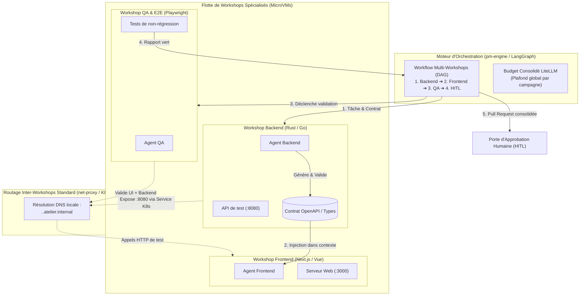

# Spécification Technique : Workflows Multi-Workshops & Orchestration d'Équipes d'Agents

> **Statut** : Document de Cadrage Technique (Jalon M12)  
> **Date** : 2026-09-05  
> **Auteur** : Équipe Atelier  
> **Principes directeurs** : Conforme à [`00-architecture-principles-substitutability.md`](00-architecture-principles-substitutability.md), prolonge [`05-devfactory-pm-engine.md`](05-devfactory-pm-engine.md) et s'articule avec [`14-devex-cli-simulateurs-hitl.md`](14-devex-cli-simulateurs-hitl.md).

---

## 1. Contexte & Problématique

Jusqu'au Jalon M8, un Workshop Atelier isole un unique agent dans une unique microVM.

Pour des chantiers d'ingénierie logicielle d'envergure (ex: ajout d'une fonctionnalité complète touchant un backend Rust/Go et une interface Next.js/React) :
1. **Saturation du contexte LLM** : Forcer un agent unique à comprendre et modifier l'ensemble de la base de code polyglotte entraîne des hallucinations, des pertes d'instructions et un coût prohibitif en tokens.
2. **Incompatibilité des environnements** : Vouloir faire cohabiter tous les runtimes (Rust nightly, Node.js, Python, bases de données) dans un seul devcontainer alourdit inutilement l'image et crée des conflits d'outillage.
3. **Nécessité de spécialisation** : Le développement moderne s'organise en rôles spécialisés :
   - *Agent Backend* : Développe l'API et génère la spécification du contrat (OpenAPI / protobuf).
   - *Agent Frontend* : Implémente l'interface utilisateur en consommant le contrat et l'API de test.
   - *Agent QA & E2E* : Valide les parcours utilisateurs et teste les cas limites.

Plutôt que d'instaurer un réseau maillé complexe ou des discussions directes et anarchiques entre LLMs (sujettes aux boucles infinies de bavardage), Atelier orchestre des **Workshops spécialisés coordonnés par contrats via `pm-engine`**.

---

## 2. Architecture Globale (Workflow Dirigé par Contrats)



---

## 3. Spécification Détaillée

### 3.1. Orchestration Dirigée par Contrats (Élimination du "Chatter Loop") — tâche 12.3, **implémentée**

**Correction par rapport à la première rédaction** : il n'existe PAS de nouveau graphe LangGraph dédié aux escouades — `pm-engine` orchestrait DÉJÀ des sous-tâches multi-Workshops en parallèle depuis le Jalon M5 (`PlanParallelTasks`/`SubTask`/`ProvisionWorkshop`/`DelegateToOpencode`/`IntegrateSubTasks`, voir `pm_engine/graph.py`) — un mécanisme de fusion Git après coup, pas d'exécution réseau connectée. Cette tâche RÉUTILISE ce graphe existant et y ajoute le handoff de contrat + la connexion réseau réelle (tâches 12.1/12.2) plutôt que de réinventer un second pipeline :
1. **Séquencement (déjà existant)** : `plan_parallel_tasks` découpe déjà le ticket en sous-tâches (`SubTask`), `delegate_to_opencode` les traite déjà DANS L'ORDRE du plan (une boucle séquentielle, pas un DAG explicite ni un fan-out `Send` — voir sa docstring). Le prompt du planificateur reconnaît maintenant explicitement un découpage backend/frontend légitime et lui fait déclarer trois champs optionnels sur `SubTask` : `service_port`/`contract_path` (sous-tâche PRODUCTRICE) et `depends_on` (sous-tâche CONSOMMATRICE, référençant l'`id` de la productrice — qui DOIT apparaître avant elle dans le plan, validé déterministiquement par `_plan_is_credible`).
   - **Étape 1 (Backend)** : traité normalement par `delegate_to_opencode`, produit son fichier de contrat (`contract_path`, ex: `openapi.yaml`) et le pousse sur sa branche (mécanisme de commit/push déjà existant).
   - **Étape 2 (Publication du Contrat)** : avant de déléguer la sous-tâche consommatrice, `delegate_to_opencode` lit ce contrat via `BaseGitProvider.get_file_content` (nouvelle méthode, implémentée pour Forgejo/GitHub/GitLab) sur la branche de la productrice, et l'injecte comme contexte IMMUABLE dans le prompt.
   - **Étape 3 (Frontend)** : reçoit aussi l'adresse `api.<workshop-productrice>.atelier.internal:<port>` (tâches 12.1/12.2) — un endpoint RÉELLEMENT joignable en HTTP depuis son propre Workshop, pas seulement une référence documentaire.
2. **Câblage réseau (tâches 12.1/12.2)** : `provision_workshop` calcule `exportedServices`/`allowedInternalTargets`/`campaignId` à partir des relations `service_port`/`depends_on` du plan entier et les transmet à `create_workshop` (MCP `atelier-api-server`, dont les trois champs — explicitement NON exposés depuis la tâche 12.1 — sont désormais exposés par cette tâche).
3. **Garantie de Convergence** : inchangée — aucun échange informel entre LLMs, chaque agent travaille sur un périmètre clairement délimité.

### 3.2. Interconnexion Inter-Workshops Standard (Zero WireGuard) — tâche 12.1, **implémentée**

Pour que le Frontend puisse tester dynamiquement l'API du Backend pendant son développement :
1. **Ports Exportés dans `WorkshopSpec`** :
   - Le CRD `Workshop` supporte une liste d'endpoints exportés :
     ```yaml
     spec:
       exportedServices:
         - name: api
           port: 8080
     ```
2. **Routage K8s Natif via `net-proxy` & Validation Stricte des Cibles — correction par rapport à la première rédaction** :
   - **Un port applicatif du guest n'existe QUE dans le netns de la microVM** — vérifié dans le code (`crates/controller/src/guest_probe.rs`, doc de tête : "pas de port exposé directement sur l'IP du pod", seul le relais WebSocket multiplexé `/portforward` de `net-proxy`, réservé au chemin externe `api-server`→Workshop, y accède). Un `Service` Kubernetes ne peut donc PAS cibler l'IP du guest (hors netns du pod, injoignable depuis un autre pod) : il cible `net-proxy` du Workshop exportateur, qui relaie lui-même vers son PROPRE guest. Nouveau `crates/net-proxy/src/ingress.rs` : un relais TCP simple (`tokio::io::copy_bidirectional`) par service exporté, PAS le protocole `portforward.k8s.io`-like (réservé au chemin externe, inutile entre deux composants du même pod).
   - Le `controller` expose un `Service` Kubernetes standard pour chaque service exporté (`<workshop-name>-<service>`, `crates/controller/src/reconcile.rs::ensure_exported_service`), sélecteur = pod parent (`atelier.dev/workshop`).
   - **Résolution — correction** : pas un résolveur DNS dans `net-proxy` (jamais besoin de résoudre `*.atelier.internal` lui-même, même raisonnement que `git.atelier.internal`) — le `controller` résout chaque cible en ClusterIP RÉEL du Service correspondant (`resolve_allowed_internal_targets`, même méthode que `git_identity::resolve_cluster_ip`) et transmet `alias=ip:port` à `net-proxy` du Workshop DEMANDEUR via `ATELIER_ALLOWED_INTERNAL_TARGETS`.
   - **Validation Nominative des Cibles (Zero Wildcard)** :
     * Il est formellement interdit d'autoriser `*.atelier.internal` en wildcard — table `squad` de `crates/net-proxy/src/internal.rs` (séparée de `simulators`, même mécanisme textuel), recherche de clé EXACTE, jamais un suffixe/motif.
     * Le `controller` n'injecte dans la configuration `net-proxy` du Workshop client QUE les cibles explicitement déclarées dans les dépendances du workflow (`allowed_internal_targets: ["api.ws-backend.atelier.internal:8080"]`).
     * Toute requête vers une cible non listée est traitée comme n'importe quel hôte inconnu par `net-proxy` (correction : pas un `403 Forbidden` dédié, comportement standard déjà en place pour tout alias non résolu).
3. **Cloisonnement au Niveau Réseau Kubernetes (`NetworkPolicy`)** :
   - Pour empêcher tout contournement par IP brute au niveau socket :
   - Le `controller` génère une `NetworkPolicy` PAR WORKSHOP de la campagne (`campaign_network_policy`) : seuls les pods portant le même label `atelier.dev/campaign-id: <id>` ET le même `atelier.dev/owner-group` (posés sur le pod parent UNIQUEMENT si `campaign_id` est renseigné) sont autorisés à établir une connexion entrante. Tout trafic transversal inter-projets ou inter-utilisateurs est détruit au niveau noyau (`DROP` implicite d'une `NetworkPolicy` de type `Ingress` sans règle correspondante) — en plus, jamais à la place, de la validation applicative "Zero Wildcard" ci-dessus.
4. **Authentification de Session Inter-Workshops — tâche 12.2, implémentée, correction par rapport à la première rédaction** :
   - **Pas `identity-proxy`, ni un en-tête HTTP `X-Atelier-Squad-Token`** : un service exporté (`Workshop.spec.exported_services`) n'est pas nécessairement HTTP (un port applicatif quelconque — base de données, protocole binaire). Le jeton est donc une PREMIÈRE LIGNE textuelle envoyée par `crate::proxy` (net-proxy émetteur, pas `identity-proxy`) avant les octets relayés, vérifiée par `crate::ingress` (net-proxy récepteur) avant de relayer quoi que ce soit vers le guest — valide pour n'importe quel protocole applicatif, même principe qu'un préfixe de trame plutôt qu'une sémantique HTTP.
   - `crates/common/src/squad_token.rs` : jeton `<workshop_name>|<expiry_unix>|<hex_hmac>`, HMAC-SHA256, TTL 15 min par défaut. Le `controller` dérive une clé PAR CAMPAGNE (`derive_campaign_key`) à partir d'un secret GLOBAL de signature (`ATELIER_SQUAD_TOKEN_SIGNING_KEY`, nouveau Secret Helm `squadToken.signingKey`, vide par défaut = fonctionnalité désactivée) — la clé dérivée, jamais le secret global, est transmise à CHAQUE Workshop de la campagne via `ATELIER_SQUAD_TOKEN_KEY` : un Workshop hors de la campagne ne la reçoit jamais, même s'il connaît le `campaign_id` (champ public du CRD).
   - Émission (`crate::proxy::handle_connection`, avant la résolution générique des alias internes) : un jeton signé est écrit comme préambule dès qu'une connexion cible une entrée `resolve_squad` (nouvelle méthode de `InternalRoutes`, distincte de `resolve()` pour que seules les cibles inter-Workshops en reçoivent un). Réémis à CHAQUE reconnexion (`forward_rewriting_with_preamble`), pas seulement à l'ouverture initiale — une nouvelle connexion TCP = un nouveau jeton attendu côté récepteur, qui ne suit aucun état entre connexions.
   - Vérification (`crate::ingress::relay_one`) : lit la première ligne (timeout 5s), la vérifie via `squad_token::verify`, ferme la connexion AVANT tout relais vers le guest si absente/invalide/expirée — en plus, jamais à la place, de la `NetworkPolicy` de la tâche 12.1 (défense en profondeur au niveau paquet, pas une preuve d'identité applicative).
   - Les règles d'allowlist egress vers Internet restent 100% actives et indépendantes (mécanisme orthogonal, non touché par cette tâche).

### 3.3. Isolation et Consolidation Git — tâche 12.4, **déjà entièrement implémentée depuis le Jalon M5**

**Découverte faite en vérifiant** (même situation que la spec 14 vis-à-vis du Jalon M9) : cette section décrit un mécanisme qui existe déjà intégralement dans `pm-engine` depuis le Jalon M5, AVANT même la rédaction de cette spec — aucun nouveau code n'était nécessaire pour la tâche 12.4.
1. **Branches Dédiées par Rôle** — déjà fait : `plan_parallel_tasks` (`pm_engine/nodes.py`) attribue `branch_name=f"feature/{issue_number}-{task_id}"` à chaque `SubTask`, `provision_workshop` crée réellement cette branche par sous-tâche.
2. **Consolidation Automatisée** — déjà fait, dans l'ordre exact décrit ci-dessus, sous des noms de nœuds différents :
   1. `integrate_sub_tasks` fusionne (`git merge --no-edit`) toutes les branches de sous-tâches dans celle de la PREMIÈRE sous-tâche (qui sert de "branche d'intégration commune"), exécuté réellement dans le Workshop de cette première sous-tâche (`exec_in_workshop`) — un conflit de fusion n'échoue jamais tout le run (`integration_conflicts` propagé, signalé explicitement dans la PR plutôt que de bloquer silencieusement).
   2. `run_devcontainer_tests` exécute `.devcontainer/test.sh` dans CE MÊME Workshop intégré (pas un Workshop QA séparé — inutile de dupliquer l'environnement puisque l'intégration a déjà eu lieu là) : c'est la suite de tests de l'ENSEMBLE réuni, pas celle d'une seule sous-tâche isolée.
   3. `open_pull_request` ouvre UNE SEULE Pull Request (tête = branche de la première sous-tâche, donc déjà porteuse de la fusion), avec un résumé consolidé (`body`, incluant l'état des tests et les éventuels conflits d'intégration non résolus).
3. **Porte d'Approbation Humaine (HITL)** — déjà fait : `AwaitHitlApproval`/`route_after_hitl`/`MergeAndClose`, aucune fusion sur `main` sans décision explicite (Dashboard ou CLI `atelier approvals approve`, tâche 9.6).

Non fait, resté hors de portée de M5 comme de cette tâche : un Workshop QA physiquement DISTINCT dédié aux tests e2e (la spec l'envisageait, l'implémentation réelle réutilise le Workshop d'intégration — plus simple, sans duplication d'environnement, jugé suffisant faute de besoin identifié d'isolement supplémentaire à ce stade).

### 3.4. Gestion Consolidée des Budgets LLM

1. **Virtual Key Parente dans LiteLLM** :
   - À l'initialisation de la campagne, `pm-engine` crée une Virtual Key de projet avec un plafond financier global (ex: `max_budget: 10.00$`).
2. **Coupe-Circuit Collectif** :
   - Si l'ensemble des agents atteint le quota, LiteLLM bloque immédiatement les appels avec un code HTTP 429.
   - Empêche tout emballement de facturation lié à une régression ou une boucle de retries.

---

## 4. Garde-Fous Techniques

1. **Pas de Dépendance Cyclique** :
   - Le graphe d'orchestration est strictement acyclique (DAG). Le démarrage des services s'effectue dans l'ordre topologique.
2. **Tests Réels Sans Mocks** :
   - L'agent QA teste l'UI réelle contre l'API réelle en cours d'exécution dans le Workshop Backend, garantissant la détection immédiate des ruptures d'intégration.
3. **Cycle de Vie Éphémère** :
   - Dès la Pull Request validée et fusionnée, l'ensemble des Workshops de la campagne est détruit pour libérer les ressources CPU/mémoire du cluster.

---

## 5. Phasage Opérationnel

| Tâche | Description | Composants |
| :--- | :--- | :--- |
| **12.1** | Export de services, validation nominative des cibles et `NetworkPolicy` par campagne | `crates/common/src/crd.rs`, `crates/controller`, `crates/net-proxy` |
| **12.2** | Authentification de session inter-workshops (`X-Atelier-Squad-Token`) | `crates/identity-proxy`, `crates/net-proxy` |
| **12.3** | Workflow LangGraph multi-étapes avec passage d'artefacts (OpenAPI) | `services/pm-engine` |
| **12.4** | Pipeline de consolidation Git multi-branches et validation QA | `services/pm-engine` |
| **12.5** | Clé de budget parent partagée dans LiteLLM | `crates/controller/src/litellm.rs`, `pm-engine` |
| **12.6** | Interface de suivi de campagne multi-agents sur le Dashboard | `dashboard/app/campaigns/` |
