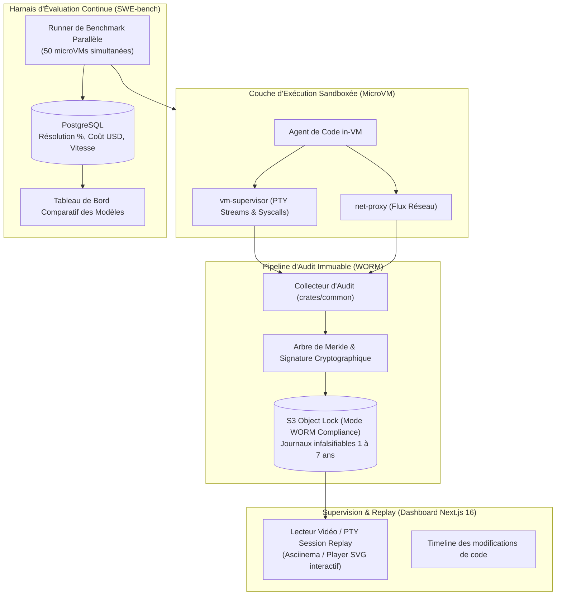

# Spécification Technique : Audit Immuable WORM, Replay de Session & Harnais d'Évaluation Continue (SWE-bench)

> **Statut** : Document de Réflexion Prospective (RFC Ouverte — Non Engageant, nécessite cadrage WORM et découplage IAM)  
> **Date** : 2026-09-05  
> **Auteur** : Équipe Atelier  
> **Principes directeurs** : Conforme à [`00-architecture-principles-substitutability.md`](00-architecture-principles-substitutability.md), étend [`12-observabilite.md`](12-observabilite.md) et [`06-dashboard-architecture-cadrage.md`](06-dashboard-architecture-cadrage.md).

---

## 1. Contexte & Problématique

Pour les départements de sécurité (CISO/RSSI), les auditeurs de conformité (**SOC2 Type II, ISO 27001, NIS 2, DORA**) et les directeurs de l'ingénierie, l'adoption massive des agents de code soulève deux questions existentielles :

1. **La preuve médico-légale absolue (Forensics & Non-répudiation)** : Si un bug critique ou une faille de sécurité est introduit dans le code de production, comment prouver de façon irréfutable ce que l'agent a fait, quelles commandes ont été passées, quels domaines ont été interrogés et qui a validé l'action ?
2. **L'évaluation scientifique et objective des modèles LLM sur le code réel** : Choisir entre Claude 3.7 Sonnet, GPT-5, DeepSeek-Coder ou un modèle open-source local ne peut pas reposer sur des impressions subjectives. L'organisation a besoin d'un banc d'évaluation automatisé régulier (type **SWE-bench**) exécuté dans de vraies microVMs étanches sur ses propres dépôts.

---

---

## 2. Garde-Fous de Conception & Périmètre Réel

1. **DLP & Regex : Heuristique "Best-Effort" (Zéro Survente de Conformité)** :
   - Un masquage par expressions régulières a un rappel imparfait sur les données sensibles. Il doit être présenté comme une **protection best-effort d'hygiène**, et non comme une garantie absolue de conformité SOC2/DORA.
2. **Spécificités Techniques de SWE-bench** :
   - Les benchmarks comme SWE-bench ciblent des environnements Python hautement spécifiques (Django, Sympy, Astropy) avec des versions figées et des dépendances système exactes. Ils requièrent des images dédiées par tâche de benchmark, distinctes du pipeline devcontainer standard d'Atelier.
3. **Découplage de SCIM v2.0** :
   - L'implémentation d'un serveur SCIM complet est un composant IAM d'entreprise majeur qui sort du périmètre d'un moteur de sandboxing d'environnements de code. Il doit être découplé du socle d'audit.

## 3. Architecture Globale Envisagée d'Audit & de Benchmarking

---

## 4. Spécification Détaillée des Pistes Techniques

### 3.1. Journalisation Immuable WORM (Write Once, Read Many)
1. **Périmètre des Événements Scellés** :
   - Flux d'entrées/sorties complet du shell PTY (chaque caractère tapé et chaque retour console).
   - Trace intégrale des requêtes réseau (URL, IP, en-têtes HTTP filtrés, décisions allowlist de `net-proxy`).
   - Journal des appels de fonctions MCP (nom de l'outil, arguments exacts, réponse reçue).
   - Événements d'approbation humaine (identité OIDC de l'approbateur, horodatage, raison).
2. **Signature Cryptographique & Arbre de Merkle** :
   - Chaque bloc de journalisation est haché en SHA-256 et chaîné au bloc précédent (*Hash Chain* inviolable).
   - Chaque heure ou à la fermeture du Workshop, la racine de l'arbre de Merkle est signée cryptographiquement avec une clé privée gérée par OpenBao / KMS Cloud.
3. **Stockage S3 Verrouillé (Object Lock)** :
   - Les archives compressées `audit-<workshop-id>.zst` sont téléversées avec l'en-tête S3 `x-amz-object-lock-mode: COMPLIANCE` et une durée de rétention définie (ex: 365 jours). Même un administrateur système ne peut ni modifier ni supprimer ces journaux avant expiration.

### 3.2. Replay Visuel de Session dans le Dashboard
1. **Composant Session Player (Next.js 16)** :
   - Intégration d'un lecteur interactif (basé sur le format standard `asciinema` / terminal SVG vectoriel).
   - L'auditeur sécurité peut rejouer la session de l'IA à vitesse réelle ou accélérée (x2, x5, x10).
2. **Synchronisation Vidéo / Diff / Réseau** :
   - Curseur temporel synchronisé : en cliquant sur une requête réseau suspecte dans la timeline, le lecteur saute exactement au moment où l'agent a tapé la commande correspondante dans son shell.

### 3.3. Harnais d'Évaluation Continue (SWE-bench in-VM)
1. **Parallélisation Massive sur MicroVMs Firecracker** :
   - Le sous-module `atelier-bench` permet de soumettre un lot d'issues (ex: 100 tickets de test du benchmark standard *SWE-bench Verified* ou un jeu de tests interne à l'entreprise).
   - Atelier instancie 20 à 50 microVMs en parallèle sur le cluster Kubernetes.
2. **Mesure Objective des Performances & Coûts** :
   - Pour chaque modèle évalué (Claude 3.7, GPT-5, Qwen-Coder local sur GPU, DeepSeek), Atelier enregistre :
     * **Taux de Résolution (% de tests unitaires passés)**.
     * **Coût d'inférence moyen par ticket résolu (en USD)**.
     * **Temps moyen de résolution**.
     * **Indice de sécurité (nombre de tentatives d'accès hors allowlist)**.
3. **Tableau de Bord Comparatif** :
   - Page dédiée `/admin/benchmarks` dans le Dashboard permettant aux décideurs IT de choisir le modèle le plus rentable pour leur stack technique.

### 3.4. Synchronisation d'Entreprise SCIM & Politiques Globales
1. **Fournisseur SCIM v2.0** :
   - Endpoint `/v1/scim/v2/Users` et `/Groups` dans `api-server` synchronisant automatiquement les départs, arrivées et appartenances aux équipes depuis Okta ou Microsoft Entra ID.
2. **Politiques Globales Immuables** :
   - Possibilité pour l'équipe sécurité de verrouiller des règles transversales (ex: interdiction absolue de toucher aux fichiers de migration SQL ou de désactiver les linters).

---

## 5. Sécurité & Rétention Légale

1. **Non-Répudiation Juridique** :
   - L'archive d'audit WORM fournit la preuve légale requise par les normes bancaires et médicales en cas de litige ou de violation de données.
2. **Masquage Automatique des Données Personnelles (DLP)** :
   - Un filtre d'expression régulière in-stream dans `AUDIT_COLLECTOR` masque automatiquement les numéros de carte bancaire, numéros de sécurité sociale ou jetons d'accès sensibles avant scellement dans l'archive.

---

## 6. Pistes de Phasage Conditionnel

| Lot | Intitulé | Livrables Clés | Dépendances |
| :--- | :--- | :--- | :--- |
| **13.1** | **Collecteur d'Audit & Arbre de Merkle** | Module `audit_log.rs` dans `crates/common`, chaînage cryptographique SHA-256 et signature KMS. | M1, M7 |
| **13.2** | **Support S3 Object Lock (WORM)** | Extension de `S3StorageBackend` avec `ObjectLockRetention`, tests contre AWS S3 / MinIO WORM. | M8, 13.1 |
| **13.3** | **Composant Session Replay (Dashboard)** | Lecteur Asciinema / SVG interactif synchronisé avec les logs réseau dans Next.js 16. | 13.1, M6 |
| **13.4** | **Ordonnanceur SWE-bench Parallèle** | Crate `atelier-bench`, exécution de batches de tests massifs sur microVMs isolées. | M1, M5 |
| **13.5** | **Dashboard de Comparaison des Modèles** | Vues analytiques (taux de succès, coûts USD, temps moyen) dans l'espace admin. | 13.4, M3 |
| **13.6** | **Connecteur SCIM v2.0 (Okta / Entra)** | Endpoints de synchronisation des utilisateurs et groupes d'entreprise dans `api-server`. | M1 |
