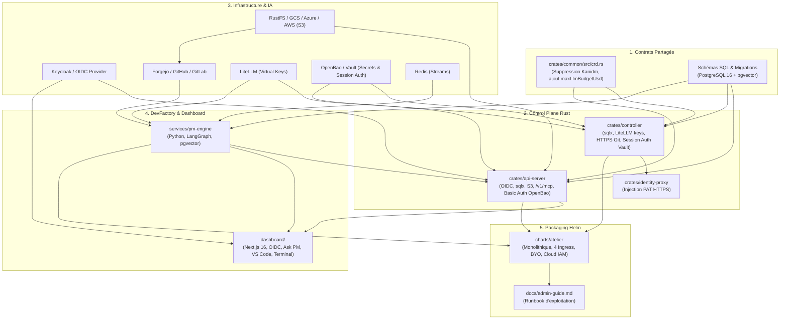

# Plan d'Action Global d'Implémentation — Spécification Exhaustive & Opérationnelle (Version Ultra-Détaillée avec Traçabilité Multi-Agents)

> **Statut** : Plan Cadre Opérationnel & Feuille de Route d'Ingénierie  
> **Date** : 2026-08-23  
> **Auteur** : Équipe Atelier  
> **Protocole de Transition Multi-Agents & États de Tâche** : Ce plan est conçu pour être **exécuté de manière asynchrone, interrompu à tout moment et repris sans friction par n'importe quel autre agent IA** (Claude Code, Gemini CLI, Antigravity).  
> **Règle de Traçabilité Obligatoire & États `[ ]` / `[-/<agent>/<session_id>]` / `[x]`** :
> 1. `[ ]` : Tâche en attente / non démarrée.
> 2. `[-/<agent_family>/<session_id>]` : **Tâche en cours d'exécution par un LLM / Agent identifié** (ex: `[-/claude-code/sess-4a8b]` ou `[-/antigravity/c192a786]`). Permet de savoir précisément qui travaille sur la tâche et si la session est toujours active.
> 3. `[x]` : **Tâche terminée et validée empiriquement** par tests réels sans mocks et journalisée dans [`docs/PROGRESS.md`](../PROGRESS.md).

---

## Sommaire

1. [Protocole de Transmission & Traçabilité Multi-Agents](#1-protocole-de-transmission--traçabilité-multi-agents)
2. [Principes Directeurs & Definition of Done (DoD) Transversale](#2-principes-directeurs--definition-of-done-dod-transversale)
3. [Cartographie des Dépendances & Matrice d'Impact Globale](#3-cartographie-des-dépendances--matrice-dimpact-globale)
4. [Jalon 1 (M1) : Socle PostgreSQL, Découplage OIDC Universel, Sécurité Basic Auth & Nettoyage CRD](#4-jalon-1-m1--socle-postgresql-découplage-oidc-universel-sécurité-basic-auth--nettoyage-crd)
5. [Jalon 2 (M2) : Stockage S3 Hybride & Git 100% HTTPS](#5-jalon-2-m2--stockage-s3-hybride--git-100-https)
6. [Jalon 3 (M3) : Passerelle d'Inférence IA LiteLLM & Budgets Stricts](#6-jalon-3-m3--passerelle-dinférence-ia-litellm--budgets-stricts)
7. [Jalon 4 (M4) : Serveur MCP Externe Embarqué dans l'API Server](#7-jalon-4-m4--serveur-mcp-externe-embarqué-dans-lapi-server)
8. [Jalon 5 (M5) : Moteur DevFactory & Project Manager Autonome (LangGraph)](#8-jalon-5-m5--moteur-devfactory--project-manager-autonome-langgraph)
9. [Jalon 6 (M6) : Chart Helm Monolithique & Documentation Administrateur](#9-jalon-6-m6--chart-helm-monolithique--documentation-administrateur)
10. [Matrice Récapitulative des Points d'Étapes & Critères de Clôture (Go / No-Go)](#10-matrice-récapitulative-des-points-détapes--critères-de-clôture-go--no-go)

---

## 1. Protocole de Transmission & Traçabilité Multi-Agents

Afin de permettre une collaboration fluide entre différents agents IA ou sessions interrompues :

### 📋 Instructions Strictes pour l'Agent Exécuteur :
1. **Vérification Initiale & Verrouillage Nominatif (`[-/<family>/<id>]`)** :
   - Inspecter `git status`, [`docs/PROGRESS.md`](../PROGRESS.md) et ce document `PLAN-ACTION-GLOBAL.md`.
   - **Vérifier qu'aucune tâche antérieure n'est laissée en cours `[-/...]`** ou non validée `[ ]`.
   - Dès qu'un agent prend en charge une tâche `[ ]`, il **DOIT IMMÉDIATEMENT positionner le marqueur nominatif `[-/<agent_family>/<session_id>]`** (ex: `[-/antigravity/c192a786]` ou `[-/claude-code/sess-xyz]`) sur la tâche dans `PLAN-ACTION-GLOBAL.md`.
2. **Validation d'une tâche (`[x]`)** :
   - Exécuter impérativement les tests unitaires et de linter (`cargo test`, `cargo clippy`, `cargo fmt` ou `pytest`).
   - Remplacer le marqueur `[-/...]` par **`[x]`** (indiquant formellement le travail terminé) dans ce document `PLAN-ACTION-GLOBAL.md`.
   - **Ajouter une entrée dans `docs/PROGRESS.md` dans la section dédiée `## Journal d'Avancement du Plan d'Action Global (Specs 01 à 06)`** avec le format standardisé.
3. **Interruption / Passage de relais** :
   - Si une session s'arrête en cours de tâche, laisser le marqueur `[-/<family>/<id>]` et documenter dans `docs/PROGRESS.md` l'état exact d'avancement pour que l'agent suivant sache exactement d'où repartir.

---

## 2. Principes Directeurs & Definition of Done (DoD) Transversale

Conformément à [`AGENTS.md`](file:///home/philippe/github.com/PhilippeVienne/atelier/AGENTS.md) et [`00-architecture-principles-substitutability.md`](00-architecture-principles-substitutability.md) :

### 🛡️ Exigences de Qualité Transversales
1. **Zero `unsafe`** dans tout le code Rust de production (`crates/*/src/`).
2. **Formatage & Linting Stricts** :
   - `cargo fmt --all -- --check` est 100% propre.
   - `cargo clippy --workspace --all-targets -- -D warnings` ne retourne aucun avertissement.
3. **Vérification Empirique sans Mocks** :
   - Tous les tests d'intégration s'exécutent contre de vrais conteneurs / clusters (PostgreSQL réel, OpenBao réel, LiteLLM réel, Redis réel, cluster Kind réel avec microVMs Firecracker).
   - Zéro mock factice remplaçant les composants réseau ou de stockage.
4. **Documentation Vivante** :
   - Mise à jour systématique de [`docs/PROGRESS.md`](file:///home/philippe/github.com/PhilippeVienne/atelier/docs/PROGRESS.md) avec preuves d'exécution.
5. **Dashboard Next.js 16** :
   - Validation de la compilation TypeScript et du build (`npm run build`).

---

## 3. Cartographie des Dépendances & Matrice d'Impact Globale



---

## 4. Jalon 1 (M1) : Socle PostgreSQL, Découplage OIDC Universel, Sécurité Basic Auth & Nettoyage CRD

### 4.1. Crate `crates/common` (CRD & Types partagés)
* **Fichier impacté** : [`crates/common/src/crd.rs`](file:///home/philippe/github.com/PhilippeVienne/atelier/crates/common/src/crd.rs)
  - [x] **1.1.1** : Supprimer le champ `pub kanidm_entity_id: Option<String>` de la struct `WorkshopStatus`.
  - [x] **1.1.2** : Ajouter dans `WorkshopResources` :
    ```rust
    #[serde(default, skip_serializing_if = "Option::is_none")]
    pub max_llm_budget_usd: Option<f64>,
    ```
  - [x] **1.1.3** : Mettre à jour la génération du manifest CRD YAML `crds/workshop.yaml` via le test `generate_crd` et valider le round-trip `serde_json` / `serde_yaml`.

### 4.2. Crate `crates/api-server` (Axum, OIDC JWT, sqlx, migrations, Basic Auth)
* **Fichier impacté** : [`crates/api-server/Cargo.toml`](file:///home/philippe/github.com/PhilippeVienne/atelier/crates/api-server/Cargo.toml)
  - [ ] **1.2.1** : Ajouter les dépendances :
    ```toml
    sqlx = { version = "0.8", default-features = false, features = ["runtime-tokio", "postgres", "uuid", "chrono", "json", "macros", "migrate"] }
    aws-sdk-s3 = { version = "1.71", default-features = false, features = ["rustls"] }
    aws-config = { version = "1.5", default-features = false, features = ["rustls"] }
    base64 = "0.22"
    ```
* **Fichier impacté** : [`crates/api-server/src/auth.rs`](file:///home/philippe/github.com/PhilippeVienne/atelier/crates/api-server/src/auth.rs)
  - [ ] **1.2.2** : Nettoyer la documentation pour universaliser le composant au-delà de Kanidm (standard OIDC RFC 7517 / RFC 7636).
  - [ ] **1.2.3** : Implémenter le cache JWKS dynamique (background refresh toutes les 10 min et refetch immédiat à la volée sur `kid` inconnu).
  - [ ] **1.2.4** : Dans la struct `Claims`, extraire et injecter `sub`, `preferred_username`, `email`, `groups`.
  - [ ] **1.2.5** : Dans le middleware d'authentification `auth_middleware`, insérer l'instance `Claims` dans les extensions de la requête Axum.
* **Fichier impacté** : [`crates/api-server/src/routes.rs`](file:///home/philippe/github.com/PhilippeVienne/atelier/crates/api-server/src/routes.rs) & `proxy_to_guest_port`
  - [ ] **1.2.6** : Sécuriser les tunnels VS Code (`/vscode/*`) et Terminal (`/terminal/*`) :
    - Récupérer le secret de session depuis OpenBao (`secret/data/workshops/<name>/session_auth`).
    - Injecter automatiquement l'en-tête `Authorization: Basic <base64(atelier:password)>` lors du relai HTTP et du handshake WebSocket vers `vm-supervisor` / microVM.
* **Fichier impacté** : [`crates/api-server/src/main.rs`](file:///home/philippe/github.com/PhilippeVienne/atelier/crates/api-server/src/main.rs)
  - [ ] **1.2.7** : Rendre la variable d'environnement `DATABASE_URL` obligatoire au démarrage et initialiser `PgPool`.
  - [ ] **1.2.8** : Injecter `db_pool` dans la struct `AppState`.
  - [ ] **1.2.9** : Créer le dossier `crates/api-server/migrations/` avec le fichier `20260824000000_init_apiserver.sql` (tables `session_logs` et `audit_events` avec RLS).

### 4.3. Crate `crates/controller` (Nettoyage Kanidm, OpenBao Session Auth, sqlx)
* **Fichier impacté** : [`crates/controller/Cargo.toml`](file:///home/philippe/github.com/PhilippeVienne/atelier/crates/controller/Cargo.toml)
  - [ ] **1.3.1** : Supprimer la dépendance `kanidm_client` et ajouter `sqlx`. *(Partiel : `kanidm_client` déjà retiré comme conséquence de 1.3.2/1.3.3 — reste l'ajout de `sqlx`, qui nécessite un PostgreSQL de dev, voir 1.2.7/1.3.6.)*
* **Fichiers supprimés / modifiés** :
  - [x] **1.3.2** : Supprimer définitivement le fichier `crates/controller/src/kanidm.rs`.
  - [x] **1.3.3** : Dans [`crates/controller/src/lib.rs`](file:///home/philippe/github.com/PhilippeVienne/atelier/crates/controller/src/lib.rs), retirer `pub mod kanidm;`.
  - [ ] **1.3.4** : Dans [`crates/controller/src/openbao.rs`](file:///home/philippe/github.com/PhilippeVienne/atelier/crates/controller/src/openbao.rs) :
    - Implémenter `generate_session_auth(workshop_name)` : génère un mot de passe aléatoire de 32 caractères et l'écrit dans `secret/data/workshops/<name>/session_auth`.
  - [ ] **1.3.5** : Dans [`crates/controller/src/reconcile.rs`](file:///home/philippe/github.com/PhilippeVienne/atelier/crates/controller/src/reconcile.rs) :
    - Supprimer tout appel à `kanidm`. *(Fait — voir 1.3.2/1.3.3.)*
    - Injecter le mot de passe de session dans la ligne de commande de lancement de la microVM (`code-server --auth password` et `ttyd --credential atelier:<password>`).
  - [ ] **1.3.6** : Dans [`crates/controller/src/main.rs`](file:///home/philippe/github.com/PhilippeVienne/atelier/crates/controller/src/main.rs), exiger `DATABASE_URL` au boot pour initialiser le pool `sqlx`.
  - [ ] **1.3.7** : Créer le dossier `crates/controller/migrations/` avec `20260824000000_init_controller.sql` (`rootfs_cache_index` et `workshop_reconciliation_history`).

### 4.4. Application `dashboard/` (Next.js 16, OIDC PKCE & BFF)
* **Fichiers impactés** : `dashboard/lib/config.ts`, `dashboard/lib/session.ts`, `dashboard/app/api/auth/*`
  - [ ] **1.4.1** : Renommer et généraliser les variables `ATELIER_KANIDM_URL` en `ATELIER_OIDC_ISSUER_URL`.
  - [ ] **1.4.2** : Valider l'interopérabilité avec les endpoints Keycloak (`/protocol/openid-connect/auth`, `/protocol/openid-connect/token`, `/protocol/openid-connect/certs`).
  - [ ] **1.4.3** : Adapter le rafraîchissement transparent du JWT (`refresh_token`) via `SessionKeepalive`.

### 🧪 Tests & Preuves Attendues pour M1
1. `cargo test -p atelier-common` : Valide la conformité du CRD sans champ Kanidm.
2. `cargo test -p atelier-api-server` :
   - Rejet au démarrage avec message explicite si `DATABASE_URL` est omis.
   - Exécution des migrations SQL sur un vrai PostgreSQL.
   - Validation 401 sur token JWT sans issuer valide / validation 200 sur JWT conforme.
   - Test du relai VS Code & Terminal : vérification de l'injection effective du header `Authorization: Basic` issu d'OpenBao et rejet 401 en cas de secret absent/invalide.
3. `cargo test -p atelier-controller` : Cycle de réconciliation complet sur Kind avec génération du secret dans OpenBao et zéro appel Kanidm.

### 🎯 Definition of Done (DoD) du Jalon M1
- [ ] PostgreSQL est connecté et les tables de base de données sont initialisées.
- [ ] Le controller et l'API server n'ont plus aucune dépendance à Kanidm.
- [ ] VS Code et `ttyd` sont protégés par mot de passe aléatoire avec injection transparente Basic Auth via OpenBao.
- [ ] `cargo test --workspace` et `cargo clippy --workspace --all-targets -- -D warnings` sont 100% verts.
- [ ] Entrée documentée dans `docs/PROGRESS.md`.

---

## 5. Jalon 2 (M2) : Stockage S3 Hybride & Git 100% HTTPS

### 5.1. Client S3 Rust dans `api-server` (`aws-sdk-s3` / `opendal`)
* **Fichier impacté** : `crates/api-server/src/storage.rs` (Nouveau module)
  - [ ] **2.1.1** : Définir le trait `StorageBackend` (`upload_stream`, `download_stream`, `delete_object`) et l'implémentation `S3StorageBackend`.
  - [ ] **2.1.2** : Implémenter le chargement dynamique des variables `S3_ENDPOINT`, `S3_REGION`, `S3_BUCKET_SESSIONS`, `S3_BUCKET_SNAPSHOTS`, `S3_FORCE_PATH_STYLE`.
  - [ ] **2.1.3** : Implémenter `upload_session_archive(workshop_name, session_id, stream)` avec compression zstd en streaming.
  - [ ] **2.1.4** : Implémenter `get_session_stream(s3_key)` pour le rejeu de session dans l'API.

### 5.2. Forge Git HTTPS (Forgejo / GitHub / GitLab) & Injection `identity-proxy`
* **Fichier impacté** : [`crates/controller/src/openbao.rs`](file:///home/philippe/github.com/PhilippeVienne/atelier/crates/controller/src/openbao.rs)
  - [ ] **2.2.1** : Structurer le chemin des secrets OpenBao pour les tokens Git : `secret/data/workshops/<name>/git_token`.
  - [ ] **2.2.2** : Configurer automatiquement dans `WorkshopSpec.identity_injection_rules` la règle pour l'hôte Git ciblé (`Authorization: token <PAT>` ou `PRIVATE-TOKEN: <PAT>`).
* **Fichier impacté** : `crates/net-proxy/src/internal.rs`
  - [ ] **2.2.3** : S'assurer que le nom d'alias interne `git.atelier.internal` ou `forgejo.atelier.internal` est routé d'office vers `identity-proxy` sans vérification d'allowlist externe.

### 🧪 Tests & Preuves Attendues pour M2
1. `cargo test -p atelier-api-server --test storage` : Upload réel d'un flux de session 5Mo compressé sur un serveur S3 (RustFS/MinIO en conteneur) et vérification de son intégrité SHA-256 au rejeu.
2. `cargo test -p atelier-identity-proxy` : Test d'interception d'une requête HTTP `git clone http://git.atelier.internal/repo.git` avec injection du header d'autorisation et relai vers la forge Git cible.

### 🎯 Definition of Done (DoD) du Jalon M2
- [ ] Les sessions terminal / VS Code volumineuses sont compressées et archivées sur S3.
- [ ] Les agents dans les microVMs clonent et pushent sur des dépôts Git privés via HTTPS sans jamais posséder de clés SSH ni de token en clair.
- [ ] Tous les tests de stockage et de proxies sont 100% verts.
- [ ] Entrée documentée dans `docs/PROGRESS.md`.

---

## 6. Jalon 3 (M3) : Passerelle d'Inférence IA LiteLLM & Budgets Stricts

### 6.1. Client LiteLLM & Provisioning dynamique des Virtual Keys (TTL Court)
* **Fichier impacté** : `crates/controller/src/litellm.rs` (Nouveau module)
  - [ ] **3.1.1** : Définir la structure `LiteLlmClient` avec méthodes `generate_virtual_key(workshop_name, owner, max_budget_usd, ttl)` et `delete_virtual_key(key_alias)`.
  - [ ] **3.1.2** : Implémenter l'appel `POST /key/generate` avec budget plafond, TTL de 1-2h et métadonnées de Workshop.
* **Fichier impacté** : [`crates/controller/src/reconcile.rs`](file:///home/philippe/github.com/PhilippeVienne/atelier/crates/controller/src/reconcile.rs)
  - [ ] **3.1.3** : Lors du provisioning et lors de la reprise post-suspension (`resume`), générer la Virtual Key et l'injecter dans `/etc/environment` (`ANTHROPIC_AUTH_TOKEN`, `OPENAI_API_KEY`).
  - [ ] **3.1.4** : Clés éphémères de build : générer une Virtual Key temporaire dédiée pour le Job `image-builder` et la révoquer dès l'achèvement du Job.

### 6.2. Enforcing des quotas & Nettoyage dans le Finalizer `atelier.dev/cleanup`
* **Fichier impacté** : [`crates/controller/src/reconcile.rs`](file:///home/philippe/github.com/PhilippeVienne/atelier/crates/controller/src/reconcile.rs)
  - [ ] **3.2.1** : Lors de la suppression d'un Workshop, exécuter `litellm_client.delete_virtual_key(&format!("atelier-wks-{}", name)).await` avant de libérer le finalizer. Idempotent (404 ignoré).

### 🧪 Tests & Preuves Attendues pour M3
1. `cargo test -p atelier-controller --test litellm` :
   - Appel réel à l'API LiteLLM pour générer une Virtual Key avec budget de `1.00$`.
   - Émission d'inférences jusqu'à dépassement du budget : vérification du blocage HTTP 429 / 403 émis par LiteLLM.
   - Suppression de la clé et vérification de son invalidation dans LiteLLM.

### 🎯 Definition of Done (DoD) du Jalon M3
- [ ] Chaque Workshop possède sa propre Virtual Key isolée avec budget strict et TTL court renouvelé à chaud.
- [ ] La destruction du Workshop nettoie la clé dans LiteLLM via le finalizer.
- [ ] Entrée documentée dans `docs/PROGRESS.md`.

---

## 7. Jalon 4 (M4) : Serveur MCP Externe Embarqué dans l'API Server

### 7.1. Route `/v1/mcp` (SSE & WebSocket), Sécurité OIDC & Fast-Fail
* **Fichier impacté** : `crates/api-server/src/mcp_server.rs` (Nouveau module)
  - [ ] **4.1.1** : Implémenter le protocole JSON-RPC MCP (Model Context Protocol 2024-11-05).
  - [ ] **4.1.2** : Vérification Fast-Fail : Rejeter immédiatement avec 503 si LiteLLM ou OpenBao est inaccessible.
  - [ ] **4.1.3** : Brancher les handlers Axum :
    - `GET /v1/mcp/sse` : Transport Server-Sent Events.
    - `POST /v1/mcp/messages` : Réception des appels d'outils.
    - `GET /v1/mcp/ws` : Transport WebSocket bidirectionnel complet.
  - [ ] **4.1.4** : Protéger ces routes avec le middleware OIDC JWT.

### 7.2. Implémentation des Tools MCP & Exécution Asynchrone Bufferisée
* **Fichier impacté** : `crates/api-server/src/mcp_tools.rs` (Nouveau module)
  - [ ] **4.2.1** : `tools/list` annonce les outils :
    - `create_workshop`, `list_workshops`, `get_workshop_status`, `suspend_workshop`, `resume_workshop`, `delete_workshop`, `exec_in_workshop`.
  - [ ] **4.2.2** : `exec_in_workshop` (Asynchrone & Bufferisé) :
    - Enregistre la commande dans `exec_commands` (PostgreSQL) et retourne un `execution_id`.
    - Streame en temps réel via WebSocket/vsock tout en écrivant les chunks dans la base.
    - Permet la reconnexion client sur coupure réseau via `GET /v1/workshops/{name}/exec/{id}/stream`.
  - [ ] **4.2.3** : Confinement automatique : en cas d'anomalie réseau détectée par `net-proxy`, déclencher immédiatement le Security Lockdown et le snapshot d'urgence.

### 🧪 Tests & Preuves Attendues pour M4
1. `cargo test -p atelier-api-server --test mcp_endpoints` :
   - Connexion d'un client MCP SSE officiel.
   - Appel de `create_workshop` ➔ création effective sur Kind.
   - Appel de `exec_in_workshop("echo Hello from MCP")` ➔ streaming en temps réel et persistance dans PostgreSQL.

### 🎯 Definition of Done (DoD) du Jalon M4
- [ ] Claude Desktop ou Cursor peut piloter Atelier via `/v1/mcp`.
- [ ] L'outil `exec_in_workshop` est résilient aux coupures réseau grâce au buffer PostgreSQL.
- [ ] Entrée documentée dans `docs/PROGRESS.md`.

---

## 8. Jalon 5 (M5) : Moteur DevFactory & Project Manager Autonome (LangGraph)

### 8.1. Scaffolding du service `services/pm-engine` (Python 3.12, FastAPI)
- [ ] **5.1.1** : Initialiser `services/pm-engine/pyproject.toml` (FastAPI, LangGraph, Redis, AsyncPG, Pydantic, HTTPX).
- [ ] **5.1.2** : Créer le `Dockerfile` optimisé pour la production.

### 8.2. Machine d'États LangGraph complète & Auto-correction continue bornée
* **Fichier** : `services/pm-engine/pm_graph.py`
  - [ ] **5.2.1** : Définir le State Typed `PMWorkflowState`.
  - [ ] **5.2.2** : Implémenter les nœuds du graphe :
    1. `AnalyzeIssue` : Analyse LLM du ticket.
    2. `PlanParallelTasks` : Découpage des tâches avec injection de prompt sans chevauchement de fichiers.
    3. `ProvisionWorkshop` : Appels MCP `create_workshop` sur sous-branches éphémères (`feature/task-<id>`).
    4. `DelegateToClaudeCode` : Appels MCP `exec_in_workshop` lançant Claude Code dans la microVM.
    5. `RunDevcontainerTests` : Exécution des suites de tests déclarées dans `.devcontainer/devcontainer.json`.
    6. `AutoCorrectionLoop` : Ré-injection des traces d'erreurs en continu tant que le budget LLM n'est pas épuisé.
    7. `OpenPullRequest` : Ouverture de la PR signée par `atelier-pm-bot`.
    8. `SuspendWhileWaitingReview` : Hook `git-sync` puis appel MCP `suspend_workshop` (décharge S3 multipart).
    9. `AwaitHitlApproval` : Checkpoint PostgreSQL (attente approbation humaine).
    10. `MergeAndClose` : Fusion de la PR et fermeture du ticket.
    11. `IndexKnowledge` : Extraction des patterns de résolution et indexation vectorielle.

### 8.3. Base `atelier_pm` : Checkpointer PostgreSQL & Mémoire RAG `pgvector` avec RLS
* **Script de migration SQL** : `20260824000000_init_pm_engine.sql`
  - [ ] **5.3.1** : Activer `CREATE EXTENSION IF NOT EXISTS vector;`.
  - [ ] **5.3.2** : Créer la table `project_memories` avec index vectoriel `ivfflat` (`VECTOR(1536)`) et politique **Row Level Security (RLS)** active.
  - [ ] **5.3.3** : Configurer `AsyncPostgresSaver` comme checkpointer persistant pour LangGraph.

### 8.4. Adaptateurs Multi-Forges Git & Pipeline Redis Streams (At-Least-Once)
* **Fichiers** : `services/pm-engine/git_providers/`
  - [ ] **5.4.1** : Interface générique `BaseGitProvider` (`get_issue`, `post_comment`, `create_branch`, `create_pr`, `merge_pr`).
  - [ ] **5.4.2** : Implémentations concrètes : `ForgejoProvider`, `GitHubProvider`, `GitLabProvider`.
  - [ ] **5.4.3** : Consommateur Redis Streams `services/pm-engine/redis_consumer.py` avec accusé de réception explicite (`XACK`) et reprise sur incident (`XAUTOCLAIM`).

### 8.5. Interface Dashboard Next.js "Ask Project Manager" & Validation HITL
* **Fichiers** : `dashboard/app/projects/[id]/pm/page.tsx` & `components/pm-chat.tsx`
  - [ ] **5.5.1** : Chat SSE interactif via Route Handler `/api/pm/chat` (BFF) scopé sur le projet et RLS.
  - [ ] **5.5.2** : Interface d'approbation Human-in-the-Loop pour valider ou rejeter les Pull Requests du bot.

### 🧪 Tests & Preuves Attendues pour M5
1. `pytest services/pm-engine/tests/` :
   - Simulation complète : issue ➔ planification ➔ dev in-VM ➔ échec de test ➔ auto-correction ➔ git-sync ➔ snapshot S3 ➔ approbation HITL ➔ merge de PR.
   - Validation de l'étanchéité RLS multi-tenant sur les embeddings `pgvector`.

### 🎯 Definition of Done (DoD) du Jalon M5
- [ ] Le PM Engine résout un ticket de bout en bout de façon autonome.
- [ ] Les microVMs sont synchronisées et mises en veille dès que la PR est ouverte.
- [ ] Le Dashboard permet d'interagir avec la mémoire du PM et d'approuver les fusions.
- [ ] Entrée documentée dans `docs/PROGRESS.md`.

---

## 9. Jalon 6 (M6) : Chart Helm Monolithique & Documentation Administrateur

### 9.1. Arborescence complète des templates du Chart `charts/atelier`
* **Structure des templates à implémenter** :
  ```text
  charts/atelier/
  ├── Chart.yaml
  ├── values.yaml
  └── templates/
      ├── _helpers.tpl
      ├── crds/
      │   └── workshop.yaml
      ├── rbac/
      │   ├── clusterrole.yaml
      │   ├── clusterrolebinding.yaml
      │   └── serviceaccounts.yaml
      ├── jobs/
      │   ├── db-init-job.yaml            # Init 6 bases Postgres + rôle atelier_migrator
      │   ├── db-migrate-job.yaml         # Hook pre-install/pre-upgrade SQL (via atelier_migrator)
      │   ├── keycloak-init-job.yaml      # Hook post-install OIDC Realm & Clients
      │   ├── openbao-init-job.yaml       # Hook post-install Auth K8s
      │   └── s3-init-job.yaml            # Hook post-install Buckets S3 (conditionnel RustFS/Cloud)
      ├── core/
      │   ├── controller-deployment.yaml
      │   ├── apiserver-deployment.yaml   # API REST + WebSocket + MCP /v1/mcp
      │   ├── apiserver-service.yaml
      │   ├── dashboard-deployment.yaml
      │   ├── dashboard-service.yaml
      │   ├── pm-engine-deployment.yaml   # FastAPI + LangGraph
      │   └── pm-engine-service.yaml
      ├── infra/
      │   ├── kvm-device-plugin-daemonset.yaml
      │   ├── postgresql-statefulset.yaml # Image pgvector/pgvector:pg16
      │   ├── postgresql-service.yaml
      │   ├── keycloak-deployment.yaml
      │   ├── keycloak-service.yaml
      │   ├── forgejo-deployment.yaml     # 100% HTTPS (pas de SSH)
      │   ├── forgejo-service.yaml
      │   ├── openbao-statefulset.yaml
      │   ├── openbao-service.yaml
      │   ├── litellm-deployment.yaml
      │   ├── litellm-service.yaml
      │   ├── redis-statefulset.yaml      # Redis Streams
      │   ├── redis-service.yaml
      │   ├── rustfs-statefulset.yaml     # S3 local
      │   └── rustfs-service.yaml
      └── ingress/
          ├── keycloak-ingress.yaml       # auth.example.com
          ├── forgejo-ingress.yaml        # git.example.com
          ├── dashboard-ingress.yaml      # app.example.com
          └── apiserver-ingress.yaml      # api.example.com (WebSocket support)
  ```

### 9.2. Fichiers Ingress Dédiés (x4) avec TLS cert-manager
- [ ] **6.2.1** : `keycloak-ingress.yaml` (`auth.example.com`).
- [ ] **6.2.2** : `forgejo-ingress.yaml` (`git.example.com` — HTTPS pur).
- [ ] **6.2.3** : `dashboard-ingress.yaml` (`app.example.com`).
- [ ] **6.2.4** : `apiserver-ingress.yaml` (`api.example.com` — WebSocket supporté avec timeouts étendus).

### 9.3. Séquencement des 5 Jobs d'initialisation Helm
- [ ] **6.3.1** : `db-init-job.yaml` crée les 6 bases PostgreSQL et le rôle d'administration `atelier_migrator`.
- [ ] **6.3.2** : `db-migrate-job.yaml` applique les migrations SQL via `atelier_migrator`.
- [ ] **6.3.3** : `keycloak-init-job.yaml` configure automatiquement le Realm `atelier` et les clients OIDC.
- [ ] **6.3.4** : `openbao-init-job.yaml` active la méthode d'auth Kubernetes.
- [ ] **6.3.5** : `s3-init-job.yaml` crée les buckets `atelier-sessions`, `atelier-snapshots` et `forgejo-lfs-attachments`.

### 9.4. Support des Identités Cloud & Rolling Upgrades Non Perturbateurs
- [ ] **6.4.1** : Annotations ServiceAccount pour AWS IRSA (`eks.amazonaws.com/role-arn`), GCP Workload Identity et Azure Workload ID.
- [ ] **6.4.2** : Gestion du statut `NeedsRestartForUpgrade` pour préserver les microVMs actives lors des `helm upgrade`.

### 9.5. Rédaction du Guide Administrateur (`docs/admin-guide.md`)
- [ ] **6.5.1** : Rédiger le guide complet (KVM bare-metal & cloud nested virt, 4 domaines DNS, S3 multi-cloud, AWS IRSA/AssumeRole, backup/restore PostgreSQL et dépannage).
- [ ] **6.5.2** : Déclarer la page dans [`mkdocs.yml`](file:///home/philippe/github.com/PhilippeVienne/atelier/mkdocs.yml).

### 🧪 Tests & Preuves Attendues pour M6
1. `helm lint charts/atelier` : Zéro erreur de syntaxe.
2. `helm template atelier charts/atelier -f values-test.yaml` : Rendu valide de tous les manifests.
3. Déploiement réel sur cluster Kind : 100% des pods `Running` et tous les hooks `Completed`.

### 🎯 Definition of Done (DoD) du Jalon M6
- [ ] L'installation complète se fait en une commande Helm.
- [ ] Les 4 Ingress et certificats TLS sont opérationnels.
- [ ] La documentation MkDocs intègre le Guide Administrateur complet.
- [ ] Entrée documentée dans `docs/PROGRESS.md`.

---

## 10. Matrice Récapitulative des Points d'Étapes & Critères de Clôture (Go / No-Go)

| Jalon | Intitulé | Livrables & Composants Clés | Critère de Validation Empirique (Go / No-Go) |
| :--- | :--- | :--- | :--- |
| **M1** | **Socle DB, OIDC & Basic Auth OpenBao** | `crates/common`, `crates/api-server`, `crates/controller`, `dashboard/` | `cargo test --workspace` passe avec vrai Postgres & OIDC, injection Basic Auth OpenBao validée sur VS Code/ttyd. |
| **M2** | **S3 & Git HTTPS** | `crates/api-server/src/storage.rs`, `crates/identity-proxy` | Upload de session S3 réussi, clone Git HTTPS privé réussi via alias interne. |
| **M3** | **LiteLLM & Budgets** | `crates/controller/src/litellm.rs`, `crates/common/src/crd.rs` | Virtual Key créée avec TTL court renouvelé à chaud post-resume, blocage 429 au dépassement de quota. |
| **M4** | **Serveur MCP Externe** | `crates/api-server/src/mcp_*.rs` | Client Claude Desktop connecté sur `/v1/mcp`, streaming `exec_in_workshop` bufferisé dans Postgres. |
| **M5** | **DevFactory PM Engine** | `services/pm-engine`, `dashboard/` | Workflow LangGraph complet (issue ➔ sous-branches ➔ auto-correction ➔ git-sync ➔ snapshot S3 ➔ merge). |
| **M6** | **Helm & Admin Doc** | `charts/atelier/`, `docs/admin-guide.md`, `mkdocs.yml` | `helm install` 100% opérationnel sur Kind avec 4 Ingress, identités Cloud et hooks validés. |
