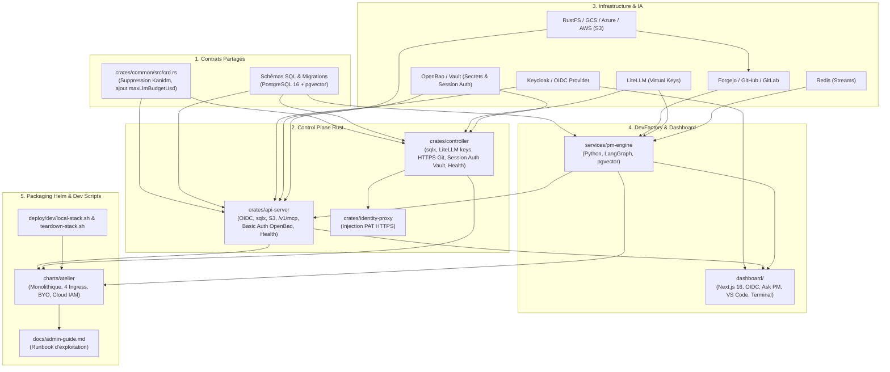

# Plan d'Action Global d'Implémentation

> **Statut** : Plan Cadre Opérationnel & Feuille de Route d'Ingénierie
> **Dernière compression** : 2026-09-05 — les jalons M1 à M6 (117 tâches,
> toutes `[x]`) ont été sortis vers
> [`docs/archive/PLAN-ACTION-M1-M6.md`](../archive/PLAN-ACTION-M1-M6.md)
> (même raison que l'archivage de `docs/PROGRESS.md` fin août 2026 : une
> tâche validée n'a plus besoin de son détail ligne à ligne dans le
> document courant, seulement dans `git log` et l'archive). Ce document ne
> garde que ce qui reste utile pour démarrer la prochaine tâche : le
> protocole de traçabilité, les principes transversaux, la carte des
> dépendances, la Matrice Récapitulative des jalons clos, et les jalons en
> cours ou à venir.
> **Protocole de Transition Multi-Agents & États de Tâche** : Ce plan est conçu pour être **exécuté de manière asynchrone, interrompu à tout moment et repris sans friction par n'importe quel autre agent IA** (Claude Code, Gemini CLI, Antigravity).
> **Règle de Traçabilité Obligatoire & États `[ ]` / `[-/<agent>/<session_id>]` / `[x]`** :
> 1. `[ ]` : Tâche en attente / non démarrée.
> 2. `[-/<agent_family>/<session_id>]` : **Tâche en cours d'exécution par un LLM / Agent identifié** (ex: `[-/claude-code/sess-4a8b]` ou `[-/antigravity/c192a786]`). Permet de savoir précisément qui travaille sur la tâche et si la session est toujours active.
> 3. `[x]` : **Tâche terminée et validée empiriquement** par tests réels sans mocks et journalisée dans [`docs/PROGRESS.md`](../PROGRESS.md).

---

## Sommaire

1. [Protocole de Transmission & Traçabilité Multi-Agents](#1-protocole-de-transmission--traçabilité-multi-agents)
2. [Principes Directeurs & Definition of Done (DoD) Transversale](#2-principes-directeurs--definition-of-done-dod-transversale)
3. [Cartographie des Dépendances & Matrice d'Impact Globale](#3-cartographie-des-dépendances--matrice-dimpact-globale)
4. [Jalons Clos (M1 à M6) — Matrice Récapitulative](#4-jalons-clos-m1-à-m6--matrice-récapitulative)
5. [Jalon 7 (M7) : Stack d'Observabilité (Traces, Métriques, Logs)](#5-jalon-7-m7--stack-dobservabilité-traces-métriques-logs)
6. [Jalon 8 (M8) : Offload S3 du Cache d'Images et des Snapshots](#6-jalon-8-m8--offload-s3-du-cache-dimages-et-des-snapshots)
7. [Jalon 9 (M9) : Expérience Dev (CLI, Pont IDE), Simulateurs in-VM & HITL](#7-jalon-9-m9--expérience-dev-cli-pont-ide-simulateurs-in-vm--hitl)
8. [Jalon 11 (M11) : Souveraineté, Air-Gap & Inférence GPU Locale](#8-jalon-11-m11--souveraineté-air-gap--inférence-gpu-locale)
9. [Jalon 12 (M12) : Workflows Multi-Workshops & Orchestration d'Équipes d'Agents](#9-jalon-12-m12--workflows-multi-workshops--orchestration-déquipes-dagents)

---

## 1. Protocole de Transmission & Traçabilité Multi-Agents

Afin de permettre une collaboration fluide entre différents agents IA ou sessions interrompues :

### 📋 Instructions Strictes pour l'Agent Exécuteur :
1. **Vérification Initiale & Verrouillage Nominatif (`[-/<family>/<id>]`)** :
   - Inspecter `git status`, [`docs/PROGRESS.md`](../PROGRESS.md) et ce document `PLAN-ACTION-GLOBAL.md`.
   - **Vérifier qu'aucune tâche antérieure n'est laissée en cours `[-/...]`** ou non validée `[ ]`.
   - Dès qu'un agent prend en charge une tâche `[ ]`, il **DOIT IMMÉDIATEMENT positionner le marqueur nominatif `[-/<agent_family>/<session_id>]`** (ex: `[-/antigravity/c192a786]` ou `[-/claude-code/sess-xyz]`) sur la tâche dans `PLAN-ACTION-GLOBAL.md`.
2. **Validation d'une tâche (`[x]`)** :
   - Exécuter impérativement les tests unitaires et de linter (`cargo test`, `cargo clippy`, `cargo fmt` ou `pytest`).
   - Remplacer le marqueur `[-/...]` par **`[x]`** (indiquant formellement le travail terminé) dans ce document `PLAN-ACTION-GLOBAL.md`.
   - Consigner ce qui doit réellement l'être dans `docs/PROGRESS.md`/`docs/architecture/pieges.md` (voir `AGENTS.md`, section « Mise à jour de la Documentation ») — pas d'entrée narrative datée par tâche.
3. **Interruption / Passage de relais** :
   - Si une session s'arrête en cours de tâche, laisser le marqueur `[-/<family>/<id>]` et documenter dans `docs/PROGRESS.md` l'état exact d'avancement pour que l'agent suivant sache exactement d'où repartir.

---

## 2. Principes Directeurs & Definition of Done (DoD) Transversale

Conformément à [`AGENTS.md`](file:///home/philippe/github.com/PhilippeVienne/atelier/AGENTS.md) et [`00-architecture-principles-substitutability.md`](00-architecture-principles-substitutability.md) :

### 🛡️ Exigences de Qualité Transversales
1. **Zero `unsafe`** dans tout le code Rust de production (`crates/*/src/`).
2. **Formatage & Linting Stricts** :
   - `cargo fmt --all -- --check` est 100% propre.
   - `cargo clippy --workspace --all-targets -- -D warnings` ne retourne aucun avertissement.
3. **Vérification Empirique sans Mocks (Infrastructure Dev Réelle)** :
   - Tous les tests d'intégration s'exécutent contre de vrais conteneurs / pods locaux (PostgreSQL réel sous Kind port 5433, S3/MinIO réel, Forgejo réel, OpenBao réel, LiteLLM réel, Redis réel, cluster Kind réel avec microVMs Firecracker).
   - Zéro mock factice remplaçant les composants réseau ou de stockage.
4. **Documentation Vivante** :
   - Mise à jour systématique de [`docs/PROGRESS.md`](file:///home/philippe/github.com/PhilippeVienne/atelier/docs/PROGRESS.md) avec preuves d'exécution.
5. **Dashboard Next.js 16** :
   - Validation de la compilation TypeScript et du build (`npm run build`).

---

## 3. Cartographie des Dépendances & Matrice d'Impact Globale

---

## 4. Jalons Clos (M1 à M6) — Matrice Récapitulative

Détail tâche par tâche (fichiers exacts, garde-fous, sous-tâches) dans
[`docs/archive/PLAN-ACTION-M1-M6.md`](../archive/PLAN-ACTION-M1-M6.md).

| Jalon | Intitulé | Livrables & Composants Clés | Critère de Validation Empirique (Go / No-Go) |
| :--- | :--- | :--- | :--- |
| **M1** | **Socle DB, OIDC, Basic Auth & Health** | `crates/common`, `crates/api-server`, `crates/controller`, `dashboard/` | `cargo test --workspace` passe avec vrai Postgres & OIDC, Basic Auth OpenBao et sondes /health opérationnelles. |
| **M2** | **S3 & Git HTTPS (Dev Pods)** | `crates/api-server/src/storage.rs`, `crates/identity-proxy`, `deploy/dev/{s3,forgejo}` | Upload de session S3 réussi, clone Git HTTPS privé réussi contre Forgejo dev. |
| **M3** | **LiteLLM & Budgets** | `crates/controller/src/litellm.rs`, `crates/common/src/crd.rs` | Virtual Key créée avec TTL court renouvelé à chaud post-resume, blocage 429 au dépassement de quota. |
| **M4** | **Serveur MCP Externe** | `crates/api-server/src/mcp_*.rs` | Client Claude Desktop connecté sur `/v1/mcp`, streaming `exec_in_workshop` bufferisé dans Postgres. |
| **M5** | **DevFactory PM Engine** | `services/pm-engine`, `dashboard/`, `deploy/dev/redis` | Workflow LangGraph complet (issue ➔ sous-branches ➔ auto-correction ➔ git-sync ➔ snapshot S3 ➔ merge). |
| **M6** | **Helm & Admin Doc** | `charts/atelier/`, `deploy/dev/*-stack.sh`, `docs/admin-guide.md` | `helm install` 100% opérationnel sur Kind avec 4 Ingress, identités Cloud, scripts dev et hooks validés — inclut la configuration des modèles LiteLLM par un admin (`docs/specs/11-admin-litellm-model-config.md`). |

---

## 5. Jalon 7 (M7) : Stack d'Observabilité (Traces, Métriques, Logs)

* **Spécification** : [`12-observabilite.md`](12-observabilite.md)
* **Constat** : `crates/common/src/telemetry.rs` exporte déjà des traces OTLP si `OTEL_EXPORTER_OTLP_ENDPOINT` est positionnée — elle ne l'est nulle part (chart, dev). Pire, vérifié empiriquement : même en la positionnant vers un vrai collecteur, **zéro trace n'est produite**, aucune route/boucle n'étant instrumentée par un span (`TraceLayer`/`#[instrument]` absents partout).
* **Fichiers** : `crates/common/src/telemetry.rs`, `crates/api-server/src/routes.rs`, `crates/controller/src/reconcile.rs`, `charts/atelier/templates/infra/observability-deployment.yaml` (nouveau), `charts/atelier/values.yaml`, `deploy/dev/local-stack.sh`.
  - [x] **7.1** : Nouveau composant chart `observability` (`grafana/otel-lgtm`, un seul pod — voir spec §3 pour la justification et les mesures empiriques de démarrage/mémoire), `.Values.observability.enabled`/`.resources`. Déployé réellement sur `kind-atelier-dev` : pod `Running` en 37s, `otel-lgtm:0.32.1` épinglé (même digest que `:latest` au moment de la vérification). `helm lint`/`helm template` passent.
  - [x] **7.2** : `OTEL_EXPORTER_OTLP_ENDPOINT` câblée sur les Deployments `api-server`/`controller` du chart quand `observability.enabled`. `deploy/dev/local-stack.sh` déploie inconditionnellement `deploy/dev/otel/dev-deployment.yaml` (remplace l'ancien `collector-config.yaml`, orphelin depuis `a51b1c9`, jamais câblé) et ouvre un port-forward local (4317) — vérifié contre le cluster de dev réel (Service→pod atteignable, `nc` réussi). `helm lint`/`helm template`/`shellcheck` propres.
  - [x] **7.3** : `tower_http::TraceLayer` sur `routes::router` (`api-server`) — un span par requête HTTP, méthode/chemin/statut en attributs. Piège trouvé en vérifiant : `TraceLayer` crée son span par défaut à `DEBUG`, filtré par l'`EnvFilter` par défaut de `telemetry::init` ("info") — sans `.level(Level::INFO)` explicite, aucune trace n'était exportée malgré `TraceLayer` en place. Vérifié bout en bout via le chemin réel (Service Kubernetes + port-forward 4317, cluster de dev, `RUST_LOG` non défini) : les requêtes HTTP produisent bien des traces `service.name=atelier-api-server` dans Tempo. `cargo test`/`clippy`/`fmt` propres.
  - [x] **7.4** : Déjà fait — `crates/controller/src/reconcile.rs` porte `#[tracing::instrument(skip_all, ...)]` sur 5 fonctions depuis le commit `a51b1c9` (2026-08-18), dont deux avec `fields(workshop = %workshop.name_any())`. Découvert en cours de rédaction de la spec (une recherche trop stricte l'avait manqué) puis reverifié bout en bout : `atelier-controller` local + `OTEL_EXPORTER_OTLP_ENDPOINT` vers un `grafana/otel-lgtm` réel + réconciliation réelle contre le cluster de dev → 5 traces `service.name=atelier-controller` retrouvées dans Tempo. Aucune implémentation nécessaire, seul le câblage de 7.2 manquait.
  - [x] **7.5** : `telemetry.rs` gagne un `MeterProvider` (`opentelemetry_otlp::MetricExporter` + `with_periodic_exporter` ; feature `metrics` déjà en défaut chez `opentelemetry_sdk`/`-otlp`, aucune dépendance nouvelle). Nouveau `crates/api-server/src/http_metrics.rs` : compteur de requêtes + histogramme de latence, posés via `.route_layer()` pour que `MatchedPath` soit résolu (évite la cardinalité non bornée du chemin brut). Vérifié contre une instance réelle de `grafana/otel-lgtm` : `http_server_request_count_total`/`http_server_duration_milliseconds_count` visibles dans Prometheus avec les bons labels. `cargo test`/`clippy`/`fmt` propres. **M7 (Observabilité) entièrement clos.**

---

## 6. Jalon 8 (M8) : Offload S3 du Cache d'Images et des Snapshots

* **Spécification** : [`13-image-cache-offload.md`](13-image-cache-offload.md)
* **Constat** : le `TODO` de `image-builder::publish_to_cache` n'était pas qu'une optimisation théorique — **découvert en creusant ce chantier** : le disque de la machine de dev était à 96 % d'utilisation, `local-path-provisioner` ne fait respecter AUCUN quota (400 Go réels contre un PVC nominal `20Gi`), et surtout `crates/controller/src/reconcile.rs::cleanup()` ne supprime JAMAIS le snapshot d'un `Workshop` supprimé (103 Go de snapshots orphelins mesurés). Pansement déjà appliqué cette session (contenu du PVC vidé manuellement, disque revenu à 50 %) — pas une solution durable.
* **Fichiers** : `crates/controller/src/reconcile.rs` (`cleanup`), `crates/controller/src/storage.rs`, `crates/image-builder/src/main.rs` (`publish_to_cache`), `crates/vm-supervisor/src/main.rs`, `crates/api-server/src/storage.rs` → à déplacer vers `crates/common/src/storage.rs` (spec §3.3), `charts/atelier/values.yaml` (`S3_BUCKET_IMAGE_CACHE`).
  - [x] **8.1** : **Correctif prioritaire (bug, pas une optimisation)** — `cleanup()` lance un Job éphémère (`busybox`, `ttlSecondsAfterFinished=300`) qui monte le PVC de cache et supprime `snapshots/<ns>_<name>` du Workshop supprimé — le controller lui-même ne monte jamais ce PVC. Vérifié de bout en bout contre le cluster de dev réel : faux snapshot créé, Workshop supprimé, Job `Complete` en 6s, répertoire confirmé absent après coup. `cargo test`/`clippy`/`fmt` propres.
  - [x] **8.2** : `StorageBackend`/`S3StorageBackend` déplacés vers `crates/common/src/storage.rs` (spec §3.3) ; `api-server` importe désormais ce type depuis `atelier_common` (dépendances `aws-sdk-s3`/`async-compression`/`bytes`/`async-trait`/`aws-config` déplacées ou retirées en conséquence, `aws-config` n'était déjà plus utilisé nulle part). Tests d'intégration déplacés (`crates/common/tests/storage.rs`) et re-vérifiés réellement contre RustFS (`cargo test -p atelier-common --test storage` + `cargo test -p atelier-api-server --test session_recorder`, les deux passent contre un vrai bucket). `cargo test`/`clippy`/`fmt` propres sur tout le workspace.
  - [x] **8.3** : Nouvelle variable `S3_BUCKET_IMAGE_CACHE` (spec §3.2, optionnelle — contrairement à `S3_BUCKET_SESSIONS`/`SNAPSHOTS`, seul `image-builder` en a besoin) ; `image-builder` téléverse vers S3 après `publish_to_cache` local (best-effort, non bloquant). **Correction découverte en implémentant** : le digest n'est connu qu'APRÈS la construction complète (`sha256_file` sur le `rootfs.ext4` fini) — aucune vérification préalable ne peut donc éviter un rebuild `envbuilder`, contrairement à ce qu'affirmait la première rédaction de la spec (corrigée, voir spec §3). Le gain réel : survie de l'artefact à une éviction locale ultérieure (8.5), pas une évitation de rebuild.
    `ReconcileCtx` gagne `s3`/`s3_pod_endpoint` (controller ne s'en sert pas lui-même, retransmet au Job — **piège trouvé en vérifiant** : sans `s3_pod_endpoint`, un controller de dev hors cluster transmettait son PROPRE `S3_ENDPOINT` en `127.0.0.1:9000`, injoignable depuis le Job ; même correctif que `llm_proxy_pod_addr`/`OpenBaoConfig::pod_addr`). Câblé dans `controller-deployment.yaml` (RustFS embarqué ET S3 externe) et `deploy/dev/local-stack.sh`. Vérifié de bout en bout contre le cluster de dev réel : vrai Workshop créé, Job `image-build` inspecté, `S3_ENDPOINT` correct des deux côtés (`127.0.0.1:9000` côté controller, DNS in-cluster côté Job) ; test d'intégration `upload_image_cache_file_is_retrievable_with_the_conventional_key` passe contre RustFS réel. `cargo test`/`clippy`/`fmt`/`helm lint`/`shellcheck` propres.
  - [x] **8.4** : `vm-supervisor` téléverse ses fichiers de snapshot vers `S3_BUCKET_SNAPSHOTS` après publication locale (`snapshot_and_publish`, best-effort) et les retélécharge si absents localement (évincés) avant `Vm::restore_persisted` — téléchargement partiel (un seul des deux fichiers) traité comme un échec complet, les deux sont supprimés pour retomber proprement sur le boot à froid. Nouvelles méthodes `S3StorageBackend::upload_snapshot_file`/`download_snapshot_to_file` (`crates/common`), clé S3 = même préfixe que le répertoire local (`storage::snapshot_cache_subdir`), transmis par le `controller` via `ATELIER_VM_SNAPSHOT_S3_PREFIX` — `vm-supervisor` n'a besoin de connaître ni `ns` ni `name` lui-même. Même câblage `ctx.s3`/`s3_pod_endpoint` que 8.3 (déjà vérifié). Nouveau test d'intégration réel (`upload_snapshot_file_survives_local_eviction_via_download`, cycle upload→suppression locale→téléchargement→vérification de contenu) passe contre RustFS réel. `cargo test`/`clippy`/`fmt` propres.
  - [x] **8.5** : Passe périodique (`crates/controller/src/eviction.rs`, boucle `tokio::spawn` indépendante de la réconciliation, toutes les 15 min) qui crée un Job éphémère (`minio/mc`) montant le PVC de cache, plafond configurable (`.Values.imageCache.evictionThresholdGb`/`ATELIER_IMAGE_CACHE_EVICTION_THRESHOLD_GB`), désactivée si `S3_BUCKET_IMAGE_CACHE` n'est pas configuré. **Piège trouvé en vérifiant** : l'image `minio/mc` n'a NI `find` NI `awk` (quasi-distroless) — le script initial (basé sur `find -printf`/`awk` comme `s3-init-job.yaml`) aurait échoué silencieusement en prod. Réécrit avec uniquement `stat -c '%Y %n' | sort -n` (tri par date) et un accumulateur shell pur (pas d'`awk`), vérifié ligne par ligne dans un pod jetable contre le cluster de dev réel avant de porter le script dans le code Rust. Scénario de sécurité vérifié explicitement : une entrée ancienne mais absente de S3 est bien préservée malgré son ancienneté, une entrée plus récente mais confirmée sur S3 est évincée à sa place. Job réellement créé et exécuté via le vrai binaire `controller` (`Complete` en 4s). `cargo test`/`clippy`/`fmt`, `helm lint`/`template`, `shellcheck` propres. **M8 (Offload S3 du Cache d'Images et des Snapshots) entièrement clos.**

---

## 7. Jalon 9 (M9) : Expérience Dev (CLI, Pont IDE), Simulateurs in-VM & HITL

* **Spécification** : [`14-devex-cli-simulateurs-hitl.md`](14-devex-cli-simulateurs-hitl.md)
* **Constat** : L'accès aux microVMs Atelier nécessite aujourd'hui le Dashboard web ou `kubectl`. Par ailleurs, les agents de code in-VM manquent de dépendances d'appoint (Postgres, S3 LocalStack, stubs API) sans accès Internet direct, et les opérations sensibles (extension allowlist, PRs critiques) nécessitent une boucle de décision humaine ("Human-in-the-Loop").
* **Fichiers** : `crates/cli` (nouveau), `crates/common/src/crd.rs` (`simulators`), `crates/controller/src/reconcile.rs`, `crates/mcp-gateway/src/`, `crates/api-server/src/approvals.rs` (nouveau), `dashboard/app/approvals/`.
  - [x] **9.1** : Nouveau crate `crates/cli` — gestion multi-environnements `atelier context add/use/list` (support d'un cluster local Kind ou distant EKS/GKE/bare-metal), flux d'auth `atelier auth login` (Device Authorization Grant RFC 8628, decouverte OIDC generique), stockage des jetons dans le trousseau OS (`keyring`, backend `linux-native`/keyutils), et commandes `atelier workshops list/create/status/stop/resume/delete`. Verifie de bout en bout contre de la vraie infra : nouveau client Keycloak `atelier-cli` (Device Authorization Grant active) ajoute a `deploy/dev/keycloak/realm-export.json` et cree via l'API admin sur l'instance de dev deja en cours ; login reel via le navigateur (utilisateur `atelier-test-user`) jusqu'a stockage du jeton dans le trousseau ; `atelier-api-server` reel lance en local, cycle complet `create` → `list` → `status` → `stop` → `resume` → `delete` execute contre lui, Workshop confirme absent de `kubectl get workshop` apres coup. `cargo check`/`clippy`/`fmt` propres. Point ouvert non bloquant : le backend `keyring` choisi (`linux-native`) n'est pas cross-platform (voir commentaire dans `crates/cli/Cargo.toml`) — a revisiter si portage macOS/Windows requis.
  - [x] **9.2** : Pont Tunnels dans la CLI — `crates/cli/src/tunnel.rs` reimplemente cote client le sous-protocole websocket `portforward.k8s.io` deja parle par `crates/api-server/src/portforward.rs`/`crates/net-proxy/src/portforward.rs` (canal `2*i` donnees / `2*i+1` erreurs, un octet de prefixe par message). `atelier port-forward <id> <local>:<remote>` (mode ecoute, une session par connexion TCP acceptee) et `atelier port-forward --stdio <id> <port>` (relais stdin/stdout, utilisable comme `ProxyCommand` SSH) ; `atelier ssh <id>` et `atelier code <id>` deleguent a un client `ssh`/IDE systeme reel via ce `ProxyCommand` (spec §3.7), `code` ecrivant un bloc dedie et delimite dans `~/.ssh/config`. **Verifie contre le vrai binaire** `atelier-net-proxy` (pas un mock du protocole) : nouveau test `crates/cli/tests/portforward_wire.rs`, lance le vrai `atelier-net-proxy` en sous-processus pointe sur un serveur TCP reel, confirme qu'un message envoye sur le canal 0 revient bien transforme par la cible. `cargo test`/`clippy`/`fmt` propres. Non verifie (hors de portee sans un Workshop entierement demarre — image-builder + boot Firecracker) : `atelier ssh`/`atelier code` de bout en bout contre un vrai sshd in-VM, a faire des qu'un Workshop de test tourne reellement.
  - [x] **9.3** : Extension du CRD `WorkshopSpec` avec `simulators: Vec<SimulatorSpec>` (`name`, `type: postgres|localstack|wiremock`, `env`) — additif et independant du mecanisme historique `tools`/`enable_simulator` (un seul LocalStack, gate par MCP, deja existant et non touche). Le `controller` (`crates/controller/src/reconcile.rs::simulator_container`) ajoute un conteneur sidecar par entree (image + port par defaut selon le type, `POSTGRES_PASSWORD` par defaut si absente de `env`) et transmet `ATELIER_SIMULATORS=nom=127.0.0.1:port,...` au conteneur `net-proxy`. `crates/net-proxy/src/internal.rs::InternalRoutes::add_simulators` resout `<name>.atelier.internal` (DNS ET routage HTTP/TLS transparent, meme mecanisme generique que `git.atelier.internal`) sans toucher a l'allowlist egress. `api-server` (`routes::create_workshop`) relaie le champ depuis la requete de creation. **Verifie de bout en bout** : CRD regenere et applique sur le cluster de dev reel (`crdgen`), nouveau test d'integration `apply_creates_simulator_sidecar_containers_when_declared` (contre kind reel, sans dependre du pipeline complet image-builder/Firecracker — patch direct de `status.imageDigest`, meme pattern que les tests existants) confirmant les conteneurs `postgres`/`mock` crees avec les bonnes images/env et `ATELIER_SIMULATORS` correctement forme sur `net-proxy` ; nouveaux tests unitaires `internal.rs` (resolution reelle par le code net-proxy, pas un mock). `cargo test`/`clippy`/`fmt` propres sur tout le workspace (`cargo test -p atelier-controller --test reconcile` : 11/11 ; regression pre-existante et non liee identifiee dans `atelier-api-server::routes::vscode_proxy_injects_real_session_auth_basic_header`, confirmee en echec identique sur HEAD avant ce changement via `git stash`). Non fait dans cette tache (hors perimetre 9.3, laisse a une session suivante) : activation dynamique a chaud (`request_simulator`, tache 9.4) et exposition du champ `simulators` dans `atelier workshops create` de la CLI.
  - [x] **9.4** : Outil MCP `request_simulator` dans `crates/mcp-gateway` (`crates/mcp-gateway/src/gateway.rs`) — patche `Workshop.spec.simulators` (ajoute une entree non pre-declaree) via un `kube::Client` en config "in-cluster" (jeton de service account monte automatiquement). **Contrainte reelle assumee et documentee** : contrairement au libelle "a chaud" de la spec, un pod Kubernetes ne peut pas recevoir de nouveau conteneur sans redemarrage — le tool le dit explicitement dans sa description et sa reponse (disponible au prochain cycle stop/resume, meme mecanisme `WorkshopUpgradeState::NeedsRestartForUpgrade` que pour un upgrade Helm, deja existant). Nouveau RBAC cote controller : `crates/controller/src/reconcile.rs::ensure_parent_pod_workshop_rbac`, Role+RoleBinding `get`+`patch` sur `workshops` scopes au SEUL Workshop du pod via `resourceNames` (jamais `workshops/status`, jamais un acces plus large), poses par le meme `ensure_parent_pod` que le reste du pod (donc a chaque reconcile, comme le reste du RBAC de ce fichier). **Verifie contre le vrai RBAC du cluster** (pas une relecture de l'objet `Role`) : nouveau test `parent_pod_service_account_can_only_patch_its_own_workshop`, emet un vrai jeton via l'API `TokenRequest` pour le ServiceAccount du pod parent d'un Workshop A, construit un second `kube::Client` reellement authentifie avec, confirme qu'il peut lire+patcher A (patch de `spec.simulators` verifie applique) mais recoit un vrai `403 Forbidden` du serveur API sur un Workshop B distinct du meme namespace. `cargo test`/`clippy`/`fmt` propres sur tout le workspace, 12/12 sur `atelier-controller --test reconcile` (regression incluse). Un probleme d'environnement (microVM builder crashant en ~3s durant cette session, cause non determinee — piste : etat KVM residuel) a empeche une verification de bout en bout via un Workshop reellement demarre avec `mcp-gateway` joignable en HTTP ; contourne par un test cible sur le mecanisme RBAC/patch reel plutot que par un mock.
  - [x] **9.5** : Socle HITL dans `api-server` — nouvelle table `hitl_requests` (migration `20260905000000_hitl_requests.sql`, RLS par `tenant` = groupe proprietaire comme le reste de cette base depuis `20260831000000_tenant_is_the_group.sql`, categorie/statut en TEXT+CHECK plutot qu'ENUM Postgres, meme convention que `exec_commands.status`) et nouveau module `crates/api-server/src/approvals.rs` : `POST`/`GET /v1/workshops/{name}/approvals` (creation, liste) et `POST /v1/approvals/{id}/decision` (approuve/rejette). TTL 15 min fail-closed : toute demande `PENDING` expiree est basculee `EXPIRED` (jamais decidee) des qu'on la rencontre en lecture ou en decision, sans tache de fond dediee. Deuxieme predicat RLS `app.is_admin` (positionne seulement si `Claims::has_role("admin")`) pour qu'un administrateur de l'instance puisse decider une demande d'un groupe dont il n'est pas membre, meme logique que `list_workshops`. **Verifie de bout en bout contre l'infra reelle** : vrai Workshop cree via l'API, cycle complet create→list→decide execute avec un vrai JWT (`atelier-test-user`, groupe `atelier-demo`) — creation, listage, decision APPROVED confirmes, re-decision d'une demande deja tranchee refusee (400) ; bypass admin cross-tenant confirme avec un second JWT reel (`atelier-admin`, groupe `atelier-core`, role `admin`) decidant une demande du groupe `atelier-demo`. `cargo check`/`clippy`/`fmt` propres. Non fait dans cette tache, laisse a une suite : cablage d'un appelant machine (`mcp-gateway`/`pm-engine`) vers ces endpoints (pas de canal d'authentification machine-a-machine defini pour l'instant — les endpoints sont utilisables par tout sujet authentifie proprietaire du Workshop, comme le reste de l'API) ; verification explicite du cas "sujet non-admin et non-membre du groupe" contre un troisieme utilisateur reel (bloque par un souci de configuration Keycloak sans rapport avec cette tache — "Account is not fully set up" — la logique de refus decoule neanmoins directement de l'algebre booleenne de la policy RLS, dont les deux autres branches sont verifiees).
  - [x] **9.6** : Interface HITL — Dashboard (`dashboard/lib/api-server.ts` : types+fonctions `listApprovals`/`decideApproval` ; `dashboard/app/actions.ts` : `decideApprovalAction`, nommage distinct de `decideReviewAction` deja existant pour les revues PM Engine — deux mecanismes independants ; `dashboard/app/workshops/[name]/approvals.tsx`, composant client sur le meme patron que `credentials.tsx` ; bandeau d'alerte sticky sur la page Workshop quand des demandes `PENDING` existent, section "Approbations" avec boutons Approuver/Rejeter et historique repliable) et CLI (`atelier approvals list/approve/reject`, `crates/cli/src/api.rs`/`commands/approvals.rs`). **Verifie de bout en bout contre l'infra reelle** : `npm run build`/`tsc --noEmit` propres ; UI exercee dans un vrai navigateur (login OIDC reel, Workshop et demande HITL reels crees via l'API) — bandeau affiche, clic "Approuver" reel confirme (bandeau disparait, demande basculee dans l'historique avec le statut "Approuvée") ; CLI exercee en reel (nouveau login device flow, `atelier approvals list/approve/reject` executes contre de vraies demandes, statuts confirmes apres coup). `cargo check`/`clippy`/`fmt` propres.
  - [x] **9.7** : Intégrations ChatOps (Slack uniquement — Teams non fait, voir ci-dessous) — nouveau `crates/api-server/src/chatops.rs` : `notify_slack` poste un payload Block Kit (bouton "Approuver"/"Rejeter", `value` = UUID de la demande) vers `ATELIER_SLACK_WEBHOOK_URL` a chaque `create_approval` (best-effort, jamais bloquant) ; `POST /v1/webhooks/slack/interactions` (hors du groupe de routes protegees par JWT OIDC — Slack n'en presente pas) verifie la signature HMAC-SHA256 (`v0:{timestamp}:{body}`, `ATELIER_SLACK_SIGNING_SECRET`, comparaison en temps constant) puis appelle `crate::approvals::apply_decision` (logique de decision extraite et partagee avec `decide_approval` REST). **Limite assumee et documentee** : une signature HMAC valide prouve seulement que la requete vient de l'app Slack configuree, jamais de quel groupe l'utilisateur Slack est membre — traite donc toute decision recue comme un bypass admin, meme mecanisme que l'admin REST. **Verification partielle, honnetement bornee** (pas de workspace Slack reel dans cet environnement) : signature HMAC verifiee par round-trip auto-coherent (signe puis verifie avec le meme code, PAS contre un vecteur officiel Slack — aucun acces reseau disponible pour le confirmer aupres de la documentation Slack, corrige apres qu'un premier essai de vecteur "officiel" recopie de memoire se soit revele faux au test) ; nouveau `crates/api-server/tests/chatops.rs` : vrai routeur Axum + vraie base Postgres (RLS), un clic "Approuver" signe correctement bascule reellement une ligne `hitl_requests` en `APPROVED` (verifie par relecture SQL directe), une signature invalide est refusee (401) sans rien changer en base, et `notify_slack` envoie un vrai POST HTTP verifie recu par un serveur TCP de test local avec le Block Kit attendu (UUID + boutons). `cargo test`/`clippy`/`fmt` propres, aucune regression (`atelier-api-server --test routes` 5/6, meme echec preexistant et non lie deja identifie en 9.5). Non fait : integration Teams (Adaptive Cards), et — comme deja signale pour 9.5 — aucun appelant machine (`mcp-gateway`/`pm-engine`) ne declenche encore reellement une demande HITL en conditions de production. **M9 (Experience Dev CLI/Pont IDE, Simulateurs in-VM, HITL) entierement clos.**
  - [x] **9.8** : Moteur Serveur Single-Node dans la CLI (`crates/cli/src/commands/server.rs`) — `atelier server doctor/install/status/upgrade/uninstall`, meme etapes exactes que `scripts/install.sh` (k3s sans Traefik, Helm, ingress-nginx, cert-manager, ClusterIssuer Let's Encrypt, identifiants generes une seule fois puis relus, `helm upgrade --install` du chart `charts/atelier`), avec spinners `indicatif`. `doctor` verifie reellement l'acces KVM par l'ioctl `KVM_GET_API_VERSION` — pas seulement l'existence de `/dev/kvm` — via `kvm-ioctls` (rust-vmm, wrapper sur : aucun `unsafe` cote atelier, regle du projet respectee), plus RAM (`/proc/meminfo`), ports 80/443 (vraie liaison TCP, distingue `PermissionDenied` de `AddrInUse`) et presence de `systemd`. **Verifie en reel (lecture seule, sans danger)** : `atelier server doctor` execute sur la machine de dev, confirme un vrai KVM (version API 12), 61,4 Go de RAM, et refuse correctement les ports 80/443 sans privilege root. **Non verifie** (delibere, evite par securite — voir doc de tete du module) : `install`/`upgrade`/`uninstall` de bout en bout, car cela installerait/desinstallerait reellement k3s sur la machine hote (systeme, pas reversible facilement, en conflit avec le cluster `kind` de dev deja en place) — implementation portee fidelement du script shell existant (memes commandes externes), a valider contre un vrai serveur/VM avant mise en production. Tentative de verifier `doctor` en root via `sudo` : `sudo` lui-meme segfault dans cet environnement sandboxe (confirme avec `sudo echo hi`, sans rapport avec ce code) — non resolu, non bloquant pour cette tache. `cargo check`/`clippy`/`fmt` propres, `atelier server --help`/`install --help` verifies. Script bootstrap `curl -fsSL https://get.atelier.dev \| sh` : NON fait (necessite un domaine/hebergement publics hors de portee de cette session).
  - [x] **9.9** : Serveur MCP Local pour agents desktop (`crates/cli/src/commands/mcp.rs`, `crates/cli/src/mcp_client.rs`) — `atelier mcp serve [--context <nom>]` ouvre une connexion CLIENTE reelle (`rmcp`, transport Streamable HTTP) vers le serveur MCP externe DEJA expose par `api-server` (`/v1/mcp`, `crates/api-server/src/mcp_server.rs`) avec le jeton OIDC du contexte, puis sert sur stdio les outils `atelier_create_sandbox`/`atelier_list_sandboxes`/`atelier_exec_in_sandbox`/`atelier_read_file`/`atelier_write_file`/`atelier_git_diff`/`atelier_suspend`/`atelier_resume` — chacun un simple relai (`create_workshop`, `list_workshops`, `exec_in_workshop`...), zero nouvelle capacite cote serveur : `read_file`/`write_file`/`git_diff` sont des raccourcis `cat`/redirection-base64/`git diff` executes via le seul mecanisme d'execution reellement expose (`exec_in_workshop` + flux SSE `/v1/workshops/{name}/exec/{id}/stream`, parse a la main cote CLI). `atelier mcp install-config --target claude-desktop|cursor [--context <nom>]` ecrit/fusionne le bloc `mcpServers.atelier` dans `claude_desktop_config.json`/`.cursor/mcp.json`. **Verifie de bout en bout contre l'infra reelle** : nouveau test `crates/cli/tests/mcp_serve.rs` qui lance le VRAI binaire `atelier` compile en sous-processus (`rmcp::transport::child_process::TokioChildProcess`, exactement le mecanisme utilise par Claude Desktop/Cursor), parle MCP stdio avec un vrai client `rmcp`, confirme les 8 outils `atelier_*` annonces et un appel reel `atelier_list_sandboxes` relaye avec succes vers un `atelier-api-server` reel (nouveau login OIDC device flow pour ce test) ; `install-config` execute reellement pour les deux cibles dans un `$HOME` jetable, JSON verifie manuellement. Incoherence trouvee et corrigee en verifiant : `install-config` ecrivait `--context <nom>` mais `mcp serve` n'acceptait pas cet argument (`McpCommand::Serve` sans champs) — ajoute `--context` a `serve` (`crate::commands::auth::ensure_access_token_for_named_context`, nouvelle fonction). `cargo test`/`clippy`/`fmt` propres sur tout le workspace.

---

## 8. Jalon 11 (M11) : Souveraineté, Air-Gap & Inférence GPU Locale

* **Spécification** : [`15-souverainete-airgap-inference-gpu.md`](15-souverainete-airgap-inference-gpu.md)
* **Constat** : les environnements d'entreprise régulés (banque, défense, santé, OIV) exigent une inférence LLM 100% locale (vLLM sur GPU), la reconnaissance des CAs internes (PKI d'entreprise) par `net-proxy` et les outils in-VM, et un packaging déconnecté (air-gap) des images conteneurs. Rien de tout cela n'existe aujourd'hui : `net-proxy` ne valide que la chaîne TLS publique par défaut, `charts/atelier` n'a pas de composant `gpu.vllm`, et il n'existe aucun script d'export/import d'images.
* **Fichiers** : `charts/atelier/values.yaml`, `charts/atelier/templates/` (nouveaux templates `net-proxy` CA / `litellm` vLLM), `crates/net-proxy/src/` (truststore), `crates/image-builder/`, `crates/guest-init/` (injection CA rootfs), `crates/cli/src/commands/server.rs` (détection GPU), `scripts/` (nouveau `airgap-bundle.sh`).
  - [x] **11.1** : Support de `tls.customCaBundle` dans `charts/atelier` (`ConfigMap` `<release>-ca-bundle`, `charts/atelier/templates/infra/ca-bundle-configmap.yaml`). **Correction faite en vérifiant** : la spec initiale visait `net-proxy` (§3.2), mais `crates/net-proxy/src/proxy.rs`/`tls_sni.rs` prouvent que ce composant ne termine JAMAIS TLS sur son chemin de relais (`CONNECT` = tunnel `TcpStream` brut ; mode transparent = lecture du seul SNI en clair) — une CA d'entreprise n'y "inspecterait" donc rien sans une réécriture MITM complète, hors périmètre. Recentré sur le point réel où TLS est terminé : nouveau mécanisme générique `atelier_common::tls_client::client_builder_trusting_extra_ca` (`crates/common/src/tls_client.rs`, généralise l'`ATELIER_JWT_CA_PATH` pré-existant d'`api-server`), câblé automatiquement côté `api-server` (`ATELIER_JWT_CA_PATH` positionnée sur le fichier monté quand `tls.customCaBundle` est renseignée et non déjà surchargée par `apiServer.env`) — couvre le cas réel `keycloak.external.enabled` avec IdP d'entreprise derrière une CA privée. **Piège trouvé en implémentant** : `reqwest::Certificate::from_pem` (backend `rustls-tls-native-roots`) accepte silencieusement un PEM invalide (octets arbitraires, ou corps base64 corrompu) sans jamais renvoyer d'erreur, ni au parsing ni à `ClientBuilder::build()` — validé désormais explicitement via `rustls_pemfile::certs` avant transmission à `reqwest`, avec 5 tests unitaires réels (dont 2 régressions sur ce piège, certificat auto-signé généré par un vrai `openssl` pour le cas valide). `helm lint`/`helm template` vérifiés avec un CA bundle réel et `keycloak.external.enabled` : `ConfigMap` rendue correctement, montage + `ATELIER_JWT_CA_PATH` positionnés, override explicite via `apiServer.env` respecté (pas d'écrasement). `cargo test -p atelier-common`/`clippy`/`fmt` propres sur tout le workspace. Non fait dans cette tâche : aucun autre `reqwest::Client` du workspace n'a aujourd'hui de vrai besoin de cette CA (les autres clients HTTPS sortants observés sont soit en clair intra-cluster — `openbao.rs`, `litellm.rs` — soit inexistants), donc `api-server`/JWKS reste l'unique consommateur réel du mécanisme pour l'instant ; pas de test d'intégration bout-en-bout contre un vrai serveur HTTPS (seule la construction du client est vérifiée empiriquement, pas un handshake réel).
  - [x] **11.2** : Injection de la CA d'entreprise (`tls.customCaBundle`, tâche 11.1) au Job `image-builder` et dans le rootfs produit (`crates/controller/src/reconcile.rs::ensure_image_build_job`, `crates/image-builder/src/main.rs`) — pas `crates/guest-init` (fallback init sans rapport avec la confiance TLS, correction de la première rédaction de la spec 15). Le controller retransmet `ATELIER_CA_BUNDLE_CONFIGMAP` (positionné par le chart, `charts/atelier/templates/core/controller-deployment.yaml`) en volume `ConfigMap` monté sur le Job (`/etc/atelier/ca/ca.crt`, `ATELIER_CA_BUNDLE_PATH`). **Correction faite en implémentant** : la spec envisageait d'invoquer `update-ca-certificates` — abandonné (binaire pas forcément présent dans l'image cible, `chroot` fragile) au profit d'un ajout direct au bundle système déjà présent (`append_pem_to_bundle_file`, TOUJOURS un ajout, jamais un remplacement — remplacer casserait tout accès HTTPS public pour les mécanismes qui font confiance à ce seul fichier). Deux consommateurs : `trust_enterprise_ca_bundle_for_this_process` (magasin du conteneur `image-builder` lui-même, pour son propre `git clone` — jamais relayé/déchiffré par `net-proxy`, voir la correction de la tâche 11.1) et `inject_enterprise_ca_bundle` (rootfs produit : bundle système combiné pour `git`/`curl`/`pip`/`cargo`, plus `NODE_EXTRA_CA_CERTS` dédié pour Node/npm qui ne consulte jamais le magasin système). 7 tests unitaires réels sur `atelier-image-builder` (dont une régression trouvée et corrigée : `inject_enterprise_ca_bundle` ne créait pas `etc/` avant d'écrire `etc/environment` sur un rootfs minimal) + 1 nouveau test d'intégration réel contre le cluster kind de dev (`apply_wires_ca_bundle_volume_into_image_build_job_when_configured`, 13/13 sur `atelier-controller --test reconcile`, un flake sans rapport confirmé en isolation). `cargo test`/`clippy`/`fmt` propres sur tout le workspace, `helm lint` propre. Non fait, limites assumées : seules les images de base Debian/Ubuntu bénéficient de la couverture complète (RHEL/Fedora jamais testé, hors périmètre) ; `envbuilder`/la microVM builder (`crates/builder-vm-init`) qui résout le devcontainer.json et exécute les features AVANT l'export du rootfs n'est PAS couverte — un devcontainer dont une feature a besoin d'un miroir npm/pip d'entreprise au moment du build échouerait encore, chantier distinct laissé à une suite.
  - [x] **11.3** : Composant Helm `gpu.vllm` — `StatefulSet` (image officielle `vllm/vllm-openai`, cache HuggingFace sur `volumeClaimTemplates` pour survivre aux redémarrages) + `Service`, `charts/atelier/templates/infra/vllm-{statefulset,service}.yaml`, gardés par `.Values.gpu.enabled`. **Correction faite en implémentant** : la spec envisageait un `litellm-configmap.yaml` — ce fichier n'existe pas et n'a jamais existé dans ce chart, `litellm-deployment.yaml` positionne `STORE_MODEL_IN_DB=True` et TOUS les modèles sont gérés dynamiquement via `/model/new` (spec 11). Nouveau `charts/atelier/templates/jobs/litellm-vllm-model-init-job.yaml` (hook `post-install,post-upgrade`, `curlimages/curl`) enregistre donc le backend vLLM comme route `model_name: "*"` (wildcard, même convention que `deploy/dev/llm-proxy/config.yaml`) via cette même API, idempotent sans `jq` (détection par présence de `api_base` dans `GET /model/info`, nécessaire car `model_name` n'est pas garanti unique côté LiteLLM). **Piège trouvé et vérifié empiriquement contre l'instance LiteLLM réelle du cluster de dev** (`atelier-llm-proxy`, `STORE_MODEL_IN_DB=True` déjà actif) : la réponse de `POST /model/new` chiffre `litellm_params.api_base` (illisible), mais `GET /model/info` le renvoie en clair — confirmé par un Job jetable réel (création `200`, `api_base` retrouvé en clair, second passage détecté "déjà présent", entrée de test supprimée après coup, aucun résidu laissé). `helm lint`/`helm template` (rendu vérifié avec `gpu.enabled: true`) et `shellcheck` (`koalaman/shellcheck:stable` en conteneur, script du Job) propres. **Non vérifié** : inférence réelle de bout en bout — cette machine a un GPU physique (RTX 3060) mais ni `nvidia-container-toolkit` ni un device plugin Kubernetes `nvidia.com/gpu` n'y sont installés (`docker run --gpus all` échoue explicitement), les installer aurait été un changement système invasif hors périmètre sur une machine de dev partagée ; le `StatefulSet` vLLM lui-même resterait `Pending` faute de cette ressource allouable. `cargo fmt`/`clippy` (aucun code Rust touché, workspace revérifié propre) sur tout le workspace.
  - [x] **11.4** : Détection GPU réelle (`crates/cli/src/commands/server.rs::detect_nvidia_gpu`) — interroge le pilote via `nvidia-smi` (NVML, même principe que la vérification KVM déjà existante via `kvm_ioctls`, pas `ls /dev/nvidia*`) ET vérifie `nvidia-container-runtime` dans le `PATH` (sans lui, k3s ne peut exposer aucun GPU aux pods). Intégré à `doctor` (diagnostic non bloquant) et au nouveau flag `--enable-gpu` d'`atelier server install` (`crates/cli/src/main.rs`), qui rend ce même diagnostic BLOQUANT (échec explicite avant toute modification système) et positionne `gpu.enabled: true`/`gpu.resources.limits."nvidia.com/gpu": 1` dans les values Helm générées. **Vérifié en réel** sur cette machine de dev (GPU physique NVIDIA RTX 3060 présent) : `atelier server doctor` détecte correctement `NVIDIA GeForce RTX 3060, 8192 MiB` et signale à raison l'absence de `nvidia-container-runtime` (non installé ici) en avertissement actionnable non bloquant. `cargo check`/`clippy`/`fmt` propres sur tout le workspace. Non vérifié : `install --enable-gpu` de bout en bout (installerait réellement k3s sur cette machine partagée, même limite déjà documentée en 9.8) — seule la fonction de détection est vérifiée en réel, son câblage dans `install` par lecture de code et compilation.
  - [x] **11.5** : Script `scripts/airgap-bundle.sh` d'export/import d'images conteneurs (`export [--with-gpu] [output-dir]` / `import --registry <registre>`), via `crane pull`/`crane push` — **correction faite en implémentant** : `skopeo`/`docker save` (première rédaction de la spec) abandonnés au profit de `crane`, déjà vendu et utilisé ailleurs dans ce dépôt (`deploy/dev/crane/crane`, `crates/image-builder`), aucune nouvelle dépendance externe. Liste des images corrigée par rapport à `deploy/terraform/aws/mirror-images.sh` (en retard sur `values.yaml` : omettait `observability`/RustFS/`gpu`/`litellmVllmModelInit`, confondait `postgres:16-alpine` — client `psql` des Jobs d'init — avec `pgvector/pgvector:pg16`, l'image réelle de la base). **Piège trouvé et corrigé en testant réellement** : `do_import` déclarait `work_dir` en `local` avec un `trap ... EXIT` qui s'exécute APRÈS le retour de la fonction (variable alors hors de portée, `variable sans liaison` sous `set -u` — import réussi mais message d'erreur final trompeur), corrigé en retirant `local`. **Vérifié de bout en bout contre de vraies images et un vrai registre** : export réel (`curlimages/curl:8.11.0`, `ghcr.io/philippevienne/atelier-net-proxy:latest`, archive ~45 Mo), import contre un vrai `registry:2` local (`docker run`, port éphémère, supprimé après coup) confirmé par `GET /v2/_catalog` (les deux images présentes, `atelier-net-proxy` re-tagué `dev` comme attendu). `shellcheck` (`koalaman/shellcheck:stable`) propre. Corrige aussi la spec 15 §3.3 : `global.imageRegistry` n'existe pas dans ce chart (aucun template ne le lit) — documenté avec les deux mécanismes réels (`ATELIER_COMPONENT_IMAGE_REGISTRY` pour les 5 composants injectés par le controller, `<composant>.image.repository` individuel pour tout le reste). Non fait, laissé à une suite : ajouter un véritable `global.imageRegistry` cohérent à toutes les sections du chart (amélioration légitime, hors périmètre de cette tâche). **M11 (Souveraineté, Air-Gap & Inférence GPU Locale) entièrement clos.**

---

## 9. Jalon 12 (M12) : Workflows Multi-Workshops & Orchestration d'Équipes d'Agents

* **Spécification** : [`16-escouades-multi-agents-swarms-mesh.md`](16-escouades-multi-agents-swarms-mesh.md)
* **Constat** : jusqu'ici, un Workshop isole un unique agent dans une unique microVM — aucun mécanisme ne permet à plusieurs Workshops spécialisés (backend/frontend/QA) de collaborer sur un même chantier via des contrats explicites plutôt qu'un dialogue LLM-à-LLM non structuré. Rien de tout cela n'existe : `WorkshopSpec` n'a ni port exporté, ni cible inter-Workshop, ni identifiant de campagne ; aucun Service Kubernetes n'est créé par Workshop (l'unique canal réseau vers un port applicatif du guest est le relais WebSocket `portforward.k8s.io`-like de `net-proxy`, jamais un port direct sur l'IP du pod).
* **Fichiers** : `crates/common/src/crd.rs`, `crates/controller/src/reconcile.rs`, `crates/net-proxy/src/` (`internal.rs`, nouveau `ingress.rs`), `crates/identity-proxy/`, `services/pm-engine/`, `dashboard/app/campaigns/`.
  - [x] **12.1** : Export de services, validation nominative des cibles ("Zero Wildcard") et `NetworkPolicy` par campagne. `WorkshopSpec` gagne `exported_services: Vec<ExportedService>` (`name`, `port`), `allowed_internal_targets: Vec<String>` et `campaign_id: Option<String>` (`crates/common/src/crd.rs`). **Découverte de conception faite en implémentant** : un port applicatif du guest n'existe QUE dans le netns de la microVM — rien n'écoute sur l'IP du pod pour lui (voir `crates/controller/src/guest_probe.rs`, "pas de port exposé directement sur l'IP du pod" — seul le relais WebSocket multiplexé `/portforward` de `net-proxy`, réservé au chemin externe api-server→Workshop, y accède). Un Service Kubernetes pointant vers l'IP du guest (hors netns du pod, injoignable depuis un AUTRE pod) est donc impossible : nouveau `crates/net-proxy/src/ingress.rs`, relais TCP simple (`tokio::io::copy_bidirectional`, PAS le protocole WebSocket — inutile entre deux composants du même pod) qui écoute sur `0.0.0.0:<port>` et forwarde vers `vm_addr:<port>` (le Service Kubernetes cible donc CE net-proxy, pas la microVM). `crates/controller/src/reconcile.rs::ensure_exported_service` crée un Service `<workshop>-<service>` par entrée (réappliqué à chaque reconcile, sans la contrainte d'immuabilité du pod) ; `resolve_allowed_internal_targets` résout chaque cible `<service>.<workshop-cible>.atelier.internal:<port>` en ClusterIP RÉEL du Service correspondant (même raisonnement que `git_identity::resolve_cluster_ip` : le controller peut tourner hors cluster, best-effort si le Workshop cible n'est pas encore provisionné) et le transmet à `net-proxy` via `ATELIER_ALLOWED_INTERNAL_TARGETS` ; `crates/net-proxy/src/internal.rs` gagne une table `squad` séparée de `simulators` (même mécanisme textuel, "Zero Wildcard" par construction — recherche de clé exacte, jamais un suffixe). `campaign_network_policy` génère, seulement si `campaign_id` est renseigné, une `NetworkPolicy` d'ingress restreignant le pod parent aux seuls pods portant les MÊMES labels `atelier.dev/campaign-id`/`atelier.dev/owner-group` (posés sur le pod UNIQUEMENT si `campaign_id` est renseigné — un `matchLabels` vide sélectionnerait sinon tout le namespace). **Vérifié de bout en bout contre le cluster kind de dev réel** : nouveau test `apply_wires_exported_services_squad_targets_and_campaign_network_policy`, DEUX vrais Workshops créés (backend exportant `api:8080`, frontend autorisé à le joindre), confirme le Service backend créé avec le bon sélecteur/port, la résolution en ClusterIP réel (pas l'alias) transmise au net-proxy du frontend, `ATELIER_EXPORTED_SERVICES=api=8080` transmise au net-proxy du backend, les labels de campagne posés, et la `NetworkPolicy` générée avec le bon sélecteur de peer (14/14 sur `atelier-controller --test reconcile`). `crates/net-proxy/src/ingress.rs` : 2 tests réels avec de vrais sockets TCP (relais bidirectionnel bout-en-bout, et fermeture propre si le port guest est fermé) ; `internal.rs` : 5 nouveaux tests (résolution par alias, "Zero Wildcard" sur une cible non listée, coexistence avec un simulateur homonyme). CRD régénéré (`crdgen`) et réappliqué sur le cluster de dev réel (`kubectl apply`, confirmé via `kubectl get crd`) — découverte au passage : `crds/workshop.yaml`/`charts/atelier/templates/crds/workshop.yaml` étaient déjà périmés AVANT cette tâche (ne portaient même pas `simulators`, tâche 9.3, alors que le CRD réellement appliqué au cluster l'avait) — corrigés au passage (hygiène, hors périmètre strict de 12.1 mais peu coûteux). `cargo test`/`clippy`/`fmt` propres sur tout le workspace, `helm lint` propre. Non fait dans cette tâche, laissé à une suite : exposition via `api-server`/CLI (phasage explicite, hors périmètre — `pm-engine`, tâche 12.3, positionnera ces champs directement via le CRD) ; `identity-proxy`/`X-Atelier-Squad-Token` (tâche 12.2, authentification applicative de session — la `NetworkPolicy` de cette tâche reste une défense en profondeur au niveau paquet, pas le mécanisme d'autorisation primaire).
  - [x] **12.2** : Authentification de session inter-workshops. **Correction faite en implémentant** : pas `identity-proxy` ni un en-tête HTTP `X-Atelier-Squad-Token` (un service exporté n'est pas nécessairement HTTP) — nouveau `crates/common/src/squad_token.rs` (jeton `<workshop_name>|<expiry_unix>|<hex_hmac>`, HMAC-SHA256, TTL 15 min, comparaison en temps constant) émis comme PREMIÈRE LIGNE textuelle par `crates/net-proxy/src/proxy.rs` (avant tout octet relayé, y compris à chaque reconnexion) et vérifié par `crates/net-proxy/src/ingress.rs` (ferme la connexion AVANT tout relais vers le guest si absent/invalide/expiré) — valide pour n'importe quel protocole applicatif. Le controller dérive une clé PAR CAMPAGNE (`derive_campaign_key`) à partir d'un secret GLOBAL (`ATELIER_SQUAD_TOKEN_SIGNING_KEY`, nouveau Secret Helm `squadToken.signingKey`, vide par défaut = désactivé) et la transmet à CHAQUE Workshop de la campagne via `ATELIER_SQUAD_TOKEN_KEY` — jamais le secret global lui-même, jamais à un Workshop hors campagne. Nouvelle méthode `InternalRoutes::resolve_squad` (distincte de `resolve()`) pour que seules les cibles inter-Workshops déclenchent l'émission d'un jeton. **Vérifié de bout en bout contre le cluster kind de dev réel** : test `apply_wires_exported_services_squad_targets_and_campaign_network_policy` étendu, confirme que les DEUX Workshops d'une même campagne reçoivent la MÊME clé dérivée (14/14 sur `atelier-controller --test reconcile`). `crates/net-proxy/src/ingress.rs` : 3 nouveaux tests réels (jeton valide laisse passer, jeton forgé avec une mauvaise clé ferme la connexion AVANT tout relais vers le guest, absence de jeton finit par expirer après le vrai délai de 5s) ; `crates/common/src/squad_token.rs` : 5 tests réels (émission/vérification, campagnes distinctes ne se vérifient jamais l'une l'autre, expiration réelle avec un vrai `sleep`, falsification du nom rejetée, entrées malformées jamais de panique) ; `internal.rs` : 1 nouveau test (`resolve_squad` ne matche que la table squad). `cargo test`/`clippy`/`fmt` propres sur tout le workspace, `helm lint`/`helm template` propres (Secret rendu, variable positionnée). Non fait, laissé à une suite : câblage effectif par `pm-engine` (tâche 12.3) qui positionnera réellement `campaign_id` lors de l'orchestration multi-Workshops.
  - [x] **12.3** : Workflow LangGraph multi-étapes avec passage d'artefacts (OpenAPI). **Correction faite en implémentant** : pas de nouveau graphe — `pm-engine` orchestrait déjà des sous-tâches multi-Workshops en parallèle depuis le Jalon M5 (`PlanParallelTasks`/`SubTask`/`DelegateToOpencode`, un mécanisme de fusion Git après coup). Réutilisé : `SubTask` (`services/pm-engine/pm_engine/state.py`) gagne trois champs optionnels — `service_port`/`contract_path` (sous-tâche PRODUCTRICE) et `depends_on` (CONSOMMATRICE) — le prompt du planificateur les documente et `_plan_is_credible` (`nodes.py`) valide déterministiquement que `depends_on` référence toujours une sous-tâche DÉJÀ VUE plus haut dans le plan (`delegate_to_opencode` traite les sous-tâches dans l'ordre, sans fan-out). Nouvelle méthode `BaseGitProvider.get_file_content` (`services/pm-engine/pm_engine/git_providers/`, implémentée pour Forgejo/GitHub/GitLab — trois API "Contents" différentes) : `delegate_to_opencode` l'utilise pour injecter le contrat de la productrice comme contexte immuable dans le prompt de la consommatrice, avant de la déléguer. `provision_workshop` calcule `exportedServices`/`allowedInternalTargets`/`campaignId` (nouvelles fonctions pures `_squad_campaign_id`/`_squad_workshop_params`) et les transmet à `create_workshop` — dont les trois champs correspondants, explicitement NON exposés côté Rust depuis la tâche 12.1 ("réservés à pm-engine, tâche 12.3"), sont désormais exposés par cette tâche (`crates/api-server/src/routes.rs::CreateWorkshopRequest` et `crates/api-server/src/mcp_server.rs::CreateWorkshopParams` — ce dernier via un type miroir `ExportedServiceParam`, **piège trouvé en implémentant** : `atelier_common::ExportedService` dérive `schemars` 0.8 (CRD Kubernetes) quand `#[tool_router]`/`rmcp` exige la 1.x, deux versions coexistant dans l'arbre de dépendances — un type ne peut implémenter les deux `JsonSchema` a la fois, d'où le miroir local plutôt qu'une réutilisation directe, même raison pour laquelle `SimulatorSpec` n'y apparaissait déjà pas). **Vérifié de bout en bout contre l'infra réelle** : nouveau test Rust `create_workshop_wires_squad_fields_into_the_crd` (`crates/api-server/tests/routes.rs`, contre le cluster kind de dev réel, 7/7 sur `--test routes`) confirmant que les trois champs atteignent bien le CRD via la route REST ; `get_file_content` vérifiée en réel pour Forgejo (contre l'instance de dev réelle, dépôt jetable, 6/6 sur `test_forgejo.py`) et pour GitHub/GitLab (contre leurs API publiques réelles, dépôts publics connus, 4/4 et 4/4) ; 4 nouveaux tests réels sur `_plan_is_credible`/`depends_on` et 3 sur `_squad_workshop_params` (calcul pur, 52/52 sur `test_nodes.py`+`test_plan_guards.py`, 14 tests pré-existants ignorés faute de `KEYCLOAK_PM_BOT_SECRET`/`LITELLM_MASTER_KEY` configurés dans cet environnement — limite déjà documentée en tête de `test_nodes.py`, sans rapport avec cette tâche). `cargo test`/`clippy`/`fmt` propres sur tout le workspace Rust ; `ruff check` propre côté Python (le formatage `ruff format` n'est pas un gate déjà en vigueur dans ce service, contrairement à `cargo fmt` côté Rust — non touché pour éviter un diff massif sans rapport). Non fait, laissé à une suite : câblage de bout en bout `provision_workshop`/`delegate_to_opencode` contre un run `pm-engine` réel complet (nécessite l'infra Keycloak/LiteLLM/Forgejo intégralement configurée, hors de portée de cet environnement — seule la logique pure et le câblage Rust sont vérifiés en réel) ; tâches 12.4 (consolidation Git multi-branches), 12.5 (budget LLM parent) et 12.6 (interface Dashboard).
  - [ ] **12.4** : Pipeline de consolidation Git multi-branches et validation QA.
  - [ ] **12.5** : Clé de budget parent partagée dans LiteLLM.
  - [ ] **12.6** : Interface de suivi de campagne multi-agents sur le Dashboard.
