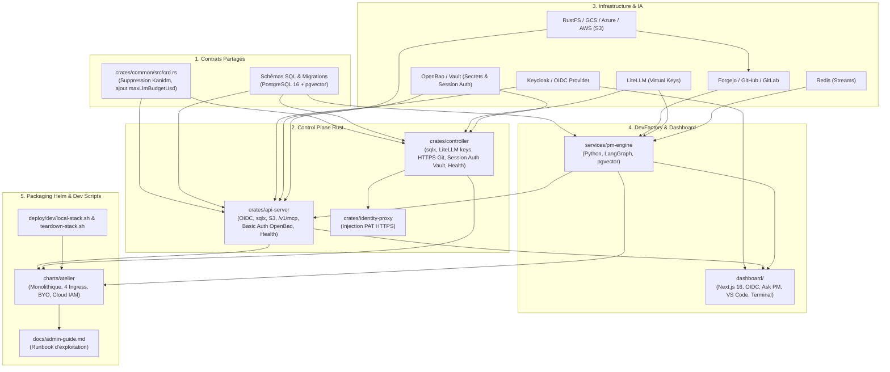

# Plan d'Action Global d'Implémentation

> **Statut** : Plan Cadre Opérationnel & Feuille de Route d'Ingénierie
> **Dernière compression** : 2026-09-05 — les jalons M1 à M6 (117 tâches,
> toutes `[x]`) ont été sortis vers
> [`docs/archive/PLAN-ACTION-M1-M6.md`](../archive/PLAN-ACTION-M1-M6.md)
> (même raison que l'archivage de `docs/PROGRESS.md` fin août 2026 : une
> tâche validée n'a plus besoin de son détail ligne à ligne dans le
> document courant, seulement dans `git log` et l'archive). Ce document ne
> garde que ce qui reste utile pour démarrer la prochaine tâche : le
> protocole de traçabilité, les principes transversaux, la carte des
> dépendances, la Matrice Récapitulative des jalons clos, et les jalons en
> cours ou à venir.
> **Protocole de Transition Multi-Agents & États de Tâche** : Ce plan est conçu pour être **exécuté de manière asynchrone, interrompu à tout moment et repris sans friction par n'importe quel autre agent IA** (Claude Code, Gemini CLI, Antigravity).
> **Règle de Traçabilité Obligatoire & États `[ ]` / `[-/<agent>/<session_id>]` / `[x]`** :
> 1. `[ ]` : Tâche en attente / non démarrée.
> 2. `[-/<agent_family>/<session_id>]` : **Tâche en cours d'exécution par un LLM / Agent identifié** (ex: `[-/claude-code/sess-4a8b]` ou `[-/antigravity/c192a786]`). Permet de savoir précisément qui travaille sur la tâche et si la session est toujours active.
> 3. `[x]` : **Tâche terminée et validée empiriquement** par tests réels sans mocks et journalisée dans [`docs/PROGRESS.md`](../PROGRESS.md).

---

## Sommaire

1. [Protocole de Transmission & Traçabilité Multi-Agents](#1-protocole-de-transmission--traçabilité-multi-agents)
2. [Principes Directeurs & Definition of Done (DoD) Transversale](#2-principes-directeurs--definition-of-done-dod-transversale)
3. [Cartographie des Dépendances & Matrice d'Impact Globale](#3-cartographie-des-dépendances--matrice-dimpact-globale)
4. [Jalons Clos (M1 à M6) — Matrice Récapitulative](#4-jalons-clos-m1-à-m6--matrice-récapitulative)
5. [Jalon 7 (M7) : Stack d'Observabilité (Traces, Métriques, Logs)](#5-jalon-7-m7--stack-dobservabilité-traces-métriques-logs)

---

## 1. Protocole de Transmission & Traçabilité Multi-Agents

Afin de permettre une collaboration fluide entre différents agents IA ou sessions interrompues :

### 📋 Instructions Strictes pour l'Agent Exécuteur :
1. **Vérification Initiale & Verrouillage Nominatif (`[-/<family>/<id>]`)** :
   - Inspecter `git status`, [`docs/PROGRESS.md`](../PROGRESS.md) et ce document `PLAN-ACTION-GLOBAL.md`.
   - **Vérifier qu'aucune tâche antérieure n'est laissée en cours `[-/...]`** ou non validée `[ ]`.
   - Dès qu'un agent prend en charge une tâche `[ ]`, il **DOIT IMMÉDIATEMENT positionner le marqueur nominatif `[-/<agent_family>/<session_id>]`** (ex: `[-/antigravity/c192a786]` ou `[-/claude-code/sess-xyz]`) sur la tâche dans `PLAN-ACTION-GLOBAL.md`.
2. **Validation d'une tâche (`[x]`)** :
   - Exécuter impérativement les tests unitaires et de linter (`cargo test`, `cargo clippy`, `cargo fmt` ou `pytest`).
   - Remplacer le marqueur `[-/...]` par **`[x]`** (indiquant formellement le travail terminé) dans ce document `PLAN-ACTION-GLOBAL.md`.
   - Consigner ce qui doit réellement l'être dans `docs/PROGRESS.md`/`docs/architecture/pieges.md` (voir `AGENTS.md`, section « Mise à jour de la Documentation ») — pas d'entrée narrative datée par tâche.
3. **Interruption / Passage de relais** :
   - Si une session s'arrête en cours de tâche, laisser le marqueur `[-/<family>/<id>]` et documenter dans `docs/PROGRESS.md` l'état exact d'avancement pour que l'agent suivant sache exactement d'où repartir.

---

## 2. Principes Directeurs & Definition of Done (DoD) Transversale

Conformément à [`AGENTS.md`](file:///home/philippe/github.com/PhilippeVienne/atelier/AGENTS.md) et [`00-architecture-principles-substitutability.md`](00-architecture-principles-substitutability.md) :

### 🛡️ Exigences de Qualité Transversales
1. **Zero `unsafe`** dans tout le code Rust de production (`crates/*/src/`).
2. **Formatage & Linting Stricts** :
   - `cargo fmt --all -- --check` est 100% propre.
   - `cargo clippy --workspace --all-targets -- -D warnings` ne retourne aucun avertissement.
3. **Vérification Empirique sans Mocks (Infrastructure Dev Réelle)** :
   - Tous les tests d'intégration s'exécutent contre de vrais conteneurs / pods locaux (PostgreSQL réel sous Kind port 5433, S3/MinIO réel, Forgejo réel, OpenBao réel, LiteLLM réel, Redis réel, cluster Kind réel avec microVMs Firecracker).
   - Zéro mock factice remplaçant les composants réseau ou de stockage.
4. **Documentation Vivante** :
   - Mise à jour systématique de [`docs/PROGRESS.md`](file:///home/philippe/github.com/PhilippeVienne/atelier/docs/PROGRESS.md) avec preuves d'exécution.
5. **Dashboard Next.js 16** :
   - Validation de la compilation TypeScript et du build (`npm run build`).

---

## 3. Cartographie des Dépendances & Matrice d'Impact Globale

---

## 4. Jalons Clos (M1 à M6) — Matrice Récapitulative

Détail tâche par tâche (fichiers exacts, garde-fous, sous-tâches) dans
[`docs/archive/PLAN-ACTION-M1-M6.md`](../archive/PLAN-ACTION-M1-M6.md).

| Jalon | Intitulé | Livrables & Composants Clés | Critère de Validation Empirique (Go / No-Go) |
| :--- | :--- | :--- | :--- |
| **M1** | **Socle DB, OIDC, Basic Auth & Health** | `crates/common`, `crates/api-server`, `crates/controller`, `dashboard/` | `cargo test --workspace` passe avec vrai Postgres & OIDC, Basic Auth OpenBao et sondes /health opérationnelles. |
| **M2** | **S3 & Git HTTPS (Dev Pods)** | `crates/api-server/src/storage.rs`, `crates/identity-proxy`, `deploy/dev/{s3,forgejo}` | Upload de session S3 réussi, clone Git HTTPS privé réussi contre Forgejo dev. |
| **M3** | **LiteLLM & Budgets** | `crates/controller/src/litellm.rs`, `crates/common/src/crd.rs` | Virtual Key créée avec TTL court renouvelé à chaud post-resume, blocage 429 au dépassement de quota. |
| **M4** | **Serveur MCP Externe** | `crates/api-server/src/mcp_*.rs` | Client Claude Desktop connecté sur `/v1/mcp`, streaming `exec_in_workshop` bufferisé dans Postgres. |
| **M5** | **DevFactory PM Engine** | `services/pm-engine`, `dashboard/`, `deploy/dev/redis` | Workflow LangGraph complet (issue ➔ sous-branches ➔ auto-correction ➔ git-sync ➔ snapshot S3 ➔ merge). |
| **M6** | **Helm & Admin Doc** | `charts/atelier/`, `deploy/dev/*-stack.sh`, `docs/admin-guide.md` | `helm install` 100% opérationnel sur Kind avec 4 Ingress, identités Cloud, scripts dev et hooks validés — inclut la configuration des modèles LiteLLM par un admin (`docs/specs/11-admin-litellm-model-config.md`). |

---

## 5. Jalon 7 (M7) : Stack d'Observabilité (Traces, Métriques, Logs)

* **Spécification** : [`12-observabilite.md`](12-observabilite.md)
* **Constat** : `crates/common/src/telemetry.rs` exporte déjà des traces OTLP si `OTEL_EXPORTER_OTLP_ENDPOINT` est positionnée — elle ne l'est nulle part (chart, dev). Pire, vérifié empiriquement : même en la positionnant vers un vrai collecteur, **zéro trace n'est produite**, aucune route/boucle n'étant instrumentée par un span (`TraceLayer`/`#[instrument]` absents partout).
* **Fichiers** : `crates/common/src/telemetry.rs`, `crates/api-server/src/routes.rs`, `crates/controller/src/reconcile.rs`, `charts/atelier/templates/infra/observability-deployment.yaml` (nouveau), `charts/atelier/values.yaml`, `deploy/dev/local-stack.sh`.
  - [x] **7.1** : Nouveau composant chart `observability` (`grafana/otel-lgtm`, un seul pod — voir spec §3 pour la justification et les mesures empiriques de démarrage/mémoire), `.Values.observability.enabled`/`.resources`. Déployé réellement sur `kind-atelier-dev` : pod `Running` en 37s, `otel-lgtm:0.32.1` épinglé (même digest que `:latest` au moment de la vérification). `helm lint`/`helm template` passent.
  - [x] **7.2** : `OTEL_EXPORTER_OTLP_ENDPOINT` câblée sur les Deployments `api-server`/`controller` du chart quand `observability.enabled`. `deploy/dev/local-stack.sh` déploie inconditionnellement `deploy/dev/otel/dev-deployment.yaml` (remplace l'ancien `collector-config.yaml`, orphelin depuis `a51b1c9`, jamais câblé) et ouvre un port-forward local (4317) — vérifié contre le cluster de dev réel (Service→pod atteignable, `nc` réussi). `helm lint`/`helm template`/`shellcheck` propres.
  - [ ] **7.3** : `tower_http::TraceLayer` sur `routes::router` (`api-server`) — un span par requête HTTP, méthode/chemin/statut en attributs.
  - [x] **7.4** : Déjà fait — `crates/controller/src/reconcile.rs` porte `#[tracing::instrument(skip_all, ...)]` sur 5 fonctions depuis le commit `a51b1c9` (2026-08-18), dont deux avec `fields(workshop = %workshop.name_any())`. Découvert en cours de rédaction de la spec (une recherche trop stricte l'avait manqué) puis reverifié bout en bout : `atelier-controller` local + `OTEL_EXPORTER_OTLP_ENDPOINT` vers un `grafana/otel-lgtm` réel + réconciliation réelle contre le cluster de dev → 5 traces `service.name=atelier-controller` retrouvées dans Tempo. Aucune implémentation nécessaire, seul le câblage de 7.2 manquait.
  - [ ] **7.5** : `telemetry.rs` gagne un `MeterProvider` (métriques, absent aujourd'hui — seules les traces sont initialisées) ; compteur de requêtes + histogramme de latence sur `api-server`, par route et code de statut.
