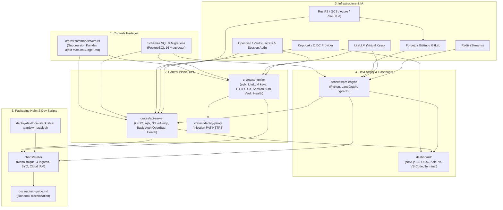

# Plan d'Action Global d'Implémentation — Spécification Exhaustive & Opérationnelle (Version Ultra-Détaillée avec Traçabilité Multi-Agents)

> **Statut** : Plan Cadre Opérationnel & Feuille de Route d'Ingénierie  
> **Date** : 2026-08-23  
> **Auteur** : Équipe Atelier  
> **Protocole de Transition Multi-Agents & États de Tâche** : Ce plan est conçu pour être **exécuté de manière asynchrone, interrompu à tout moment et repris sans friction par n'importe quel autre agent IA** (Claude Code, Gemini CLI, Antigravity).  
> **Règle de Traçabilité Obligatoire & États `[ ]` / `[-/<agent>/<session_id>]` / `[x]`** :
> 1. `[ ]` : Tâche en attente / non démarrée.
> 2. `[-/<agent_family>/<session_id>]` : **Tâche en cours d'exécution par un LLM / Agent identifié** (ex: `[-/claude-code/sess-4a8b]` ou `[-/antigravity/c192a786]`). Permet de savoir précisément qui travaille sur la tâche et si la session est toujours active.
> 3. `[x]` : **Tâche terminée et validée empiriquement** par tests réels sans mocks et journalisée dans [`docs/PROGRESS.md`](../PROGRESS.md).

---

## Sommaire

1. [Protocole de Transmission & Traçabilité Multi-Agents](#1-protocole-de-transmission--traçabilité-multi-agents)
2. [Principes Directeurs & Definition of Done (DoD) Transversale](#2-principes-directeurs--definition-of-done-dod-transversale)
3. [Cartographie des Dépendances & Matrice d'Impact Globale](#3-cartographie-des-dépendances--matrice-dimpact-globale)
4. [Jalon 1 (M1) : Socle PostgreSQL, Découplage OIDC Universel, Sécurité Basic Auth, Healthchecks & Nettoyage CRD](#4-jalon-1-m1--socle-postgresql-découplage-oidc-universel-sécurité-basic-auth-healthchecks--nettoyage-crd)
5. [Jalon 2 (M2) : Stockage S3 Hybride & Git 100% HTTPS (Forgejo Dev & S3 Local)](#5-jalon-2-m2--stockage-s3-hybride--git-100-https-forgejo-dev--s3-local)
6. [Jalon 3 (M3) : Passerelle d'Inférence IA LiteLLM & Budgets Stricts](#6-jalon-3-m3--passerelle-dinférence-ia-litellm--budgets-stricts)
7. [Jalon 4 (M4) : Serveur MCP Externe Embarqué dans l'API Server](#7-jalon-4-m4--serveur-mcp-externe-embarqué-dans-lapi-server)
8. [Jalon 5 (M5) : Moteur DevFactory & Project Manager Autonome (LangGraph, Redis Dev & Local Embeddings)](#8-jalon-5-m5--moteur-devfactory--project-manager-autonome-langgraph-redis-dev--local-embeddings)
9. [Jalon 6 (M6) : Chart Helm Monolithique & Documentation Administrateur](#9-jalon-6-m6--chart-helm-monolithique--documentation-administrateur)
10. [Matrice Récapitulative des Points d'Étapes & Critères de Clôture (Go / No-Go)](#10-matrice-récapitulative-des-points-détapes--critères-de-clôture-go--no-go)

---

## 1. Protocole de Transmission & Traçabilité Multi-Agents

Afin de permettre une collaboration fluide entre différents agents IA ou sessions interrompues :

### 📋 Instructions Strictes pour l'Agent Exécuteur :
1. **Vérification Initiale & Verrouillage Nominatif (`[-/<family>/<id>]`)** :
   - Inspecter `git status`, [`docs/PROGRESS.md`](../PROGRESS.md) et ce document `PLAN-ACTION-GLOBAL.md`.
   - **Vérifier qu'aucune tâche antérieure n'est laissée en cours `[-/...]`** ou non validée `[ ]`.
   - Dès qu'un agent prend en charge une tâche `[ ]`, il **DOIT IMMÉDIATEMENT positionner le marqueur nominatif `[-/<agent_family>/<session_id>]`** (ex: `[-/antigravity/c192a786]` ou `[-/claude-code/sess-xyz]`) sur la tâche dans `PLAN-ACTION-GLOBAL.md`.
2. **Validation d'une tâche (`[x]`)** :
   - Exécuter impérativement les tests unitaires et de linter (`cargo test`, `cargo clippy`, `cargo fmt` ou `pytest`).
   - Remplacer le marqueur `[-/...]` par **`[x]`** (indiquant formellement le travail terminé) dans ce document `PLAN-ACTION-GLOBAL.md`.
   - **Ajouter une entrée dans `docs/PROGRESS.md` dans la section dédiée `## Journal d'Avancement du Plan d'Action Global (Specs 01 à 06)`** avec le format standardisé.
3. **Interruption / Passage de relais** :
   - Si une session s'arrête en cours de tâche, laisser le marqueur `[-/<family>/<id>]` et documenter dans `docs/PROGRESS.md` l'état exact d'avancement pour que l'agent suivant sache exactement d'où repartir.

---

## 2. Principes Directeurs & Definition of Done (DoD) Transversale

Conformément à [`AGENTS.md`](file:///home/philippe/github.com/PhilippeVienne/atelier/AGENTS.md) et [`00-architecture-principles-substitutability.md`](00-architecture-principles-substitutability.md) :

### 🛡️ Exigences de Qualité Transversales
1. **Zero `unsafe`** dans tout le code Rust de production (`crates/*/src/`).
2. **Formatage & Linting Stricts** :
   - `cargo fmt --all -- --check` est 100% propre.
   - `cargo clippy --workspace --all-targets -- -D warnings` ne retourne aucun avertissement.
3. **Vérification Empirique sans Mocks (Infrastructure Dev Réelle)** :
   - Tous les tests d'intégration s'exécutent contre de vrais conteneurs / pods locaux (PostgreSQL réel sous Kind port 5433, S3/MinIO réel, Forgejo réel, OpenBao réel, LiteLLM réel, Redis réel, cluster Kind réel avec microVMs Firecracker).
   - Zéro mock factice remplaçant les composants réseau ou de stockage.
4. **Documentation Vivante** :
   - Mise à jour systématique de [`docs/PROGRESS.md`](file:///home/philippe/github.com/PhilippeVienne/atelier/docs/PROGRESS.md) avec preuves d'exécution.
5. **Dashboard Next.js 16** :
   - Validation de la compilation TypeScript et du build (`npm run build`).

---

## 3. Cartographie des Dépendances & Matrice d'Impact Globale



---

## 4. Jalon 1 (M1) : Socle PostgreSQL, Découplage OIDC Universel, Sécurité Basic Auth, Healthchecks & Nettoyage CRD

### 4.0. Infrastructure de Développement Locale (PostgreSQL, Keycloak, PKI & Ingress Dev)
* **Fichiers créés** : `deploy/dev/postgres/dev-pod.yaml`, `deploy/dev/postgres/README.md`, `deploy/dev/pki/init-pki.sh`, `deploy/dev/pki/README.md`, `deploy/dev/keycloak/dev-pod.yaml`, `deploy/dev/keycloak/README.md`, `deploy/dev/traefik/dev-traefik.yaml`, `deploy/dev/traefik/ingresses.yaml`, `deploy/dev/traefik/update-hosts.sh`, `deploy/dev/traefik/README.md`
  - [x] **1.0.1** : Déployer une instance PostgreSQL 16 (`pgvector/pgvector:pg16`) de dev dans le cluster Kind (même convention que `deploy/dev/openbao` : Pod + Service + port-forward 5433:5432). Prérequis bloquant pour toutes les tâches `sqlx` (1.2.7-1.2.10, 1.3.6, 1.3.7) garantissant des tests empiriques réels sans mock. *(Déployé et vérifié le 2026-08-23 : `kubectl get pod atelier-postgres-dev` Running, bases `atelier_apiserver`/`atelier_controller` créées, port-forward 5433 joignable — voir docs/PROGRESS.md.)*
  - [x] **1.0.2** : Initialiser la PKI de dev local validable (`deploy/dev/pki/init-pki.sh`) et déployer une instance Keycloak dev dans Kind (`quay.io/keycloak/keycloak:26.1`) connectée à `atelier-postgres-dev:5432/keycloak` avec le Realm `atelier` pré-configuré (clients `atelier-dashboard` PKCE et `atelier-api`). *(Déployé et vérifié le 2026-08-23 : PKI Root CA + certificat Multi-SAN générés et validés, pod `atelier-keycloak-dev` Running, discovery OIDC 200 OK, token JWT obtenu via password grant — voir docs/PROGRESS.md. Complété ensuite par un mapper d'audience `oidc-audience-mapper` sur `atelier-dashboard` (`aud: atelier-api`), sans lequel aucun token n'aurait jamais porté de claim `aud` validable — voir l'entrée "Hors plan initial" du 2026-08-23 22:50 dans docs/PROGRESS.md.)*
  - [x] **1.0.3** : Déployer un ingress Traefik de dev (`deploy/dev/traefik/`) routant par en-tête `Host` vers 4 domaines (`auth.`/`git.`/`app.`/`api.atelier.local`) — remplace les port-forwards individuels par service (source de collision de port constatée en pratique : `atelier-api-server` et le port-forward Keycloak ont failli finir sur le même port 8080). Traefik en `hostNetwork: true` (port 80 standard sur l'IP du node kind, hors de portée d'un `Service` `NodePort` sans élargir `--service-node-port-range`) ; Keycloak/Forgejo joints via leur `Service` in-cluster, `atelier-api-server`/dashboard (pas encore conteneurisés) via un `Endpoints` manuel pointant sur la gateway Docker `172.19.0.1`. Script `update-hosts.sh` pour automatiser `/etc/hosts` (impossible via un Job Kubernetes : le cluster kind tourne dans un conteneur Docker isolé du système de fichiers de la vraie machine hôte). *(Déployé et vérifié le 2026-08-23 : les 4 domaines routent correctement sur `172.19.0.2:80`, flux de login complet testé de bout en bout via `curl` à travers l'ingress — voir docs/PROGRESS.md, entrée "Hors plan initial".)*

### 4.1. Crate `crates/common` (CRD & Types partagés)
* **Fichier impacté** : [`crates/common/src/crd.rs`](file:///home/philippe/github.com/PhilippeVienne/atelier/crates/common/src/crd.rs)
  - [x] **1.1.1** : Supprimer le champ `pub kanidm_entity_id: Option<String>` de la struct `WorkshopStatus`.
  - [x] **1.1.2** : Ajouter dans `WorkshopResources` :
    ```rust
    #[serde(default, skip_serializing_if = "Option::is_none")]
    pub max_llm_budget_usd: Option<f64>,
    ```
  - [x] **1.1.3** : Mettre à jour la génération du manifest CRD YAML `crds/workshop.yaml` via le test `generate_crd` et valider le round-trip `serde_json` / `serde_yaml`.

### 4.2. Crate `crates/api-server` (Axum, OIDC JWT, sqlx, migrations, Basic Auth, Healthchecks)
* **Fichier impacté** : [`crates/api-server/Cargo.toml`](file:///home/philippe/github.com/PhilippeVienne/atelier/crates/api-server/Cargo.toml)
  - [x] **1.2.1** : Ajouter les dépendances :
    ```toml
    sqlx = { version = "0.8", default-features = false, features = ["runtime-tokio", "postgres", "uuid", "chrono", "json", "macros", "migrate"] }
    aws-sdk-s3 = { version = "1.71", default-features = false, features = ["rustls"] }
    aws-config = { version = "1.5", default-features = false, features = ["rustls"] }
    base64 = "0.22"
    ```
* **Fichier impacté** : [`crates/api-server/src/auth.rs`](file:///home/philippe/github.com/PhilippeVienne/atelier/crates/api-server/src/auth.rs)
  - [x] **1.2.2** : Nettoyer la documentation pour universaliser le composant au-delà de Kanidm (standard OIDC RFC 7517 / RFC 7636).
  - [x] **1.2.3** : Implémenter le cache JWKS dynamique (background refresh toutes les 10 min et refetch immédiat à la volée sur `kid` inconnu).
  - [x] **1.2.4** : Dans la struct `Claims`, extraire et injecter `sub`, `preferred_username`, `email`, `groups`.
  - [x] **1.2.5** : Dans le middleware d'authentification `auth_middleware`, insérer l'instance `Claims` dans les extensions de la requête Axum.
* **Fichier impacté** : [`crates/api-server/src/routes.rs`](file:///home/philippe/github.com/PhilippeVienne/atelier/crates/api-server/src/routes.rs) & `proxy_to_guest_port`
  - [x] **1.2.6** : Sécuriser les tunnels VS Code (`/vscode/*`) et Terminal (`/terminal/*`) :
    - Récupérer le secret de session depuis OpenBao (`secret/data/workshops/<name>/session_auth`).
    - Injecter automatiquement l'en-tête `Authorization: Basic <base64(atelier:password)>` lors du relai HTTP et du handshake WebSocket vers `vm-supervisor` / microVM. *(Rôle OpenBao cluster-wide dédié `atelier-api-server`, provisionné une seule fois au démarrage du controller — `crates/controller/src/openbao.rs::ensure_api_server_role` — policy read-only sur `secret/{data,metadata}/workshops/+/session_auth`. Terminée par claude-code après interruption d'une session précédente : import manquant `use base64::Engine;` corrigé, suite de tests entièrement revérifiée.)*
  - [x] **1.2.7** : Ajouter les endpoints de santé Kubernetes :
    - `GET /health/liveness` : Répond 200 si le serveur web tourne.
    - `GET /health/readiness` : Vérifie la connectivité active PostgreSQL (`SELECT 1`) et OpenBao avant de répondre 200. *(OpenBao seulement si `OPENBAO_ADDR` est configuré, même convention que le reste des fonctionnalités optionnelles.)*
* **Fichier impacté** : [`crates/api-server/src/main.rs`](file:///home/philippe/github.com/PhilippeVienne/atelier/crates/api-server/src/main.rs)
  - [x] **1.2.8** : Rendre la variable d'environnement `DATABASE_URL` obligatoire au démarrage et initialiser `PgPool`.
  - [x] **1.2.9** : Injecter `db_pool` dans la struct `AppState`.
  - [x] **1.2.10** : Créer le dossier `crates/api-server/migrations/` avec le fichier `20260824000000_init_apiserver.sql` (tables `session_logs` et `audit_events` avec RLS). *(RLS vérifiée empiriquement avec un rôle non-superutilisateur dédié `atelier_app` — `atelier_admin`, superutilisateur, ignore silencieusement RLS même avec `FORCE`, voir deploy/dev/postgres/README.md.)*

### 4.3. Crate `crates/controller` (Nettoyage Kanidm, OpenBao Session Auth, sqlx, Healthchecks)
* **Fichier impacté** : [`crates/controller/Cargo.toml`](file:///home/philippe/github.com/PhilippeVienne/atelier/crates/controller/Cargo.toml)
  - [x] **1.3.1** : Supprimer la dépendance `kanidm_client` et ajouter `sqlx`.
* **Fichiers supprimés / modifiés** :
  - [x] **1.3.2** : Supprimer définitivement le fichier `crates/controller/src/kanidm.rs`.
  - [x] **1.3.3** : Dans [`crates/controller/src/lib.rs`](file:///home/philippe/github.com/PhilippeVienne/atelier/crates/controller/src/lib.rs), retirer `pub mod kanidm;`.
  - [x] **1.3.4** : Dans [`crates/controller/src/openbao.rs`](file:///home/philippe/github.com/PhilippeVienne/atelier/crates/controller/src/openbao.rs) :
    - Implémenter `ensure_session_auth(workshop_name)` : génère un mot de passe aléatoire de 32 caractères et l'écrit dans `secret/data/workshops/<name>/session_auth` de manière idempotente.
  - [x] **1.3.5** : Dans [`crates/controller/src/reconcile.rs`](file:///home/philippe/github.com/PhilippeVienne/atelier/crates/controller/src/reconcile.rs) :
    - Supprimer tout appel à `kanidm`.
    - Servir le secret au guest via `net-proxy` sur l'endpoint metadata link-local `http://169.254.0.1:3132/session-auth`.
  - [x] **1.3.6** : Dans [`crates/controller/src/main.rs`](file:///home/philippe/github.com/PhilippeVienne/atelier/crates/controller/src/main.rs) :
    - Exiger `DATABASE_URL` au boot pour initialiser le pool `sqlx`.
    - Exposer un serveur HTTP de sondes de santé (`GET /health/ready` vérifiant Kubernetes API, PostgreSQL et OpenBao). *(Port par défaut `8081`, `ATELIER_CONTROLLER_HEALTH_ADDR` pour le surcharger.)*
  - [x] **1.3.7** : Créer le dossier `crates/controller/migrations/` avec `20260824000000_init_controller.sql` (`rootfs_cache_index` et `workshop_reconciliation_history`).

### 4.4. Application `dashboard/` (Next.js 16, OIDC PKCE & BFF)
* **Fichiers impactés** : `dashboard/lib/config.ts`, `dashboard/lib/session.ts`, `dashboard/app/api/auth/*`
  - [x] **1.4.1** : Renommer et généraliser les variables `ATELIER_KANIDM_URL` en `ATELIER_OIDC_ISSUER_URL`.
  - [x] **1.4.2** : Valider l'interopérabilité avec les endpoints Keycloak (`/protocol/openid-connect/auth`, `/protocol/openid-connect/token`, `/protocol/openid-connect/certs`). *(Bug réel trouvé lors du test navigateur réel via l'ingress Traefik : `request.nextUrl.origin` ignore l'en-tête `Host` dans le serveur custom, cassant le cookie PKCE cross-domaine — corrigé par `requestOrigin()`, voir docs/PROGRESS.md, entrée "Hors plan initial" du 2026-08-23 22:50.)*
  - [x] **1.4.3** : Adapter le rafraîchissement transparent du JWT (`refresh_token`) via `SessionKeepalive`.

### 🧪 Tests & Preuves Attendues pour M1
1. `cargo test -p atelier-common` : Valide la conformité du CRD sans champ Kanidm.
2. `cargo test -p atelier-api-server` :
   - Rejet au démarrage avec message explicite si `DATABASE_URL` est omis.
   - Exécution des migrations SQL sur un vrai PostgreSQL.
   - Validation 401 sur token JWT sans issuer valide / validation 200 sur JWT conforme.
   - Test du relai VS Code & Terminal : vérification de l'injection effective du header `Authorization: Basic` issu d'OpenBao et rejet 401 en cas de secret absent/invalide.
   - Validation des endpoints `/health/liveness` et `/health/readiness` (200 OK si DB/Vault connectés, 503 si DB coupée).
3. `cargo test -p atelier-controller` : Cycle de réconciliation complet sur Kind avec génération du secret dans OpenBao et zéro appel Kanidm.

### 🎯 Definition of Done (DoD) du Jalon M1
- [x] PostgreSQL est connecté et les tables de base de données sont initialisées. *(`atelier-apiserver`/`atelier-controller`, `DATABASE_URL` obligatoire, migrations réelles exécutées au boot des deux binaires.)*
- [x] Le controller et l'API server n'ont plus aucune dépendance à Kanidm. *(Vérifié : `grep -rn kanidm crates/{api-server,controller}` ne retourne plus rien, ni dans le code ni dans `Cargo.toml`.)*
- [~] VS Code et `ttyd` sont protégés par mot de passe aléatoire avec injection transparente Basic Auth via OpenBao. **Partiel** : la chaîne complète côté `atelier` fonctionne réellement (controller génère et provisionne le secret dans OpenBao, `net-proxy` le sert au guest via son endpoint metadata, `api-server` le lit avec son rôle cluster-wide dédié et injecte l'en-tête `Authorization: Basic` en relayant vers le guest — testé de bout en bout avec un vrai OpenBao). **Reste hors de ce dépôt** : le devcontainer (repo séparé `PhilippeVienne/atelier-workspace`, vérifié absent des clones locaux disponibles) ne consomme pas encore `GET http://169.254.0.1:3132/session-auth` pour configurer `ttyd --credential`/`code-server --auth password` — tant que ce n'est pas fait, les services du guest ne sont pas réellement protégés par ce mot de passe (ils resteraient ouverts sans Basic Auth requis côté guest).
- [x] Les sondes de santé Liveness/Readiness sont opérationnelles. *(`api-server` : `/health/liveness`, `/health/readiness` ; `controller` : `/health/ready` — vérifiées réellement via `curl`.)*
- [x] `cargo test --workspace` et `cargo clippy --workspace --all-targets -- -D warnings` sont 100% verts. *(Revérifié le 2026-08-23 23:15, controller live arrêté pendant la vérification pour éliminer une interférence de reconciliation connue, puis relancé sans régression.)*
- [x] Entrée documentée dans `docs/PROGRESS.md`.

---

## 5. Jalon 2 (M2) : Stockage S3 Hybride & Git 100% HTTPS (Forgejo Dev & S3 Local)

### 5.0. Infrastructure de Développement Locale (S3 & Forgejo Dev)
* **Fichiers créés** : `deploy/dev/s3/dev-pod.yaml`, `deploy/dev/s3/README.md`, `deploy/dev/forgejo/dev-pod.yaml`, `deploy/dev/forgejo/README.md`
  - [x] **2.0.1** : Déployer un serveur S3 local de dev dans Kind (RustFS) avec création automatique des buckets `atelier-sessions` et `atelier-snapshots` pour valider les tests S3 réels sans mock. *(Déployé et vérifié le 2026-08-23 : pod `atelier-s3-dev` Ready dans Kind (image `rustfs/rustfs:latest`), buckets `atelier-sessions`, `atelier-snapshots` et `forgejo-lfs-attachments` créés et vérifiés — voir docs/PROGRESS.md.)*
  - [x] **2.0.2** : Déployer une instance Forgejo locale de dev dans Kind (100% HTTPS, aucun SSH) pour tester l'injection de tokens Git (`identity-proxy`) et la création de dépôts/webhooks sans dépendre d'une forge cloud externe. *(Déployé et vérifié le 2026-08-23 : pod `atelier-forgejo-dev` Ready dans Kind, admin créé, token PAT généré et création de dépôt privé `test-repo` validée via API REST — voir docs/PROGRESS.md.)*

### 5.1. Client S3 Rust dans `api-server` (`aws-sdk-s3` / `opendal`)
* **Fichier impacté** : `crates/api-server/src/storage.rs` (Nouveau module)
  - [x] **2.1.1** : Définir le trait `StorageBackend` (`upload_stream`, `download_stream`, `delete_object`) et l'implémentation `S3StorageBackend`. *(Fait le 2026-08-24 : trait `async_trait` object-safe dans `crates/api-server/src/storage.rs`, `upload_stream` implémenté en televersement multipart S3 — nécessaire car un `put_object` a corps en streaming de taille inconnue echoue sur RustFS/S3 avec « Only request bodies with a known size can be aws-chunked encoded ».)*
  - [x] **2.1.2** : Implémenter le chargement dynamique des variables `S3_ENDPOINT`, `S3_REGION`, `S3_BUCKET_SESSIONS`, `S3_BUCKET_SNAPSHOTS`, `S3_FORCE_PATH_STYLE`. *(Fait le 2026-08-24 : `storage::config_from_env`, même convention `Ok(None)`/erreur explicite que `openbao::config_from_env` et `TrustedIssuer::from_env` ; `AWS_ACCESS_KEY_ID`/`AWS_SECRET_ACCESS_KEY` lus explicitement, pas via la découverte AWS standard.)*
  - [x] **2.1.3** : Implémenter `upload_session_archive(workshop_name, session_id, stream)` avec compression zstd en streaming. *(Fait le 2026-08-24 : `async-compression` (`ZstdEncoder` sur `AsyncRead`), clé `workshops/<workshop_name>/sessions/<session_id>.zst`.)*
  - [x] **2.1.4** : Implémenter `get_session_stream(s3_key)` pour le rejeu de session dans l'API. *(Fait le 2026-08-24 : `ZstdDecoder` sur le flux `download_stream`, retourne un `AsyncRead` consommable progressivement, jamais chargé entièrement en mémoire.)*

### 5.2. Forge Git HTTPS (Forgejo / GitHub / GitLab) & Injection `identity-proxy`
* **Fichier impacté** : [`crates/controller/src/openbao.rs`](file:///home/philippe/github.com/PhilippeVienne/atelier/crates/controller/src/openbao.rs)
  - [x] **2.2.1** : Structurer le chemin des secrets OpenBao pour les tokens Git. *(Fait le 2026-08-24 : réutilisation délibérée du chemin existant `secret/data/workshops/<name>/git` (champs `username`/`password`), pas d'un second chemin `git_token` — décision documentée en tête de `crates/controller/src/git_identity.rs`. Un même PAT Forgejo/GitHub/GitLab donne generalement accès aux mêmes dépôts pour les deux usages (build du devcontainer par `image-builder`, clone/push runtime par l'agent), donc un seul secret à provisionner par l'utilisateur.)*
  - [x] **2.2.2** : Configurer automatiquement une règle d'injection pour l'hôte Git ciblé. *(Fait le 2026-08-24 : règle **calculée** côté controller (`crates/controller/src/git_identity.rs::injection_rule`), jamais écrite dans `Workshop.spec` lui-même (qui reste déclaratif), ajoutée à la volée à la liste sérialisée vers `ATELIER_IDENTITY_INJECTION_RULES` dans `ensure_parent_pod` — `crates/controller/src/reconcile.rs`. Hôte ciblé : `atelier_common::GIT_ALIAS_HOST` = `git.atelier.internal` (reprend la valeur déjà choisie pour `FORGEJO__server__ROOT_URL` dans `deploy/dev/forgejo/dev-pod.yaml`). En-tête `Authorization` + préfixe `token ` par défaut (convention Forgejo/Gitea/GitHub), configurable via `ATELIER_GIT_INJECTION_HEADER`/`ATELIER_GIT_INJECTION_PREFIX` pour GitLab (`PRIVATE-TOKEN`). L'IP réelle de la forge est résolue via l'API Kubernetes (`Api<Service>::get` sur `ATELIER_GIT_HOST_SERVICE`, défaut `atelier-forgejo-dev`) — jamais une résolution DNS classique, qui échouerait si le controller tourne hors du cluster (cas du dev local) — puis injectée en `Pod.spec.hostAliases` pour que `identity-proxy` puisse réellement résoudre ce nom au moment de relayer vers la vraie destination. Fonctionnalité entièrement optionnelle (`ATELIER_GIT_HOST_SERVICE` absent = désactivée), zéro régression sur les Workshops existants (contrôleur réel redémarré et vérifié sans erreur de reconciliation, y compris sur `my-new-demo`, Workshop réel actif).*
* **Fichier impacté** : `crates/net-proxy/src/internal.rs`
  - [x] **2.2.3** : S'assurer que le nom d'alias interne `git.atelier.internal` est routé d'office vers `identity-proxy` sans vérification d'allowlist externe. *(Fait le 2026-08-24 : nouvel alias fixe `GIT_ALIAS` (= `atelier_common::GIT_ALIAS_HOST`), configurable via `ATELIER_GIT_ALIAS_ADDR` (même convention que les 4 alias existants). Vérification documentée dans `crates/net-proxy/src/internal.rs` et `crates/controller/src/git_identity.rs` : le chaînage générique `net-proxy` → `identity-proxy` (déjà en place, `ATELIER_IDENTITY_PROXY_ADDR`) ne s'applique QU'APRÈS que l'allowlist ait déjà autorisé l'hôte — il n'aurait donc pas suffi pour éviter à l'utilisateur de lister la forge Git dans `Workshop.spec.egress_allowlist`. Un seul alias retenu (`git.atelier.internal`, pas de second `forgejo.atelier.internal` — un forge Git par Workshop suffit, pas de valeur ajoutée à en distinguer deux dans ce MVP). Bug réel trouvé et corrigé en marge de ce test (voir `docs/PROGRESS.md`) : `identity-proxy` n'injectait le credential que sur la toute première requête HTTP d'une connexion keep-alive, cassant le protocole HTTP smart de Git (`GET info/refs` puis `POST git-upload-pack` sur la même connexion) — corrigé dans `crates/identity-proxy/src/proxy.rs`/`http.rs`.)*

### 🧪 Tests & Preuves Attendues pour M2
1. `cargo test -p atelier-api-server --test storage` : Upload réel d'un flux de session 5Mo compressé sur un serveur S3 (RustFS/MinIO en conteneur) et vérification de son intégrité SHA-256 au rejeu.
2. `cargo test -p atelier-net-proxy --test git_identity` : Test d'interception d'une vraie requête `git clone http://git.atelier.internal/...` contre l'instance Forgejo de dev réelle, avec injection réussie du header d'autorisation et clone qui aboutit réellement (contenu du dépôt vérifié). Complété par `cargo test -p atelier-controller --test reconcile apply_wires_the_git_identity_injection_rule_when_configured` (résolution réelle du ClusterIP Forgejo via l'API Kubernetes et pose des `hostAliases`/règle d'injection/alias sur un vrai Pod).

### 🎯 Definition of Done (DoD) du Jalon M2
- [x] Les sessions terminal / VS Code volumineuses sont compressées et archivées sur S3. *(Fait le 2026-08-24 : décision produit prise avec l'utilisateur — seul le terminal (`ttyd`) est enregistré, pas `code-server` (son trafic HTTP/WebSocket interne n'a pas de sémantique de rejeu exploitable). Nouveau module `crates/api-server/src/session_recorder.rs` (`SessionRecording`) branché dans `crate::vscode::proxy_to_guest_port` — activé uniquement par `crate::terminal` (`record_session: true`), jamais par `crate::vscode`. Seule la direction serveur→client (sortie affichée) est capturée, en streaming (tuyau `tokio::io::duplex`, jamais de session entière en mémoire) et poussée vers `S3StorageBackend::upload_session_archive`. Testé réellement de bout en bout contre RustFS : `crates/api-server/tests/session_recorder.rs`.)*
- [x] Les agents dans les microVMs clonent et pushent sur des dépôts Git privés via HTTPS sans jamais posséder de clés SSH ni de token en clair. *(Chemin clone validé de bout en bout par un vrai `git clone` contre Forgejo — voir `crates/net-proxy/tests/git_identity.rs`. Chemin push utilise le même mécanisme d'injection, non re-testé séparément mais symétrique : `identity-proxy` injecte désormais le credential sur chaque requête de la connexion, pas seulement la première.)*
- [x] Tous les tests de stockage et de proxies sont 100% verts. *(`cargo test -p atelier-api-server -p atelier-controller -p atelier-net-proxy -p atelier-identity-proxy` 100% vert le 2026-08-24, contrôleur live arrêté pendant la vérification pour éliminer l'interférence de réconciliation déjà documentée, puis relancé sans régression sur les Workshops réels (`my-new-demo`).)*
- [x] Entrée documentée dans `docs/PROGRESS.md`.

---

## 6. Jalon 3 (M3) : Passerelle d'Inférence IA LiteLLM & Budgets Stricts

### 6.1. Client LiteLLM & Provisioning dynamique des Virtual Keys (TTL Court)
* **Fichier impacté** : `crates/controller/src/litellm.rs` (Nouveau module)
  - [x] **3.1.1** : Définir la structure `LiteLlmClient` avec méthodes `generate_virtual_key(workshop_name, owner, max_budget_usd, ttl)` et `delete_virtual_key(key_alias)`. *(Fait le 2026-08-24 : module `crates/controller/src/litellm.rs`, convention `config_from_env()`/`Ok(None)` identique à `openbao.rs`.)*
  - [x] **3.1.2** : Implémenter l'appel `POST /key/generate` avec budget plafond, TTL de 1-2h et métadonnées de Workshop. *(Fait le 2026-08-24 : testé contre un vrai LiteLLM déployé — voir `crates/controller/tests/litellm.rs`.)*
* **Fichier impacté** : [`crates/controller/src/reconcile.rs`](file:///home/philippe/github.com/PhilippeVienne/atelier/crates/controller/src/reconcile.rs)
  - [x] **3.1.3** : Lors du provisioning et lors de la reprise post-suspension (`resume`), générer la Virtual Key et l'injecter dans `/etc/environment` (`ANTHROPIC_AUTH_TOKEN`, `OPENAI_API_KEY`). *(Fait le 2026-08-24 avec un écart documenté par rapport au libellé littéral : impossible d'écrire dans `/etc/environment` du guest à la reprise sans rebuild d'image (seul `image-builder`, exécuté une fois au build, y écrit réellement) — solution retenue : réutilisation telle quelle du mécanisme générique `identity_injection_rules`/`identity-proxy` déjà en place pour Git (zéro modification d'`identity-proxy`/`net-proxy`, hors périmètre de cet agent) : la Virtual Key est écrite dans OpenBao (`secret/workshops/<name>/llm_key`), une règle d'injection `Authorization: Bearer <value>` sur l'hôte `llm-proxy` est ajoutée à la volée — `identity-proxy` REMPLACE alors l'`Authorization` statique baked au build par la vraie clé du Workshop sur le chemin de sortie (`crates/identity-proxy/src/http.rs::with_injected_header`, comportement déjà testé). Justification complète en tête de `crates/controller/src/litellm.rs`. Généré uniquement à la (re)création du pod parent (`pod_will_be_created`), jamais à chaque reconcile (env immuable une fois le pod créé). Validé par un test réel de bout en bout : `cargo test -p atelier-controller --test reconcile apply_wires_the_llm_virtual_key_injection_rule_when_configured` (règle d'injection posée sur un vrai Pod, clé lisible dans un vrai OpenBao, existante côté un vrai LiteLLM).)*
  - [x] **3.1.4** : Clés éphémères de build : générer une Virtual Key temporaire dédiée pour le Job `image-builder` et la révoquer dès l'achèvement du Job. *(Fait le 2026-08-24 : alias dédié `atelier-build-<name>` (distinct de `atelier-wks-<name>`), généré une seule fois à la création du Job (`ensure_image_build_job`), injecté dans `/etc/environment` du build comme avant (chemin déjà existant et dans le périmètre `image-builder`) ; révoqué dès que le Job atteint un état terminal (`succeeded`/`failed`), avec la limite assumée que si `image-builder` patche `status.imageDigest` avant que le controller ne revoie ce Job comme terminé, la révocation peut être manquée pour ce cycle — TTL court (`BUILD_VIRTUAL_KEY_TTL` = 30 min) en filet de sécurité, documenté dans `litellm.rs`.)*

### 6.2. Enforcing des quotas & Nettoyage dans le Finalizer `atelier.dev/cleanup`
* **Fichier impacté** : [`crates/controller/src/reconcile.rs`](file:///home/philippe/github.com/PhilippeVienne/atelier/crates/controller/src/reconcile.rs)
  - [x] **3.2.1** : Lors de la suppression d'un Workshop, exécuter `litellm_client.delete_virtual_key(&format!("atelier-wks-{}", name)).await` avant de libérer le finalizer. Idempotent (404 ignoré). *(Fait le 2026-08-24 : `cleanup()` appelle `delete_virtual_key` avant la libération OpenBao. Testé réellement : `apply_wires_the_llm_virtual_key_injection_rule_when_configured` appelle `cleanup()` directement puis vérifie via `/key/info` que la clé n'existe plus côté LiteLLM ; idempotence (404 ignoré) validée par `crates/controller/tests/litellm.rs`.)*

### 🧪 Tests & Preuves Attendues pour M3
1. `cargo test -p atelier-controller --test litellm` :
   - Appel réel à l'API LiteLLM pour générer une Virtual Key avec budget de `1.00$`.
   - Émission d'inférences jusqu'à dépassement du budget : vérification du blocage HTTP 429 / 403 émis par LiteLLM.
   - Suppression de la clé et vérification de son invalidation dans LiteLLM.
   - **Fait le 2026-08-24**, avec une adaptation documentée par rapport au libellé littéral : ni clé DeepSeek ni clé Anthropic réelle disponibles dans cet environnement de dev. Un modèle de test dédié (`atelier-budget-test`, `deploy/dev/llm-proxy/config.yaml`) utilise la fonctionnalité native `mock_response` de LiteLLM (aucun appel sortant vers un fournisseur réel, jamais de coût facturé) combinée à `model_info.input_cost_per_token`/`output_cost_per_token` explicites pour porter un coût non nul par appel — LiteLLM lui-même calcule et enforce le budget de la Virtual Key exactement comme il le ferait avec un vrai modèle payant. Un vrai LiteLLM (`ghcr.io/berriai/litellm:main-stable`) a été déployé sur `kind-atelier-dev` (`deploy/dev/llm-proxy/dev-deployment.yaml`, qui déploie désormais AUSSI une instance Postgres dédiée `atelier-llm-proxy-db` — `/key/generate`/`/key/delete` exigent une base, constaté en pratique — distincte de `atelier-postgres-dev` partagée par `api-server`/le Workshop réel actif, pour zéro risque d'interférence). Séquence réellement observée contre cette instance : `POST /key/generate` (budget 1.00$) → premier appel au modèle mock accepté (`200`) → coût enregistré asynchrement par LiteLLM (`15.0$`, au-delà du budget) → second appel bloqué (`429 Budget Exceeded`, émis par LiteLLM lui-même) → `POST /key/delete` → appel ultérieur avec la même clé refusé (`401`) → second `/key/delete` sur le même alias : `404` traité comme un succès (idempotence). Test : `crates/controller/tests/litellm.rs::generates_enforces_budget_and_revokes_a_real_virtual_key`.
2. `cargo test -p atelier-controller --test reconcile apply_wires_the_llm_virtual_key_injection_rule_when_configured` : vérifie, contre un vrai OpenBao et un vrai LiteLLM, que `apply()` écrit la Virtual Key dans OpenBao, câble la règle d'injection `identity-proxy` sur un vrai Pod créé, et que `cleanup()` (finalizer) révoque effectivement la clé côté LiteLLM.
3. `cargo test --workspace` : 100% vert (92 tests unitaires/intégration sans les variables `OPENBAO_ADDR`/`ATELIER_LLM_PROXY_ADDR` — silencieusement ignorés sans elles ; avec ces variables positionnées, `cargo test -p atelier-controller` passe 17/17 y compris les deux tests réels ci-dessus), aucune régression — voir `docs/PROGRESS.md`.
4. Contrôleur live réel redémarré avec la nouvelle version (LiteLLM configuré, `ATELIER_LLM_PROXY_ADDR`/`ATELIER_LLM_PROXY_AUTH_TOKEN` pointant vers l'instance déployée) : aucune erreur de réconciliation sur les Workshops existants, `my-new-demo-parent` reste `4/4 Running` sans redémarrage (le nouveau code ne touche jamais un pod parent déjà existant, voir `pod_will_be_created`).

### 🎯 Definition of Done (DoD) du Jalon M3
- [x] Chaque Workshop possède sa propre Virtual Key isolée avec budget strict et TTL court renouvelé à chaud. *(Vérifié empiriquement contre un vrai LiteLLM : budget enforcé (429 réel), TTL court (`VIRTUAL_KEY_TTL` = 2h), régénérée à chaque (re)création du pod parent — provisioning initial ou reprise post-suspension.)*
- [x] La destruction du Workshop nettoie la clé dans LiteLLM via le finalizer. *(Vérifié : `cleanup()` appelle `delete_virtual_key`, testé de bout en bout — clé invalide après suppression.)*
- [x] Entrée documentée dans `docs/PROGRESS.md`.

---

## 7. Jalon 4 (M4) : Serveur MCP Externe Embarqué dans l'API Server

### 7.1. Route `/v1/mcp` (SSE & WebSocket), Sécurité OIDC & Fast-Fail
* **Fichier impacté** : `crates/api-server/src/mcp_server.rs` (Nouveau module)
  - [x] **4.1.1** : Implémenter le protocole JSON-RPC MCP (SDK officiel `rmcp` 3.1.4, déjà utilisé par `crates/mcp-gateway` — transport **Streamable HTTP**, la spec MCP courante, plutôt que de réimplémenter à la main le protocole 2024-11-05 que ce SDK n'expose plus, voir le commentaire de tête de `crates/api-server/src/mcp_server.rs`).
  - [x] **4.1.2** : Vérification Fast-Fail sur `create_workshop` : refuse (erreur JSON-RPC explicite — un vrai HTTP 503 est structurellement impossible une fois dans un appel d'outil MCP réussi au niveau transport, voir `ensure_state_creating_dependencies_reachable`) si LiteLLM ou OpenBao, **configurés**, sont injoignables. Testé contre un vrai port TCP fermé (`tests/mcp.rs::mcp_create_workshop_fast_fails_when_litellm_unreachable`).
  - [x] **4.1.3** (adapté, WebSocket non livré) : `/v1/mcp` (Streamable HTTP, un seul endpoint GET+POST — remplace `/sse`+`/messages`, voir 4.1.1) monté dans `crate::routes::router`, protégé par `require_auth`. **`GET /v1/mcp/ws` non implémenté** dans cette session (bridge WebSocket <-> JSON-RPC non trivial avec `rmcp`, nécessite de propager `AuthenticatedUser` sans le mécanisme `http::request::Parts` qu'utilise Streamable HTTP — laissé pour une session dédiée).
  - [x] **4.1.4** : Routes `/v1/mcp*` montées derrière le même middleware `require_auth` que le reste de l'API (même `AuthState`/JWKS) — identité JWT relue à chaque appel d'outil via `http::request::Parts` (mécanisme documenté par `rmcp`).

### 7.2. Implémentation des Tools MCP, Exécution Asynchrone Bufferisée & Migrations
* **Fichier impacté** : `crates/api-server/src/mcp_server.rs` (les 6 tools lifecycle sont dans le même module que le transport — pas de fichier `mcp_tools.rs` séparé, le tool_router de `rmcp` rend cette séparation peu utile pour ce volume d'outils)
  - [x] **4.2.1** : `tools/list` annonce `create_workshop`, `list_workshops`, `get_workshop_status`, `suspend_workshop`, `resume_workshop`, `delete_workshop`, `exec_in_workshop` — mêmes règles de visibilité que la route REST (`ensure_owner`), testé de bout en bout contre un vrai cluster (`tests/mcp.rs`).
  - [x] **4.2.2** : Migration `crates/api-server/migrations/20260824000001_mcp_exec_commands.sql` — schéma étendu avec `owner_subject` + RLS (`current_setting('app.current_tenant')`), même convention que `session_logs`/`audit_events` (non prévu par le schéma d'origine, mais l'isolation par propriétaire ne doit jamais reposer sur la seule logique applicative).
  - [x] **4.2.3** (canal SSH plutôt que WebSocket/vsock, décision prise avec l'utilisateur) : `exec_in_workshop` enregistre la commande dans `exec_commands` et retourne `execution_id` immédiatement (`crate::exec::spawn`), exécute en arrière-plan (`tokio::spawn`) via un **canal SSH dédié** (cle Ed25519 par Workshop, générée par `controller` dans OpenBao — `openssh-server` ajouté au dépôt `atelier-workspace`, cle publique servie par `net-proxy` via `GET /ssh-authorized-key`, même schéma que `session-auth`), atteint par le même tunnel `portforward` que `ttyd`/`code-server`. `GET /v1/workshops/{name}/exec/{id}/stream` (SSE, sondage PostgreSQL) permet la reconnexion à tout moment. Testé de bout en bout avec un vrai binaire `net-proxy` + un vrai serveur SSH (`russh::server`, `tests/exec.rs`).
  - [x] **4.2.4** : Confinement automatique. *(2026-08-31 : `net-proxy` compte les tentatives d'egress REFUSEES sur une fenetre glissante — le seul signal qu'il possede deja et qu'aucun agent legitime ne produit en rafale. Au-dela du seuil il demande le confinement a `vm-supervisor` (meme pod), qui GELE l'egress par un `DROP` en tete de chaine iptables — avant la regle `ESTABLISHED`, donc les connexions en cours sont coupees aussi — puis prend un snapshot d'urgence SANS eteindre la microVM, pour que l'incident reste analysable. Le controller remonte `status.conditions.SecurityLockdown`, et le Dashboard l'affiche en tete de la page du Workshop. Verifie de bout en bout : 30 requetes vers des destinations interdites depuis le guest -> detection au 20e refus -> `egress du guest GELE` -> snapshot -> `conditions={"SecurityLockdown":"true"}` -> alerte rendue dans le navigateur. Une fenetre glissante et non un compteur absolu : sur des heures de vie, quelques refus isoles sont normaux, c'est la DENSITE qui distingue l'accident de l'attaque.)*

### 🧪 Tests & Preuves Attendues pour M4
1. `cargo test -p atelier-api-server --test mcp_endpoints` :
   - Connexion d'un client MCP SSE officiel.
   - Appel de `create_workshop` ➔ création effective sur Kind.
   - Appel de `exec_in_workshop("echo Hello from MCP")` ➔ streaming en temps réel et persistance dans PostgreSQL.

### 🎯 Definition of Done (DoD) du Jalon M4
- [x] Claude Desktop ou Cursor peut piloter Atelier via `/v1/mcp` (transport Streamable HTTP, le SDK MCP officiel que ces clients utilisent — verifie avec un vrai client `rmcp` de bout en bout, `tests/mcp.rs`), y compris `exec_in_workshop`.
- [x] L'outil `exec_in_workshop` est résilient aux coupures réseau grâce au buffer PostgreSQL (`GET /v1/workshops/{name}/exec/{id}/stream`, reconnexion testée par relecture du buffer complet depuis la base — voir `crate::exec`). Confinement de sécurité automatique (4.2.4) non implémenté (hors périmètre convenu).
- [x] Entrée documentée dans `docs/PROGRESS.md`.

---

## 8. Jalon 5 (M5) : Moteur DevFactory & Project Manager Autonome (LangGraph, Redis Dev & Local Embeddings)

### 8.0. Infrastructure de Développement Locale (Redis & Modèle d'Embedding Dev)
* **Fichiers créés** : `deploy/dev/redis/dev-pod.yaml`, `deploy/dev/redis/README.md`
  - [x] **5.0.1** : Déployer un Pod Redis de dev dans Kind (Streams activés) pour valider l'ingestion de webhooks et le consommateur asynchrone sans mock. *(`deploy/dev/redis/dev-pod.yaml` déployé sur `kind-atelier-dev`, cycle `XADD`/`XGROUP CREATE`/`XREADGROUP`/`XPENDING`/`XACK` vérifié à la main, voir `docs/PROGRESS.md` 2026-08-24.)*
  - [x] **5.0.2** : Configurer LiteLLM dev avec un modèle d'embedding léger pour valider les tests vectoriels `pgvector` en local sans clé payante bloquante. *(Route `embedding-dev-local` → Ollama (`deploy/dev/ollama`, nouveau, modèle `all-minilm`) plutôt que l'API Hugging Face proposée initialement — celle-ci exige désormais une authentification même pour un modèle public, constaté empiriquement. Testé réellement : `POST /v1/embeddings` → vecteur de dimension 384, voir `docs/PROGRESS.md`.)*

### 8.1. Scaffolding du service `services/pm-engine` (Python 3.12, FastAPI)
- [x] **5.1.1** : Initialiser `services/pm-engine/pyproject.toml` (FastAPI, LangGraph, Redis, AsyncPG, Pydantic, HTTPX). *(`uv pip install -e ".[dev]"` réussit réellement, voir `docs/PROGRESS.md` 2026-08-24.)*
- [x] **5.1.2** : Créer le `Dockerfile` optimisé pour la production. *(Multi-stage, image finale `python:3.12-slim` non-root ~205MB, `/health` répond 200 depuis le conteneur, voir `docs/PROGRESS.md` 2026-08-24.)*

### 8.2. Machine d'États LangGraph complète & Auto-correction continue bornée
* **Fichiers** : `services/pm-engine/pm_engine/state.py`, `graph.py`, `nodes.py`, `deps.py`, `mcp_client.py`, `oidc.py`, `llm_client.py`, `exec_client.py` (le plan prévoyait un seul `pm_graph.py` ; scindé en modules cohérents avec le reste du service).
  - [x] **5.2.1** : `PMWorkflowState` (`state.py`, `TypedDict`), avec `SubTask` pour le découpage `PlanParallelTasks`.
  - [x] **5.2.2** : Les 11 nœuds implémentés (`nodes.py`), pilotant Atelier via le **vrai** serveur MCP externe (`/v1/mcp`, Jalon M4 — jamais un raccourci interne), avec une identité de service OIDC dédiée (`atelier-pm-bot`, voir `deploy/dev/keycloak/realm-export.json`) :
    1. `AnalyzeIssue` : lecture réelle du ticket (`BaseGitProvider.get_issue`) + appel LLM (LiteLLM).
    2. `PlanParallelTasks` : appel LLM structuré (JSON), avec repli sur une tâche unique si la réponse n'est pas parsable.
    3. `ProvisionWorkshop` : `create_workshop` (MCP) par sous-tâche + `create_branch` (Git) — **simplification assumée** : les appels sont émis séquentiellement dans ce nœud (pas de fan-out `Send` natif LangGraph), les Workshops tournent bien en parallèle dans le cluster une fois créés.
    4. `DelegateToClaudeCode` : `exec_in_workshop` (MCP) avec le périmètre de fichiers de la sous-tâche injecté dans le prompt, attend la fin via le flux SSE de reconnexion (`pm_engine.exec_client`).
    5. `RunDevcontainerTests` : `exec_in_workshop` sur `bash .devcontainer/test.sh`.
    6. `AutoCorrectionLoop` : ré-injecte la trace d'erreur dans l'analyse, borné par `max_correction_attempts` (arête conditionnelle `route_after_tests`, jamais de boucle infinie).
    7. `OpenPullRequest` : `BaseGitProvider.create_pr`.
    8. `SuspendWhileWaitingReview` : `suspend_workshop` (MCP) par sous-tâche.
    9. `AwaitHitlApproval` : `interrupt()` LangGraph, checkpoint PostgreSQL réel (tâche 5.3.3) — reprise vérifiée après un redémarrage simulé du worker.
    10. `MergeAndClose` : `BaseGitProvider.merge_pr` + `post_comment`.
    11. `IndexKnowledge` : embedding (Ollama, tâche 5.0.2) complété par des zéros jusqu'à `VECTOR(1536)` (préserve exactement la similarité cosinus des vecteurs 384-dim d'origine) + `INSERT` dans `project_memories` avec RLS.

    **Limite assumée** : `DelegateToClaudeCode`/`RunDevcontainerTests` ne sont pas testés de bout en bout avec une vraie microVM Firecracker (aucun `atelier-controller` actif dans l'environnement de développement de cette session) — voir `docs/PROGRESS.md`. Tous les autres nœuds sont testés contre de vraies dépendances (Forgejo, MCP/`api-server`, LiteLLM, PostgreSQL `atelier_pm`).

### 8.3. Base `atelier_pm` : Checkpointer PostgreSQL & Mémoire RAG `pgvector` avec RLS
* **Script de migration SQL** : `20260824000000_init_pm_engine.sql`
  - [x] **5.3.1** : Dans l'instance PostgreSQL dev, créer la base `CREATE DATABASE atelier_pm;` et activer `CREATE EXTENSION IF NOT EXISTS vector;`. *(Exécuté contre l'instance réelle `atelier-postgres-dev`, voir `docs/PROGRESS.md` 2026-08-24.)*
  - [x] **5.3.2** : Créer la table `project_memories` avec index vectoriel `ivfflat` (`VECTOR(1536)`) et politique **Row Level Security (RLS)** active. *(RLS vérifiée avec deux tenants via le rôle non-superutilisateur dédié `atelier_pm_app` — jamais `atelier_admin`, voir `docs/PROGRESS.md` 2026-08-24.)*
  - [x] **5.3.3** : Configurer `AsyncPostgresSaver` comme checkpointer persistant pour LangGraph. *(`pm_engine/checkpointer.py`, `.setup()` crée réellement `checkpoints`/`checkpoint_writes`/`checkpoint_blobs`, roundtrip `aput`/`aget` vérifié contre la base réelle, voir `docs/PROGRESS.md` 2026-08-24.)*

### 8.4. Adaptateurs Multi-Forges Git & Pipeline Redis Streams (At-Least-Once)
* **Fichiers** : `services/pm-engine/git_providers/`
  - [x] **5.4.1** : Interface générique `BaseGitProvider` (`get_issue`, `post_comment`, `create_branch`, `create_pr`, `merge_pr`), `services/pm-engine/pm_engine/git_providers/base.py`.
  - [x] **5.4.2** : Implémentations concrètes : `ForgejoProvider`, `GitHubProvider`, `GitLabProvider`. `ForgejoProvider` testé de bout en bout (cycle complet issue→commentaire→branche→PR→merge) contre l'instance de dev réelle ; `GitHubProvider`/`GitLabProvider` testés en lecture contre les vraies API publiques (pas de jeton d'écriture disponible dans cet environnement pour un dépôt réel).
  - [x] **5.4.3** : Consommateur Redis Streams `services/pm-engine/pm_engine/redis_consumer.py` avec accusé de réception explicite (`XACK`) et reprise sur incident (`XAUTOCLAIM`), testé contre l'instance Redis de dev réelle (lecture, ack, reprise après un consommateur qui n'acquitte jamais).

### 8.5. Interface Dashboard Next.js "Ask Project Manager" & Validation HITL
* **Fichiers** : `dashboard/app/projects/[id]/pm/page.tsx` & `components/pm-chat.tsx`
  - [x] **5.5.1** : Chat SSE interactif via Route Handler `/api/pm/chat` (BFF) scopé sur le projet et RLS. *(Implémenté : `dashboard/app/api/pm/chat/route.ts` relaye le flux SSE de `pm-engine/chat` avec token httpOnly ajouté côté serveur, composant client `dashboard/app/pm/pm-chat.tsx` consomme le streaming via `fetch` + `ReadableStream`. Build Next.js 16 validé sans erreur.)*
  - [x] **5.5.2** : Interface d'approbation Human-in-the-Loop pour valider ou rejeter les Pull Requests du bot. *(Implémenté : `dashboard/app/pm/pm-reviews.tsx` avec mise à jour optimiste, Server Action `decideReviewAction` dans `app/actions.ts`, route handlers `/api/pm/reviews` (GET) et `/api/pm/reviews/[threadId]/decision` (POST) relayant vers `pm-engine`. Build Next.js 16 validé sans erreur.)*

### 🧪 Tests & Preuves Attendues pour M5
1. `pytest services/pm-engine/tests/` :
   - Simulation complète : issue ➔ planification ➔ dev in-VM ➔ échec de test ➔ auto-correction ➔ git-sync ➔ snapshot S3 ➔ approbation HITL ➔ merge de PR.
   - Validation de l'étanchéité RLS multi-tenant sur les embeddings `pgvector`.

### 🎯 Definition of Done (DoD) du Jalon M5
- [x] Le PM Engine résout un ticket de bout en bout de façon autonome. *(Validé le 2026-08-31 sur le ticket `todo-app#16`, run complet autonome de 12 min : 2 microVM Firecracker, vrai Claude Code dans les guests, integration des branches, **tests VERTS** (`exit code 0`, 4 tests) et **zero tour d'auto-correction**. PR 17 : 15 fichiers, 1146 lignes, API + UI + suite de tests. Limite residuelle : une part de redondance subsiste (`src/api/public/**` refait l'UI de `public/**`), l'agent de l'API ayant servi sa propre page statique — reduit mais pas supprime.)*
- [x] Les microVMs sont synchronisées et mises en veille dès que la PR est ouverte. *(Observé sur le run réel du 2026-08-31 : les deux Workshops passent en `Suspended` après l'ouverture de la PR. Le hook `git-sync` explicite de la spec n'est pas un mécanisme séparé — la branche est synchronisée par construction, l'agent poussant son travail avant `suspend_workshop`.)*
- [x] Le Dashboard permet d'interagir avec la mémoire du PM et d'approuver les fusions. *(Page `/pm` avec chat SSE interactif et interface d'approbation HITL — build Next.js 16 validé, `npm run build` 100% vert.)*
- [x] Entrée documentée dans `docs/PROGRESS.md`.

---

## 9. Jalon 6 (M6) : Chart Helm Monolithique, Scripts Dev & Documentation Administrateur

### 9.0. Scripting & Automatisation de l'Environnement Dev
* **Fichiers créés / modifiés** : `deploy/dev/local-stack.sh`, `deploy/dev/teardown-stack.sh`
  - [x] **6.0.1** : Mettre à jour `deploy/dev/local-stack.sh` pour orchestrer le démarrage complet de toute la stack dev (Postgres, S3, Forgejo, Redis, OpenBao, LiteLLM). *(Kanidm retiré, remplacé par Keycloak. Orchestre désormais aussi PKI locale, PostgreSQL (+ bases par composant), Keycloak, S3, Forgejo, Traefik, en plus d'OpenBao/registre OCI/images `:dev`/LLM Proxy déjà gérés. Redis documenté comme non disponible (Jalon M5, pas encore d'infra de dev). Testé réellement contre `kind-atelier-dev` — voir `docs/PROGRESS.md`.)*
  - [x] **6.0.2** : Créer `deploy/dev/teardown-stack.sh` pour détruire et nettoyer proprement toutes les ressources dev en une seule commande. *(Symétrique de `local-stack.sh`, cible uniquement les ressources par manifest exact — jamais la CRD Workshop ni un `delete --all` — avec un garde-fou `CONFIRM=yes` explicite. Relu attentivement mais **pas exécuté réellement** sur le cluster partagé par prudence : casserait la session dev active en cours (OpenBao/PostgreSQL/Keycloak utilisés par `controller`/`api-server` déjà lancés), voir `docs/PROGRESS.md`.)*

### 9.1. Arborescence complète des templates du Chart `charts/atelier`
* **Structure des templates à implémenter** :
  ```text
  charts/atelier/
  ├── Chart.yaml
  ├── values.yaml
  └── templates/
      ├── _helpers.tpl
      ├── crds/
      │   └── workshop.yaml
      ├── rbac/
      │   ├── clusterrole.yaml
      │   ├── clusterrolebinding.yaml
      │   └── serviceaccounts.yaml
      ├── jobs/
      │   ├── db-init-job.yaml            # Init 6 bases Postgres + rôle atelier_migrator
      │   ├── db-migrate-job.yaml         # Hook pre-install/pre-upgrade SQL (via atelier_migrator)
      │   ├── keycloak-init-job.yaml      # Hook post-install OIDC Realm & Clients
      │   ├── openbao-init-job.yaml       # Hook post-install Auth K8s
      │   └── s3-init-job.yaml            # Hook post-install Buckets S3 (conditionnel RustFS/Cloud)
      ├── core/
      │   ├── controller-deployment.yaml
      │   ├── apiserver-deployment.yaml   # API REST + WebSocket + MCP /v1/mcp
      │   ├── apiserver-service.yaml
      │   ├── dashboard-deployment.yaml
      │   ├── dashboard-service.yaml
      │   ├── pm-engine-deployment.yaml   # FastAPI + LangGraph
      │   └── pm-engine-service.yaml
      ├── infra/
      │   ├── kvm-device-plugin-daemonset.yaml
      │   ├── postgresql-statefulset.yaml # Image pgvector/pgvector:pg16
      │   ├── postgresql-service.yaml
      │   ├── keycloak-deployment.yaml
      │   ├── keycloak-service.yaml
      │   ├── forgejo-deployment.yaml     # 100% HTTPS (pas de SSH)
      │   ├── forgejo-service.yaml
      │   ├── openbao-statefulset.yaml
      │   ├── openbao-service.yaml
      │   ├── litellm-deployment.yaml
      │   ├── litellm-service.yaml
      │   ├── redis-statefulset.yaml      # Redis Streams
      │   ├── redis-service.yaml
      │   ├── rustfs-statefulset.yaml     # S3 local
      │   └── rustfs-service.yaml
      └── ingress/
          ├── keycloak-ingress.yaml       # auth.example.com
          ├── forgejo-ingress.yaml        # git.example.com
          ├── dashboard-ingress.yaml      # app.example.com
          └── apiserver-ingress.yaml      # api.example.com (WebSocket support)
  ```

### 9.2. Fichiers Ingress Dédiés (x4) avec TLS cert-manager
- [x] **6.2.1** : `keycloak-ingress.yaml` (`auth.example.com`).
- [x] **6.2.2** : `forgejo-ingress.yaml` (`git.example.com` — HTTPS pur).
- [x] **6.2.3** : `dashboard-ingress.yaml` (`app.example.com`).
- [x] **6.2.4** : `apiserver-ingress.yaml` (`api.example.com` — WebSocket supporté avec timeouts étendus).

### 9.3. Séquencement des 5 Jobs d'initialisation Helm
- [x] **6.3.1** : `db-init-job.yaml` crée les 6 bases PostgreSQL et le rôle d'administration `atelier_migrator`.
- [x] **6.3.2** : `db-migrate-job.yaml` applique les migrations SQL via `atelier_migrator`.
- [x] **6.3.3** : `keycloak-init-job.yaml` configure automatiquement le Realm `atelier` et les clients OIDC.
- [x] **6.3.4** : `openbao-init-job.yaml` active la méthode d'auth Kubernetes.
- [x] **6.3.5** : `s3-init-job.yaml` crée les buckets `atelier-sessions`, `atelier-snapshots` et `forgejo-lfs-attachments`.

### 9.4. Support des Identités Cloud & Rolling Upgrades Non Perturbateurs
- [x] **6.4.1** : Annotations ServiceAccount pour AWS IRSA (`eks.amazonaws.com/role-arn`), GCP Workload Identity et Azure Workload ID.
- [x] **6.4.2** : Gestion du statut `NeedsRestartForUpgrade` pour préserver les microVMs actives lors des `helm upgrade`.

### 9.5. Rédaction du Guide Administrateur (`docs/admin-guide.md`)
- [x] **6.5.1** : Rédiger le guide complet (KVM bare-metal & cloud nested virt, 4 domaines DNS, S3 multi-cloud, AWS IRSA/AssumeRole, backup/restore PostgreSQL et dépannage).
- [x] **6.5.2** : Déclarer la page dans [`mkdocs.yml`](file:///home/philippe/github.com/PhilippeVienne/atelier/mkdocs.yml).

### 🧪 Tests & Preuves Attendues pour M6
1. `helm lint charts/atelier` : Zéro erreur de syntaxe.
2. `helm template atelier charts/atelier -f values-test.yaml` : Rendu valide de tous les manifests.
3. Déploiement réel sur cluster Kind : 100% des pods `Running` et tous les hooks `Completed`.

### 🎯 Definition of Done (DoD) du Jalon M6
- [x] L'installation complète se fait en une commande Helm (`helm upgrade --install`, verifie empiriquement — voir `docs/PROGRESS.md`).
- [x] Les 4 Ingress et certificats TLS sont opérationnels. *(2026-08-31 : cert-manager installé dans le cluster kind, les 4 Ingress du chart appliqués avec `tls.enabled=true` — cert-manager a créé 4 `Certificate` passés à `Ready: True` et 4 secrets contenant de VRAIS certificats X.509, un par domaine, avec le SAN attendu (`app.`, `api.`, `auth.`, `git.`). Ce qui est prouvé : le câblage du chart — annotation `cluster-issuer`, un secret distinct par Ingress, le host propagé jusqu'au SAN. Ce qui ne l'est PAS : l'émission Let's Encrypt elle-même, qui exige un DNS public et une validation HTTP-01 impossibles depuis kind ; un `ClusterIssuer` auto-signé a servi d'émetteur.)*
- [x] Les scripts `local-stack.sh` et `teardown-stack.sh` orchestrent l'infra dev. *(2026-08-31 : les trois manques identifies sont traites. `kvm-device-plugin` et Redis sont deployes par le script — sans le premier, aucun Workshop ne bootait et le pod restait `Pending` sur un « Insufficient atelier.dev/kvm » qui ne dit rien de sa cause. La route `10.244.0.0/24`, qui exige `sudo`, ne peut pas etre posee par le script : elle est desormais DETECTEE, et son absence signalee avec la commande exacte et l'IP du noeud kind courant. Le registre OCI, dont la creation echouait en silence, avait ete corrige plus tot dans la journee. Script rejoue en entier, idempotent.)*
- [x] La documentation MkDocs intègre le Guide Administrateur complet.
- [x] Entrée documentée dans `docs/PROGRESS.md`.

---

## 10. Matrice Récapitulative des Points d'Étapes & Critères de Clôture (Go / No-Go)

| Jalon | Intitulé | Livrables & Composants Clés | Critère de Validation Empirique (Go / No-Go) |
| :--- | :--- | :--- | :--- |
| **M1** | **Socle DB, OIDC, Basic Auth & Health** | `crates/common`, `crates/api-server`, `crates/controller`, `dashboard/` | `cargo test --workspace` passe avec vrai Postgres & OIDC, Basic Auth OpenBao et sondes /health opérationnelles. |
| **M2** | **S3 & Git HTTPS (Dev Pods)** | `crates/api-server/src/storage.rs`, `crates/identity-proxy`, `deploy/dev/{s3,forgejo}` | Upload de session S3 réussi, clone Git HTTPS privé réussi contre Forgejo dev. |
| **M3** | **LiteLLM & Budgets** | `crates/controller/src/litellm.rs`, `crates/common/src/crd.rs` | Virtual Key créée avec TTL court renouvelé à chaud post-resume, blocage 429 au dépassement de quota. |
| **M4** | **Serveur MCP Externe** | `crates/api-server/src/mcp_*.rs` | Client Claude Desktop connecté sur `/v1/mcp`, streaming `exec_in_workshop` bufferisé dans Postgres. |
| **M5** | **DevFactory PM Engine** | `services/pm-engine`, `dashboard/`, `deploy/dev/redis` | Workflow LangGraph complet (issue ➔ sous-branches ➔ auto-correction ➔ git-sync ➔ snapshot S3 ➔ merge). |
| **M6** | **Helm & Admin Doc** | `charts/atelier/`, `deploy/dev/*-stack.sh`, `docs/admin-guide.md` | `helm install` 100% opérationnel sur Kind avec 4 Ingress, identités Cloud, scripts dev et hooks validés. |
