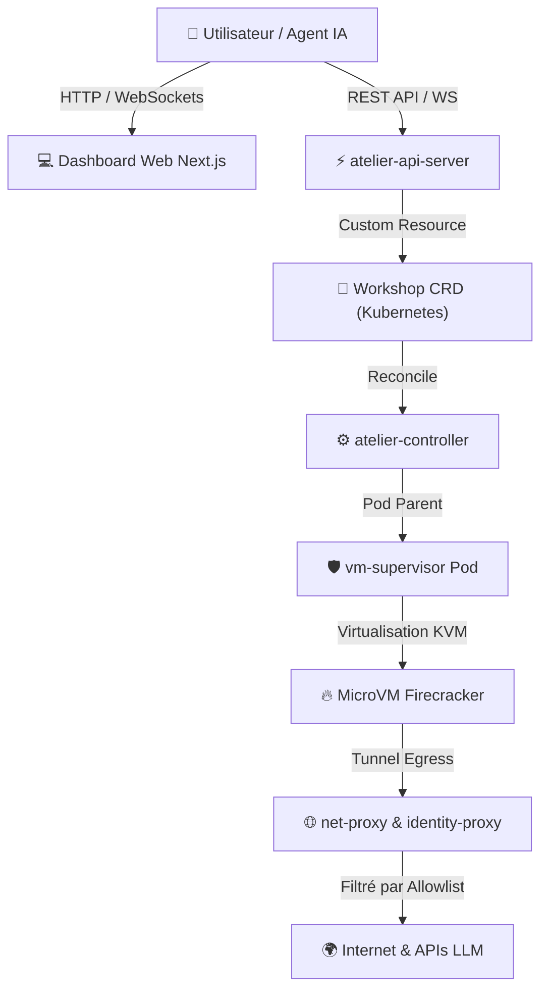
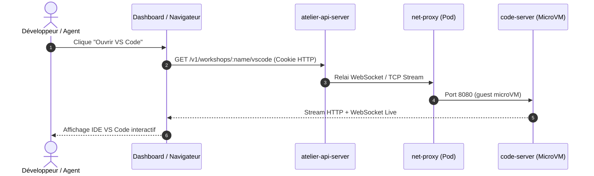

# Guide Utilisateur — Atelier

Bienvenue dans le guide utilisateur d'**Atelier**. Ce document décrit comment créer, piloter et interagir avec des environnements de développement isolés (*Workshops*) exécutés dans des micro-VMs Firecracker sous Kubernetes.

---

## 🧭 Vue d'ensemble des Fonctionnalités

Atelier vous permet de lancer des environnements de développement prêts à l'emploi et isolés au niveau matériel pour des ingénieurs de code ou des agents IA (Claude Code, Gemini CLI, etc.).



---

## 🚀 1. Créer un Environnement (*Workshop*)

### Option A : Via l'Interface Dashboard Web

1. Rendez-vous sur l'interface du Dashboard Atelier (ex: `http://localhost:3000` ou votre URL de déploiement).
2. Cliquez sur **Nouveau Workshop**.
3. Renseignez les paramètres requis :
   - **Nom du Workshop** : un identifiant unique (ex: `dev-python-project`).
   - **Dépôt Git** : l'URL du projet contenant le fichier `.devcontainer/devcontainer.json`.
   - **Ressources** : allocation CPU et Mémoire (ex: `2 CPU`, `4Gi RAM`).
4. Cliquez sur **Créer**. Atelier va automatiquement télécharger le devcontainer, construire l'image rootfs Firecracker et démarrer le pod parent.

### Option B : Via la CLI Kubernetes (`kubectl`)

Vous pouvez également déclarer vos environnements sous forme de manifeste YAML :

```yaml
apiVersion: atelier.dev/v1alpha1
kind: Workshop
metadata:
  name: mon-projet-rust
  namespace: default
spec:
  desiredState: Running
  devcontainer:
    repo: https://github.com/mon-organisation/mon-projet
    configPath: .devcontainer/devcontainer.json
  resources:
    cpu: "2"
    memory: "4Gi"
```

Appliquez le fichier avec `kubectl` :
```bash
kubectl apply -f mon-projet-rust.yaml
```

Pour suivre l'état de démarrage :
```bash
kubectl get workshops -w
```

---

## 💻 2. Accéder à l'Environnement

### VS Code Web dans le Navigateur
Si le Workshop inclut `code-server` ou l'outillage VS Code :
1. Dans le Dashboard, sur la page du Workshop en état `Running`, cliquez sur le bouton **Ouvrir VS Code**.
2. Un nouvel onglet s'ouvre, vous donnant accès directement à l'IDE VS Code complet s'exécutant à l'intérieur de la micro-VM.



---

## 🔄 3. Suspendre et Reprendre un Workshop

Pour économiser les ressources compute de votre cluster, Atelier prend en charge la mise en veille ultra-rapide (*Snapshot & Restore*) :

- **Mise en veille (Suspend)** :
  - Depuis le Dashboard : Cliquez sur **Suspendre**.
  - Via `kubectl` : Passez `spec.desiredState: Suspended`.
  - *Action* : Firecracker gèle la mémoire RAM et les registres CPU dans un snapshot, puis libère le Pod Kubernetes.
- **Reprise (Resume)** :
  - Cliquez sur **Reprendre** (ou repassez `desiredState: Running`).
  - *Action* : Le Pod est réalloué et la micro-VM reprend instantanément à l'état exact où elle s'était arrêtée.

---

## 🛡️ 4. Sécurité & Contrôle du Réseau

Chaque agent exécuté dans un Workshop est soumis à des règles de sécurité réseau strictes :

- **Allowlist Egress** : Tous les appels sortants (HTTP/HTTPS et DNS) sont interceptés par `net-proxy`. Seuls les domaines explicitement autorisés dans la politique réseau sont accessibles.
- **Injection d'Identité OpenBao** : L'agent N'A PAS d'accès direct aux clés privées ou aux jetons d'API sensibles. `identity-proxy` intercepte les requêtes sortantes pour y injecter les tokens d'authentification à la volée.

!!! tip "Zéro secret dans la microVM"
    Même un agent IA compromis ou détourné ne peut ni lire ni exfiltrer un token brut : il ne voit jamais que des requêtes déjà authentifiées, injectées à la volée à la frontière du sandbox.

---

## 🤖 5. Utilisation par un Agent IA (Claude Code / Gemini CLI)

Les agents IA peuvent interagir directement avec le Workshop grâce à la passerelle **MCP (Model Context Protocol)** :

1. L'agent se connecte à `mcp-gateway` sur le port interne dédié.
2. Il peut exécuter des commandes shell, lire des fichiers ou inspecter les logs dans le bac à sable Firecracker sans pouvoir compromettre l'hôte Kubernetes.

---

## 🏭 6. DevFactory Autonome (PM Engine)

Au-delà du pilotage manuel d'un Workshop, Atelier peut prendre en charge un
ticket de bout en bout via le **PM Engine** (`services/pm-engine`), un
moteur d'orchestration LangGraph qui joue le rôle de chef de projet
autonome :

1. Ouvrez une **issue** sur votre dépôt Forgejo (ou tout autre forge
   connectée). Le webhook correspondant est empilé dans un Redis Stream
   (`atelier:webhooks`) et consommé au moins une fois par le PM Engine.
2. Le PM Engine analyse le ticket, planifie les sous-tâches, provisionne
   un ou plusieurs Workshops, délègue le travail à un agent de code, fait
   tourner les tests du devcontainer et boucle sur l'auto-correction en
   cas d'échec.
3. Une fois le code prêt, il exécute des revues automatisées (code,
   sécurité, ops), ouvre une **Pull Request**, et attend une **validation
   humaine (HITL)** avant de fusionner.
4. Après la fusion, un dernier passage (`QAValidation`) vérifie
   dynamiquement le résultat en environnement réel à partir de preuves
   déposées dans un bucket S3 dédié (captures d'écran, sorties de
   requêtes) avant de clore le ticket.

Cette automatisation reste optionnelle : elle ne s'active que si le PM
Engine est déployé et connecté à votre forge (voir le guide
administrateur). Elle ne remplace pas l'usage manuel des Workshops décrit
dans les sections précédentes, qui reste disponible à tout moment.
